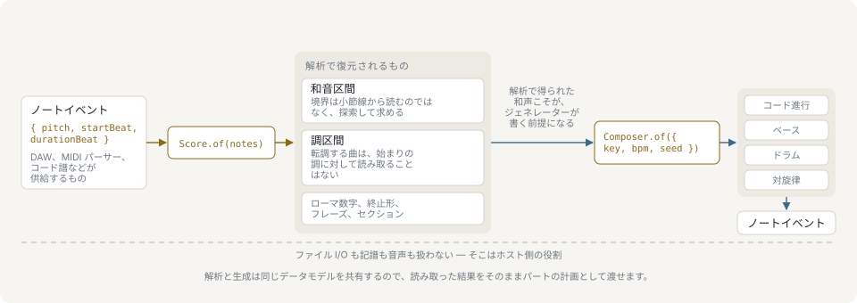

# @libraz/libcantus

MIDI ノートイベントのための、TypeScript 製の音楽理論ライブラリです。ノートから和声を読み取り、その読み取り結果に沿って新しいパートを書けます。実行時依存はありません。

[](https://github.com/libraz/libcantus/actions)
[](https://www.npmjs.com/package/@libraz/libcantus)
[](https://codecov.io/gh/libraz/libcantus)
[](https://github.com/libraz/libcantus/blob/main/LICENSE)
[](https://www.typescriptlang.org/)
[](https://nodejs.org/)
[](https://libraz.github.io/libcantus/)



このライブラリは、すでにノートやコード記号を持っているソフトウェア（DAW のプロジェクト、MIDI パーサー、練習支援ツールなど）と、その音が和声的に何を意味するかとの間を埋めます。ノートイベントを渡すと和声が求まり、ジェネレーターはいま読み取ったその和声に沿ってパートを書きます。

## できること

```ts
import { Composer, Score } from '@libraz/libcantus';

// DAW から渡ってくる形の、4 小節のブロックコード:
const harmony = [[48, 60, 64, 67], [41, 60, 65, 69], [43, 59, 62, 65], [48, 60, 64, 67]].flatMap(
  (pitches, bar) => pitches.map((pitch) => ({ pitch, startBeat: bar * 4, durationBeat: 4 })),
);

const chords = Score.of(harmony).timeline();
chords.roman().map((entry) => entry.roman); // ['I', 'IV', 'V7', 'I']
chords.cadences().at(-1)?.cadence.type; // 'authentic'

// 求まった和声の上に、ウォーキングベースを書く:
Composer.of({ key: chords.key, bpm: 120, seed: 1 }).bass(chords, { style: 'walking' }).notes;
// 16 音: [{ pitch: 36, startBeat: 0, durationBeat: 1, velocity: 100 }, ...]
```

コードの境界は決め打ちせずに探索し、キーも同様に探します。転調する曲を、冒頭のキーのまま読み続けることはありません。答えには根拠が伴います。コード分析・終止・ローマ数字はいずれも `rationale` と、採らなかった読みを併せて返し、入力だけでは決まらない項目は、もっともらしい推測ではなく `null` を返します。

## ユースケース

| ユースケース | 内容 | 実例のガイド |
|---|---|---|
| DAW のアシスタント | トラックから和声を読み取り、それに沿ってベースラインを書く。 | [DAW ワークフロー](docs/ja/use-cases/daw-workflow.md) |
| 楽曲アナライザー | 1 つのスコアから調区間、終止形、和声的な還元、フレーズ、セクション、モチーフを得る。 | [楽曲の解析](docs/ja/use-cases/piece-analysis.md) |
| 転調レポート | 転調を、軸和音・確信度・調同士の関係とともに提示する。 | [転調レポート](docs/ja/use-cases/modulation-report.md) |
| 和声課題のチェッカー | 声部書法と種目対位法の違反を、違反した声部と破った規則つきで報告する。 | [和声課題のチェック](docs/ja/use-cases/harmony-exercise-checker.md) |
| 自動生成アレンジ | シードを固定した 1 つのコンポーザーがコード進行・各パート・ドラムを書き、演奏可能性を確認する。 | [生成によるアレンジ](docs/ja/use-cases/generative-arrangement.md) |
| コード譜の取り込み | 打ち込んだコード記号をタイムライン、ヴォイシング、ベースラインに変換する。 | [コード譜の取り込み](docs/ja/use-cases/chord-chart-import.md) |
| パート譜の準備 | パートを楽器に合わせ、その奏者が読む音高で書き出す。 | [パート譜の準備](docs/ja/use-cases/part-preparation.md) |

## インストール

Node.js 22 以降が必要です。

```sh
yarn add @libraz/libcantus
```

パッケージのルートから API 全体を公開しています。`@libraz/libcantus/core`、`/theory`、`/analyze`、`/generate`、`/model` は同じシンボル群に対する、より狭い読み込み境界です。いずれのパスも ESM と CommonJS の両方のビルドを同梱しています。

## ドキュメント

音楽理論にはじめて触れる場合は、[入門ガイド](docs/ja/primer/index.md)から始めてください。この API が土台にしている考え方 — 音高と音程、音階と調、和音、和声、声部、リズムと拍子 — を、楽譜ではなく TypeScript を書く読者に向けて説明しています。

そうでなければ[はじめに](docs/ja/introduction.md)と[使いはじめる](docs/ja/getting-started.md)から読んでください。各分野のガイドとリファレンスはそこから辿れます。ガイド中の `ts` の例はすべてテストスイートで実行され、行末コメントがリテラルを名指していれば（em ダッシュに続けて理由が書かれていてもかまいません）実際の戻り値と照合されます。

## できないこと

- **入出力・記譜・音声は扱いません。** MIDI ファイルの読み書き、楽譜の描画、音声解析、再生はいずれも対象外です。パーサーは呼び出し側で用意し、ノートイベントを渡してください。その下の層が必要な場合、[libsonare](https://github.com/libraz/libsonare) が音声解析・マスタリング・合成・SMF の入出力を扱います。両者はコードを共有せず、どちらも他方を必要としません。
- **微分音の解析は行いません。** 周波数、セント、オクターブの等分割、純正律の比は `core` にありますが、音高より上の層はすべて 12 のピッチクラスで動きます。
- **旋法体系そのものは扱いません。** `WORLD_SCALES` が記録するのは、その伝統が名前を与えている音の素材 — ターット、マカームの音組織、日本の五音音階 — であって、その上に築かれた語法ではありません。
- **コーパスは同梱しません。** 統計を取るためのデータは含みません。

残りは[疑問と制限](docs/ja/faq.md)にまとめています。機能和声の読みが適用できない場合や、エンジンが推測しないことについてもそこで扱います。

## ライセンス

[@libraz/libcantus](https://github.com/libraz/libcantus) は [Apache License 2.0](LICENSE) で公開しています。
