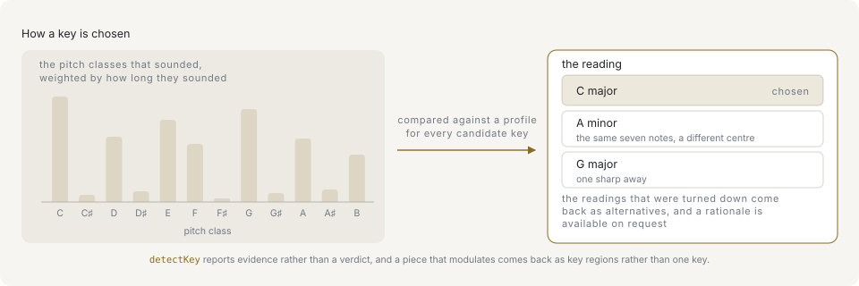
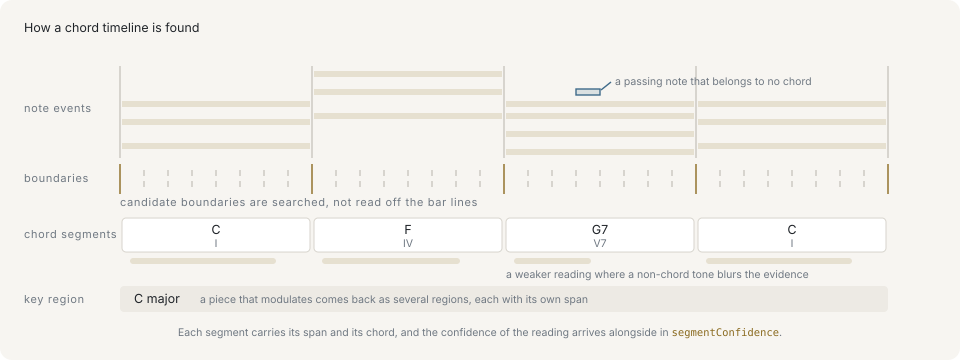

# Analysis

Analysis returns structured reports. They keep the answer, the evidence used to choose it, and — in APIs that support it — the alternatives that were rejected.

The class API asks these questions of a value: a `Chord` recognized from pitches, a `Timeline` that knows its own cadences, a `Score` that can name its phrases. The functional API takes the same plain data and returns the same reports. An analysis path is complete on the class side — every reading on this page is reachable from a `Chord`, `Timeline`, `Score`, or `Arrangement` — so a page of analysis code can be written either way. That does not extend to the library as a whole: the validators, the type guards, the counterpoint predicates, the dictionary readings and the generator stages are functions by design, and a few readings with a receiver of their own — `barPositionToBeat`, `barPositionToPulse`, `chordFromSpec`, `secondaryDominant`, `shiftByScaleDegrees` — have no method yet.

Every result on this page is a reading supported by evidence, not a fact recovered from the notes. A UI that presents one should show the supporting figures and allow an override.

The musical vocabulary the reports use — chords, functions, cadences — is taught in [the harmony primer](primer/harmony.md).

## Chord recognition

`Chord.detectBest` recognizes a chord from MIDI pitches, and `Chord.detectMatches` keeps the evidence beside it:

```ts
import { Chord } from '@libraz/libcantus';

Chord.detectBest([60, 63, 67, 70])?.symbol(); // 'Cm7'

const [best] = Chord.detectMatches([60, 64, 67]);

best?.chord.symbol(); // 'C'
best?.match.quality; // 'maj'
best?.match.exact; // true
best?.match.inversion; // 0

Chord.detectMatches([64, 67, 72])[0]?.match.inversion; // 1
```

The functional entry points return the same rankings as plain data, without the class value on top:

```ts
import { detectChord, detectChordBest } from '@libraz/libcantus';

detectChordBest([60, 64, 67])?.rootPc; // 0

const match = detectChord([60, 64, 67])[0];
match?.quality; // 'maj'
match?.exact; // true
match?.inversion; // 0

detectChord([64, 67, 72])[0]?.inversion; // 1
```

`detectChordBest` and `Chord.detectBest` return a chord ready to use; `detectChord` returns ranked `ChordMatch` values and `Chord.detectMatches` pairs each with the chord it names, which is what to reach for when the evidence matters as much as the answer. A `ChordMatch` reports `missingPcs` for chord tones absent from the input, `extraPcs` for input pitches outside the chord, and `exact` when the two sets agree. `inversion` is null when no inversion can be named — an unordered pitch-class set with no bass, or a bass that is not a chord tone, in which case `bassPc` still reports it.

`input` decides how the numbers are read: `midi` takes the numerically lowest pitch as the bass, `pitchClass` treats the input as unordered, and the default `auto` chooses pitch-class mode only when every value lies in 0..11.

## Key recognition



The key is read off how much of the music each pitch class accounts for, not off a signature written somewhere: that distribution is correlated against a profile for every candidate key, and the whole ranking comes back so a caller can see the margin and the runners-up.

`Key.detectBest` and `Key.detectMatches` rank keys from a list of sounding pitches or pitch classes, each occurrence counting once unless `weights` says otherwise:

```ts
import { Key } from '@libraz/libcantus';

const sounding = [2, 2, 2, 2, 5, 5, 9, 9, 11, 11, 7, 4, 0, 2];

Key.detectMatches(sounding, { modes: true })[0]?.scaleName; // 'dorian'
Key.detectBest(sounding)?.toString(); // 'D melodic minor'
```

`detectKey` and `detectKeyBest` are the functions behind them, and answer with the plain key/scale rather than a `Key`:

```ts
import { detectKey, detectKeyBest } from '@libraz/libcantus';

const sounding = [2, 2, 2, 2, 5, 5, 9, 9, 11, 11, 7, 4, 0, 2];

detectKey(sounding, { modes: true })[0]?.scaleName; // 'dorian'
detectKeyBest(sounding)?.mode; // 'minor'
```

A `KeyMatch` carries the scale that scored best, the major or minor key it is closest to, which scale form it uses (`variant`), the exact name from `NAMED_SCALES`, the share of the input its scale covers (`fit`), and the `score` the ranking is by: the Pearson correlation, in [-1, 1], between the input's weighted pitch-class distribution and the candidate's key profile rotated onto its tonic. `fit` counts membership and `score` measures where the weight falls among the degrees, which is what separates a key from its relative, so only `score` orders the list. `Key.detectMatches` reports all of it, with the key itself as a `Key`; a detected `Key` keeps the scale form it was matched under, which is why the one above names itself melodic rather than just minor. `modes: true` puts the church modes in the running; without it the candidates are the 12 major and 12 minor keys, and the minor scale form takes no part in the contest — a minor candidate is scored once on the minor profile and only then reports whichever of the natural, harmonic and melodic masks covers the most input weight.

`explain: true` attaches a `rationale` to every candidate and, to the top-ranked one alone, the `alternatives` it beat, each with the reason it ranked lower. It is off by default: a ranking is 24 candidates before the modes are counted, and phrasing all of them costs more than the detection does.

```ts
import { detectKey } from '@libraz/libcantus';

const sounding = [2, 2, 2, 2, 5, 5, 9, 9, 11, 11, 7, 4, 0, 2];

const [top] = detectKey(sounding, { explain: true });

typeof top?.rationale; // 'string'
top?.alternatives?.[0]?.label; // 'D major'
```

`profile` chooses what the observed distribution is correlated against — `krumhansl` by default, `temperley` for corpus proportions, or `flat` for an unweighted comparison. `weights` says how much each pitch counts; `detectKeyFromNotes` supplies duration times velocity, and is the right entry point when the input is note events rather than a histogram. It weighs notes the way chord inference weighs its own histogram, down to counting a note that carries no velocity at full weight rather than at an assumed one, with one deliberate exception: the metrical accent chord inference adds is not part of it, because `detectKeyFromNotes` is never told the time signature that accent would be measured against. `Score.detectKeys()` is the same ranking from the class side, over a whole score read as one key, so a caller can see what the winner beat and by how much:

```ts
import { Score } from '@libraz/libcantus';

const score = Score.of([{ pitch: 60, startBeat: 0, durationBeat: 4 }]);

score.detectKeys()[0]?.key.rootPc; // 0
```

`Score.key()` goes further and answers with the single key held longest across a whole piece.

## Timelines and cadences



Boundaries are searched for rather than read off the bar lines, so a bar holding two chords comes back as two segments; each segment carries its span and its chord, and the confidence of the reading arrives beside the timeline in `segmentConfidence`.

A `Timeline` is harmony that keeps its place in time. `Timeline.fromChords` places chords whose roots and onsets are already known, and `Score.timeline()` or `Timeline.fromNotes` search note events for the segments and the key in force:

```ts
import { Chord, Key, Timeline } from '@libraz/libcantus';

const timeline = Timeline.fromChords(
  [Chord.parse('C').span(0), Chord.parse('F').span(4), Chord.parse('G7').span(8)],
  12,
  Key.major('C'),
);

timeline.length; // 3
timeline.at(9)?.symbol(); // 'G7'
timeline.roman().map((entry) => entry.roman);
// ['I', 'IV', 'V7']
```

`chordTimelineFromChords` is the function underneath, taking the spans as plain data:

```ts
import { chordTimelineFromChords, chordToRoman, majorKey } from '@libraz/libcantus';

const timeline = chordTimelineFromChords(
  [
    { rootPc: 0, quality: 'maj', startBeat: 0 },
    { rootPc: 5, quality: 'maj', startBeat: 4 },
    { rootPc: 7, quality: 'dom7', startBeat: 8 },
  ],
  12,
);

timeline.segments.length; // 3
timeline.segments.map((segment) => chordToRoman(segment.chord, majorKey(0)));
// ['I', 'IV', 'V7']
```

`chordTimelineFromNotes` returns more than the timeline: `keys` holds the key regions the analysis ran against, `prevailingKey` the one held longest, and `segmentConfidence` one value per segment in segment order. A `Timeline` carries all three: `timeline.keys`, `timeline.key`, and `timeline.segmentConfidence`. Omitting `key` is what lets a piece that modulates be analyzed against the key actually in force; supplying one yields a single region because the caller has already answered the question.

A confidence is the share of a window the chosen chord accounts for: the weight carried by its own chord tones over the total weight sounding there, discounted where the match is inexact. A window holding nothing but the chord reads at 1, and a passing note sounding against it pulls the value down.

`segmentation` decides where a boundary may fall. The default `'dynamic'` searches the notes for the changes they imply, and `harmonicRhythm` is a prior on that search: the longer a chord is expected to hold, the more evidence a change needs before one is placed. `'grid'` cuts a segment every `harmonicRhythm` beats instead, which is right only where the harmonic rhythm is known to be fixed.

An augmented sixth — a chord named for the interval between its bass and one upper voice rather than for a stack of thirds — is worked out separately, because no tertian match can carry one. Where the same tones over the lowered submediant resolve outward onto the dominant, straight onto V or V7 or through a cadential six-four standing on the dominant bass, the augmented sixth is reported as the segment's chord; where they move anywhere else, the tertian reading of a ♭VI7 stands instead.

`timeline.cadences()` labels every arrival across a whole span — a cadence being the chord pair that closes a phrase — each with the beat it lands on:

```ts
import { Chord, Key, Timeline } from '@libraz/libcantus';

const timeline = Timeline.fromChords(
  [Chord.parse('C').span(0), Chord.parse('G').span(4), Chord.parse('C').span(8)],
  12,
  Key.major('C'),
);

const hits = timeline.cadences();

hits.map((hit) => hit.cadence.type); // ['half', 'authentic']
hits[1]?.atBeat; // 8
```

`detectCadence` labels one pair of chords, and `detectCadences` is what the timeline runs over its own segments:

```ts
import { Chord, Key, detectCadence } from '@libraz/libcantus';

const key = Key.major('C').scale;
const g = Chord.of('G', 'maj').data;
const c = Chord.of('C', 'maj').data;

detectCadence(g, c, key).type; // 'authentic'
detectCadence(g, c, key).strength; // null
```

`strength` is null only where a voicing is the one thing missing: the dominant itself, both chords standing on their roots, and no soprano named. A leading-tone chord standing in for the dominant, or either chord off its own root, grades the cadence `imperfect` with or without a voicing. Supply a voicing and a root-position V–I is graded perfect or imperfect by whether the soprano — the top voice — lands on the tonic. A repeated V with no root motion is not reported as a cadence. `Progression.cadences` is the untimed counterpart, reading one cadence per adjacent pair.

Cadences are measured against the degrees the key actually has, not against fixed semitone distances: a mode resolves deceptively onto its own submediant, the subdominant a plagal cadence falls from is the key's own fourth degree — a tritone above the tonic in lydian, where a chord five semitones up is not in the key at all — and where a mode's dominant carries no leading tone (the `v` of dorian or mixolydian) an arrival on that dominant is a half cadence too. That last relaxation is the modes' alone: a major key keeps its leading tone, so a borrowed minor `v` there is not one, and a minor key cadences through the raised seventh it writes as an accidental, so its own `v` is not one either.

Two labels name borrowed chords rather than degrees of the key, and those are stated as the fixed offsets they mean: `modal` is the major triad on the ♭VII a whole tone below the tonic, whatever the key writes on its seventh degree, and the Phrygian cadence is the subdominant in first inversion falling a semitone in the bass, from the lowered submediant onto the dominant of a minor key.

`cadence.type` is one of six labels — `authentic`, `plagal`, `half`, `deceptive`, `phrygian`, `modal` — or null when the pair forms no cadence. The last two are the ones a filter drops silently. `phrygian` is a particular half cadence and is reported in place of `half`, so code counting half cadences has to count `phrygian` alongside it; `modal` is the ♭VII–I arrival no common-practice type covers, which is where a popular or modal piece puts weight that a search for `authentic` never sees. The TSDoc on `CadenceResult.type` is the exhaustive reference.

A cadential six-four is the dominant, not an inverted tonic: its bass has already arrived and the notes above it resolve down onto the dominant's own. Pass the chord before the dominant as `approach` and the cadence is reported as the one event it is — the type and the beat stay with the dominant's resolution, and the rationale says the cadence began at the six-four. A six-four the bass leaves, as in `IV–I64–IV`, is an ordinary inverted tonic and reads as one.

## Reduction and form

`timeline.reduce()` marks chords as `structural`, `passing`, or `neighbor` — the two embellishing figures spelled the way `analyzeVoice` spells them for a note, so one legend covers both levels — with a rationale, and with the beats each chord holds:

```ts
import { Chord, Key, Timeline } from '@libraz/libcantus';

const timeline = Timeline.fromChords(
  [Chord.parse('Cmaj7').span(0), Chord.parse('C#dim7').span(4), Chord.parse('Dm7').span(8)],
  12,
  Key.major('C'),
);

timeline.reduce().map((entry) => entry.level);
// ['structural', 'passing', 'structural']
```

The reading needs a key, so a timeline built without one — `Timeline.fromChords` with no third argument — refuses rather than guessing. `basis` chooses what counts as the frame: the default `'function'` keeps the tonic, the dominant, and the chords that cadence, while `'duration'` keeps a chord that outlasts the chords around it — its length is compared strictly against the median of the other chords' lengths, so an even harmonic rhythm singles out nobody and the two embellishing figures decide. Under either basis a reduction never demotes the chord a progression opens on or the one it ends on: each frames the progression, whichever reading is in force. `reduceProgression` is the function, and takes the key as its own argument:

```ts
import { chordTimelineFromChords, majorKey, reduceProgression } from '@libraz/libcantus';

const timeline = chordTimelineFromChords(
  [
    { rootPc: 0, quality: 'maj7', startBeat: 0 },
    { rootPc: 1, quality: 'dim7', startBeat: 4 },
    { rootPc: 2, quality: 'min7', startBeat: 8 },
  ],
  12,
);

reduceProgression(timeline, majorKey(0)).map((entry) => entry.level);
// ['structural', 'passing', 'structural']
```

A `Score` answers the form questions from the notes it holds: `phrases()` uses cadences, rests, held notes, repetition, hypermetric position and the end of the piece to propose phrase boundaries, and each phrase records which of those signals contributed; `hypermeter()` finds metrical grouping above the bar; `sections()` identifies repeated units as labels such as A and B — it does not claim that A is a verse. The functions behind them are `phrasesFromTimeline`, `hypermeter`, and `sectionsFromNotes`, which take the notes and the chord timeline separately.

A phrase reports two numbers that answer different questions. `confidence` grades the boundary itself, weighing its evidence against the length a phrase runs to elsewhere in the piece. `structuralWeight` grades the cadence that closes it, in [0, 1] and 0 where no cadence does: how conclusive the type is, then where the phrase sits — a cadence ending the piece or landing on a hypermetric boundary closes more than one in the middle of a hyperbar. `structuralCadences` ranks the phrase cadences by it.

## Modulation

`Score.keys()`, `keyTimelineFromNotes`, and `detectModulations` divide a piece into key regions, each with a confidence and, where the chords support one, a pivot. See [Key relations and modulation](key-relations-and-modulation.md).

`timeline.modulations()` is the chord route to the same regions. A timeline carries the key it was built with — for placed chords, whatever the caller stated or nothing at all — and this is where the chords themselves are searched for the keys they imply, which a chord argues for far more strongly than its three or four pitch classes do:

```ts
import { Chord, Key, Timeline } from '@libraz/libcantus';

const timeline = Timeline.fromChords(
  [Chord.parse('C').span(0), Chord.parse('G7').span(4), Chord.parse('C').span(8)],
  12,
  Key.major('C'),
);

const regions = timeline.modulations();

regions.length; // 1
regions[0]?.startBeat; // 0
regions[0]?.endBeat; // 12
```

## Melodic analysis

`Score.motifs()` and `Score.contour()` cover repeated and transformed melodic material, and a `Motif` compares itself with another through `relateTo` and `similarityTo`. As functions: `melodicContour`, `extractMotifs`, `relateMotifs`, and `melodicSimilarity`. See [Melody and motifs](melody-and-motifs.md).

## Arrangement reports

An `Arrangement` reads several tracks together. It combines chord timelines, key regions, theory labels, and conflicts between notes and the current harmony, and answers with a class where it has one — `timeline()` hands back a `Timeline`, `track(name)` a `Score`:

```ts
import { Arrangement } from '@libraz/libcantus';

const arrangement = Arrangement.of([
  {
    role: 'harmony',
    notes: [
      { pitch: 60, startBeat: 0, durationBeat: 4 },
      { pitch: 64, startBeat: 0, durationBeat: 4 },
      { pitch: 67, startBeat: 0, durationBeat: 4 },
    ],
  },
]);

arrangement.timeline().at(0)?.symbol(); // 'C'
Array.isArray(arrangement.conflicts); // true
```

`analyzeArrangement` is the whole of that reading as one call. The report carries `keys` and `prevailingKey`, the `timeline` and, beside it rather than on it, `segmentConfidence` — the plain `ChordTimeline` holds only `at` and `segments` — then the `cadences`, the per-track annotations in `tracks`, and the `conflicts`; tension is a separate reading, from `tensionCurve`:

```ts
import { analyzeArrangement } from '@libraz/libcantus';

const report = analyzeArrangement([
  {
    role: 'harmony',
    notes: [
      { pitch: 60, startBeat: 0, durationBeat: 4 },
      { pitch: 64, startBeat: 0, durationBeat: 4 },
      { pitch: 67, startBeat: 0, durationBeat: 4 },
    ],
  },
]);

report.timeline.segments.length >= 1; // true
Array.isArray(report.conflicts); // true
```

`tensionCurve` and `analyzeVoice` expose parts of that report when a complete arrangement result is unnecessary, and `toVoiceNotes` prepares a single track for voice-level analysis; `Arrangement.tension` is the first of those from the class side. `Score.voices` is the second, read over a whole piece: a score is polyphony, so its notes are separated into voices and each note is classified in its own voice against everything else sounding under it. That is what a suspension needs — a dissonance is dissonant against something — and it keeps a note of one voice from being heard as the passing tone of another. `analyzePolyphony` is that same voice-level reading over one passage handed in as a flat array: it separates the notes into voices, classifies each against everything else sounding under it, and answers with one annotation per note in the order the notes arrived, each carrying its index in that array as its `noteId`. A note of no length never sounds and so has no voice to be dissonant in; it keeps its entry and is read against the chord alone. `createArrangementSession` keeps an analysis open across edits, which is what `Arrangement.update` uses; see [Performance](performance.md).

The ornament figures `analyzeVoice` names — passing, neighbor, suspension, appoggiatura, anticipation, escape — are the words `classifyMelodyTones` uses for the same notes, so one melody read through the analysis and through the harmonizer comes back under one vocabulary. The two read different evidence, though, and neither answer is a subset of the other: `analyzeVoice` reads a note against the chord sounding under it, so a note the chord contains is a chord tone there whatever shape it passes through, while `classifyMelodyTones` reads the melody and the metre and may call that same note a passing tone; and `classifyMelodyTones` weighs the metre where `analyzeVoice` does not, so a leap answered by a step lands as an appoggiatura in one reading and as structural in the other. A host that colours notes from both will see two legends over one bar, and that is what each is for rather than a disagreement to resolve.
