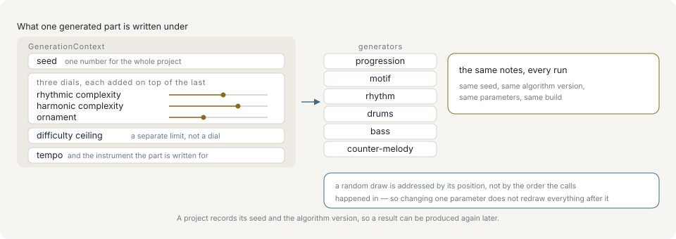

# Determinism and seeding

A saved project is a seed plus parameters. It reopens as the same piece only if the library turns them back into the same notes, so generation is built around three separate promises: the same seed gives the same stream, a draw belongs to a position rather than to a call, and the contract itself carries a version number.

The dials below are named after musical ideas, and the page counts in bars and beats; the [primer](primer/index.md) covers both for a reader with no musical training.

## One seed for the whole piece



One context feeds every generator. The seed is a single number for the whole project; the three complexity dials stack on one another, and the difficulty ceiling sits beside them rather than among them, as a limit rather than a fourth dial; the tempo and the instrument a part is written for travel in the same object. Everything on this page follows from that one entry point.

`GenerationContext` holds the project seed, and every part derives its own randomness from it. Passing a bare number is shorthand for `{ seed }`:

```ts
import { generateDrums, resolveContext } from '@libraz/libcantus';

resolveContext(7).seed; // 7
resolveContext({ seed: 7, bpm: 96 }).bpm; // 96

const a = generateDrums({ bars: 2, style: 'standard', section: 'verse', ctx: 7 });
const b = generateDrums({ bars: 2, style: 'standard', section: 'verse', ctx: 7 });
JSON.stringify(a) === JSON.stringify(b); // true
```

Parts derived from the same seed do not collide, because each generator addresses its own namespace under it. A bass line and a drum pattern generated from seed 7 are independent; regenerating either one with the same seed reproduces it exactly.

The seed is optional and zero when left out. A context naming only a tempo is a whole request, and a generator handed no context at all is still deterministic — it draws from seed 0.

`deriveSeed` is the derivation the context is built on, exposed for a host that generates material of its own and wants it to travel with the project seed. A context adds two segments of its own before the caller's — `'v'` and the resolved algorithm version — so a host that wants its material pinned the same way passes them too:

```ts
import { ALGORITHM_VERSION, deriveSeed, resolveContext } from '@libraz/libcantus';

resolveContext().seed; // 0

deriveSeed(42, 'drums') === deriveSeed(42, 'drums'); // true
deriveSeed(42, 'drums') === deriveSeed(42, 'bass'); // false
deriveSeed(42, 'drums') === deriveSeed(42, 'drums', 'v', ALGORITHM_VERSION); // false
```

## Draws addressed by position

Drawing in call order makes every value depend on how many draws preceded it, so editing one parameter in the middle of a piece redraws everything after it. `PositionalRng` removes that coupling: a draw is a pure function of the seed and a path, so the value at bar 4 beat 2.5 does not care what happened at bar 3.

```ts
import { createPositionalRng, includeAt } from '@libraz/libcantus';

const rng = createPositionalRng(7);

rng.at('ghost', 4, 2.5) === rng.at('ghost', 4, 2.5); // true
includeAt(rng, 0, 'ghost', 4, 2.5); // false
includeAt(rng, 1, 'ghost', 4, 2.5); // true
```

`includeAt` tests `at(...path) < complexity`, which is what gives a complexity slider the behaviour a user expects. Because the draw is fixed by the position, the set of selected events grows monotonically: for any `c1 < c2`, everything included at `c1` is still included at `c2`. Raising the dial only adds events, and every event already sounding stays exactly where it was.

A context takes such a source directly, and `GenerationContext.rng` replaces the seed derivation rather than feeding it: with a source supplied, `seed` is never read. Each part still addresses its own namespace under that source, so the parts of one piece stay independent of each other:

```ts
import { createPositionalRng, resolveContext } from '@libraz/libcantus';

const supplied = resolveContext({ seed: 999, rng: createPositionalRng(7) });
const derived = resolveContext({ seed: 999 });

supplied.part('drums').at('ghost', 1, 2) === derived.part('drums').at('ghost', 1, 2); // false
```

`createRng` is the ordinary sequential generator, for cases where a stream is genuinely wanted:

```ts
import { createRng } from '@libraz/libcantus';

const rng = createRng(42);
const first = rng.next();

createRng(42).next() === first; // true
createRng(43).next() === first; // false
```

`prob`, `range`, and `float` validate their arguments before consuming a draw. A rejected call therefore does not shift the stream, so a caller that catches the error still sees the sequence a caller that never made the call would see.

## Complexity and difficulty are different dials

`Complexity` has four fields, and only three of them are the same kind of thing:

| Field | Range | Meaning |
| --- | --- | --- |
| `rhythmic` | 0..1 | Subdivision and syncopation. |
| `harmonic` | 0..1 | Tension, substitution, passing chords. |
| `ornament` | 0..1 | Ghost notes, flams, decoration. |
| `difficulty` | 1..5 | A ceiling on how hard the result may be to play. |

The first three ask for more of something, and moving one adds material without disturbing what is already there. `difficulty` is not a strength — it only ever takes candidates away. "Involved but easy" and "plain but hard" are both real requests, so the ceiling filters what the other three proposed instead of scaling it.

```ts
import { generateDrums, MAX_DIFFICULTY, MIN_DIFFICULTY } from '@libraz/libcantus';

MIN_DIFFICULTY; // 1
MAX_DIFFICULTY; // 5

const sparse = generateDrums({
  bars: 2,
  style: 'funk',
  section: 'chorus',
  ctx: { seed: 3, bpm: 100, complexity: { rhythmic: 0.2, ornament: 0.1 } },
});
const busy = generateDrums({
  bars: 2,
  style: 'funk',
  section: 'chorus',
  ctx: { seed: 3, bpm: 100, complexity: { rhythmic: 0.9, ornament: 0.8 } },
});

sparse.length <= busy.length; // true
```

The ceiling governs the timing layer alone. Whether a note exists on the instrument at all, and whether a shape can be held, come from `GenerationContext.instruments` and apply whatever the ceiling says — see [Instruments and playability](instruments-and-playability.md).

Naming a `bpm` — the tempo, in quarter-note beats per minute — matters when a ceiling is in play: without a tempo there is nothing to measure "reachable in the time available" against.

## Pinning the algorithm version

A package version cannot say which reading of a project's parameters a take was made under. A bug fix inside a generator is a patch release and still moves every note. `ALGORITHM_VERSION` is the separate number that says it:

```ts
import { ALGORITHM_VERSION, MIN_ALGORITHM_VERSION, resolveAlgorithmVersion } from '@libraz/libcantus';

resolveAlgorithmVersion(undefined) === ALGORITHM_VERSION; // true
resolveAlgorithmVersion(MIN_ALGORITHM_VERSION); // 1
```

For a fixed algorithm version, the same seed and the same documented parameters produce the same generated output from a given build. The number says which reading of those parameters a project was written against.

What it does not do is freeze that reading against correction. The generators hold one implementation rather than one per version, so pinning an older number selects a different draw of the current implementation and does not restore what that number produced before. A fix to output that was musically wrong therefore moves the notes of a version already in use; it ships as a patch and is stated in the changelog. Raising the constant marks a deliberate change of approach rather than a correction, and reproducing a piece exactly means recording the package version alongside the seed and the algorithm version.

The version takes part in every derivation a generator draws through, so two versions never share a draw. A host deriving its own material with `deriveSeed` is outside that and pins it by passing the resolved `algorithmVersion` as a path segment. A version this build does not produce is rejected rather than rendered as another one, since an older build cannot reproduce a project saved by a newer one.

```ts
import { isLibcantusError, resolveContext } from '@libraz/libcantus';

let code = 'ok';
try {
  resolveContext({ seed: 1, algorithmVersion: 999 });
} catch (error) {
  if (isLibcantusError(error)) code = error.code;
}
code; // 'INVALID_INPUT'
```

## What a project file has to store

To reopen a generated part as itself, record:

- the seed,
- the resolved `algorithmVersion`,
- the package version the take was made under,
- every option passed to the generator, including `complexity` and `bpm`,
- any vocabulary the caller supplied.

The generated note events do not have to be stored, but storing them is the safer choice for a user's work: it survives a version this build no longer produces, and it survives the user editing the result by hand.

A composer assembles the first two of those records itself. `composer.data` is the settings it was built from with the seed and the `algorithmVersion` resolved into them even when the caller named neither, so it holds what the parts were actually drawn under rather than what the build it is reopened on would default to, and `Composer.fromData` takes it straight back:

```ts
import { ALGORITHM_VERSION, Composer } from '@libraz/libcantus';

const composer = Composer.of({ key: 'C major', bpm: 96 });

composer.data.seed; // 0
composer.data.algorithmVersion === ALGORITHM_VERSION; // true
Composer.fromData(composer.data).data.seed; // 0
```

A source supplied as `rng` is the one setting `data` leaves out: it is a handle on a stream rather than a value, so it cannot be written to a project file, and a composer rebuilt from stored data draws from the seed instead.

The context itself is not one of those records. `resolveContext` returns a live object — its `instrument` and `part` are functions — so serializing it loses exactly the parts a generator calls. Store the fields that were passed in, and resolve the context again on load:

```ts
import { resolveContext } from '@libraz/libcantus';

const saved = { seed: 7, algorithmVersion: 1, complexity: { rhythmic: 0.4 } };
const context = resolveContext(saved);
context.seed; // 7
resolveContext(saved).seed === context.seed; // true
```

## What is not covered

The promise covers what the generators return. Analysis results, error messages, and output taken under a different algorithm version sit outside it. Analysis is deterministic in practice — the same notes give the same reading — but it is not versioned, so an improvement to key detection may change a label between releases.
