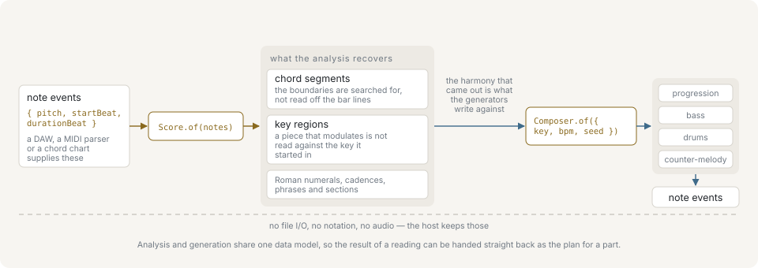
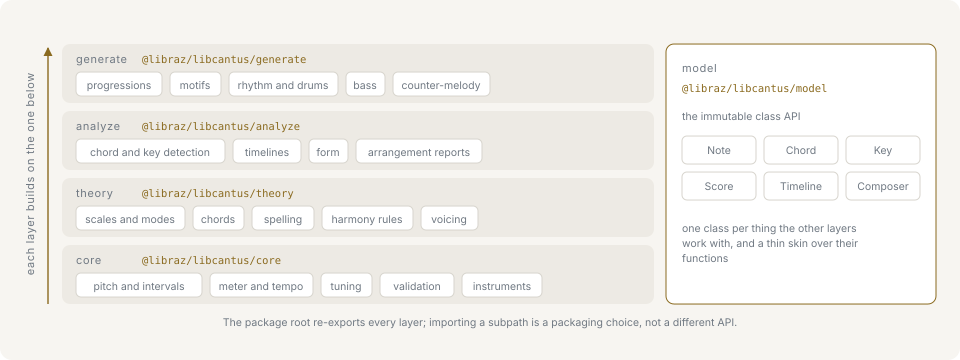

# Introduction

`@libraz/libcantus` is a TypeScript music-theory engine for software that already has notes or chord symbols. It works with MIDI pitch numbers, spelled notes, chord specifications, keys, and timed note events. It does not read or write MIDI files, render notation, analyze audio, or play sound.

No musical training is assumed. The [primer](primer/index.md) teaches each musical idea the library models and names the function that implements it; start there if a term on this page is unfamiliar.

The package has no runtime dependencies, every entry point is synchronous, and the functional API produces plain JSON-compatible data — no class instances. The class API wraps that same data and exposes it through `.data`.

## What the library does end to end



Material enters as note events or chord symbols. Analysis reads structure out of it — chords, keys, cadences, phrases — and generation writes new parts against that reading. Each stage takes and returns plain data, so an application can start at whichever one matches the data it already holds, and use the result without going further.

## The mental model

The library models two kinds of thing, and each one comes as an immutable class and as plain data:

- Single values, such as `Note`, `Interval`, `Chord`, `Key`, and `Progression`.
- Collections and timelines: a `Score` of `NoteEvent` values, a `Timeline` of chord segments, an `Arrangement` of tracks. The classes hold the material together with its context; the pure functions underneath do the work and stay callable on their own.

The two styles interoperate. A class exposes its plain value through `.data`, and functions that analyze or generate music return data that can be passed to another function or wrapped by a class.

Every `NoteEvent` uses MIDI pitch and quarter-note beats:

```ts
import type { NoteEvent } from '@libraz/libcantus';

const note: NoteEvent = {
  pitch: 60,
  startBeat: 0,
  durationBeat: 1,
  velocity: 96,
};
```

Negative `startBeat` values represent a pickup. Optional `velocity` and `articulation` fields carry performance detail without changing the timing model.

## Layers

The package root exports the complete public API. The same exports are grouped into five subpaths:

| Subpath | Focus |
| --- | --- |
| `@libraz/libcantus/core` | pitch, intervals, meter, tempo, tuning, validation, and instrument data |
| `@libraz/libcantus/theory` | scales, chords, spelling, harmony rules, and voicing |
| `@libraz/libcantus/analyze` | chord/key detection, timelines, form, and arrangement analysis |
| `@libraz/libcantus/generate` | progressions, motifs, rhythms, drums, bass, and counter-melody |
| `@libraz/libcantus/model` | the immutable class API: one class per thing the other layers work with, each a thin skin over their functions |



The layers stack: `theory` builds on `core`, `analyze` on `theory`, `generate` on all three, and `model` on all four. Nothing calls upward, so an import from a lower subpath pulls in less. Importing from a subpath is a packaging choice, not a different API.

## Three principles

**Analysis reports evidence, it does not decide.** A chord timeline carries confidences, a key region carries a correlation, a reduction carries a rationale, and a violation carries the rule it broke. Where a reading is genuinely ambiguous, the result says so rather than picking one and hiding the doubt.

**Inspection never rewrites.** `checkPartWriting` reports what an exercise did wrong and returns the exercise unchanged. `playability` says whether a passage can be played and edits nothing. Rewriting is what the generators do, and they return new material rather than modifying their input.

**Generation is reproducible.** The same seed, algorithm version and parameters give the same notes from the same build, and a project records all three. Random draws are addressed by position rather than by call order, so changing one parameter does not redraw everything after it.

## What the engine assumes

Analysis above the pitch layer uses twelve pitch classes — a pitch class is a note with its octave discarded, C being 0 and B being 11. Frequencies, cents, equal divisions of the octave, and just-intonation ratios are available in `core`, but harmonic analysis does not model microtonal pitch classes.

Functional harmony — reading each chord as a tonic, subdominant or dominant role within a key — is intended for compatible tonal material. `supportsFunctionalHarmony` lets a caller check a named scale before applying a Roman-numeral or cadence reading; for a whole-tone or non-functional scale the correct answer is that the analysis does not apply.

The engine keeps spelling information — the letter and accidental a pitch is written with — where it matters. A diminished fifth and an augmented fourth share a pitch-class distance but are not the same written interval. Part-writing, counterpoint, and line spelling therefore accept spelled notes or a key context instead of reducing everything to numbers.

## Where to go next

- [Primer](primer/index.md) — the musical ideas the library models, each one tied to the API that implements it: [pitch and intervals](primer/pitch-and-intervals.md), [scales and keys](primer/scales-and-keys.md), [chords](primer/chords.md), [harmony](primer/harmony.md), [voices](primer/voices.md), [rhythm and meter](primer/rhythm-and-meter.md).
- [Getting started](getting-started.md) — install and a first working example.
- [Use cases](use-cases/index.md) — complete flows, from the data an application already has.
- Domain pages, in rough order of depth: [Pitch and notation](pitch-and-notation.md), [Scales and modes](scales-and-modes.md), [Harmony](harmony.md), [Key relations and modulation](key-relations-and-modulation.md), [Voicing](voicing.md), [Counterpoint and part-writing](counterpoint-and-part-writing.md), [Time and arrangement](time-and-arrangement.md), [Analysis](analysis.md), [Melody and motifs](melody-and-motifs.md), [Rhythm and groove](rhythm-and-groove.md), [Generation](generation.md), [Reharmonization](reharmonization.md), [Instruments and playability](instruments-and-playability.md), [Tuning and frequency](tuning-and-frequency.md).
- Cross-cutting concerns: [Determinism and seeding](determinism-and-seeding.md), [Errors and validation](errors-and-validation.md), [Performance](performance.md), [Interoperability](interoperability.md).
- Reference: [API reference](api-reference.md), [Glossary](glossary.md), [Questions and limitations](faq.md).
