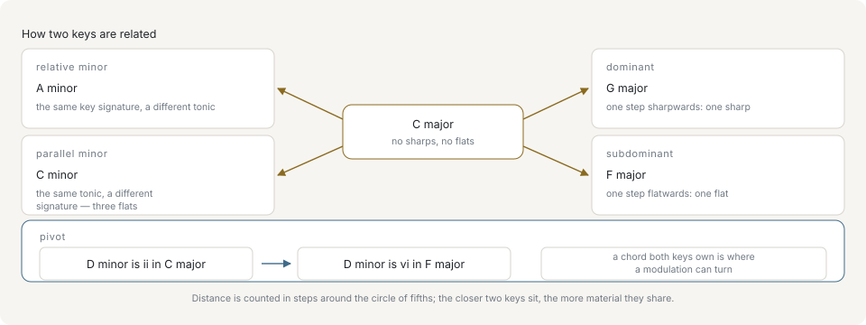

# Key relations and modulation

The musical vocabulary this page assumes — scale, degree, key signature, tonic — is taught in [the primer's page on scales and keys](primer/scales-and-keys.md).

A key is a root pitch class plus a mode mask, which says nothing about how it is written. The relation functions add that: they travel around the circle of fifths — the ordering of keys by signature, each a fifth from the next — and read the tonic back off it, which is what keeps the spelling right.

## Spelling a key

`SpelledKey` pairs a key with the spelled tonic that anchors its letter names. The tonic carries no octave, because a key is rooted on a pitch class:

```ts
import { formatNote, majorKey, scaleByName, spelledKeyOf } from '@libraz/libcantus';

formatNote(spelledKeyOf(majorKey(1)).tonic); // 'Db'
formatNote(spelledKeyOf(scaleByName('harmonicMinor', 8)).tonic); // 'G#'
```

Among the signatures in [-7, 7] whose key has the requested root, the one with the fewest accidentals names it — so pitch class 1 in major is Db with five flats rather than C# with seven sharps. A scale that is not a diatonic mode keeps its own mask and borrows only the tonic spelling of its parallel major or minor: G# harmonic minor is spelled G# and stays harmonic minor.

## Key signatures

```ts
import { formatNote, keyFromFifths, keySignatureFifths, majorKey, parseNote } from '@libraz/libcantus';

keySignatureFifths(parseNote('D'), majorKey(2)); // 2
keySignatureFifths(parseNote('Eb'), majorKey(3)); // -3

const twoSharps = keyFromFifths(2, 'major');
formatNote(twoSharps.tonic); // 'D'
```

The count is signed: positive is sharps, negative is flats. `keyFromFifths` is the inverse, and takes the mode because one signature names two keys. `Key` carries the same pair as a getter and a factory:

```ts
import { Key } from '@libraz/libcantus';

Key.major('D').fifths; // 2
Key.major('Eb').fifths; // -3
Key.fromFifths(2).toString(); // 'D major'
Key.fromFifths(2, 'minor').toString(); // 'B minor'
```

`Key.toString` names the scale the key actually carries rather than the major or minor key nearest to it: a mode names its mode, and a minor key holding a harmonic or melodic form says so. `Key.parse` reads that same text back, so a key stored as a string is restored as the key it was:

```ts
import { Key } from '@libraz/libcantus';

Key.named('dorian', 'D').toString(); // 'D dorian'
Key.parse('D dorian').toString(); // 'D dorian'
Key.parse('A harmonic minor').toString(); // 'A harmonic minor'
```

The scale word is an English qualifier. Asked for another notation system — `toString({ system: 'german' })` — a key names its parallel plain major or minor there, because the other systems have no word for the form.

The form itself is the key's `variant`: `'major'`, `'natural'`, `'harmonic'`, `'melodic'`, or `'modal'` for a key standing in none of the four. It is set by naming the scale that carries it, and read back off the resolved key. `variantOfMask` makes the same reading from a bare mode mask, which is what `resolveKey` does for a key that arrives as pitch classes alone:

```ts
import { Key, majorKey, scaleByName, variantOfMask } from '@libraz/libcantus';

Key.named('harmonicMinor', 'A').variant; // 'harmonic'
Key.minor('A').variant; // 'natural'
Key.named('dorian', 'D').variant; // 'modal'

variantOfMask(scaleByName('harmonicMinor', 9).modeMask12); // 'harmonic'
variantOfMask(majorKey(0).modeMask12); // 'major'
```

A `variant` handed in alongside a scale is checked rather than trusted: `resolveKey` and `Key.of` raise `InvalidInputError` for a form the mask does not hold, since a key claiming `'harmonic'` over a major mask would print as a harmonic minor while comparing equal to plain C major. `assertKeyVariant` is that check on its own, for a caller validating a stored key before building it.

`isSignatureKey` says whether a key is written with a signature of its own — the seven diatonic modes, and the harmonic and melodic minor, whose raised degrees are printed as accidentals against the minor signature — rather than borrowing its parallel major's or minor's as an approximation. A scale that only borrows one has to be spelled from the scale itself, since nothing about how it is written follows from that signature:

```ts
import { isSignatureKey, scaleByName } from '@libraz/libcantus';

isSignatureKey(scaleByName('harmonicMinor', 9)); // true
isSignatureKey(scaleByName('majorPentatonic', 0)); // false
```

## The closely related keys



Each spoke is one short move: the relative minor keeps the signature and moves the tonic, the parallel minor keeps the tonic and changes the signature, and the dominant and subdominant are a single step sharpwards and flatwards around the circle. Distance is counted in those steps, and the closer two keys sit the more material they share — which is what makes a chord both of them own a place a modulation can turn. `relatedKeysOf` returns those four together with the relative minors of the dominant and the subdominant, in a fixed order.

```ts
import { formatNote, majorKey, parseNote, relatedKeysOf } from '@libraz/libcantus';

const related = relatedKeysOf(parseNote('C'), majorKey(0));

related.map((entry) => entry.relation);
// ['relative', 'parallel', 'dominant', 'subdominant', 'relativeOfDominant', 'relativeOfSubdominant']
related.map((entry) => formatNote(entry.tonic));
// ['A', 'C', 'G', 'F', 'E', 'D']
```

`Key.relatedKeys` answers the same question with keys rather than spelled tonics:

```ts
import { Key } from '@libraz/libcantus';

const related = Key.major('C').relatedKeys();

related.map((entry) => entry.relation);
// ['relative', 'parallel', 'dominant', 'subdominant', 'relativeOfDominant', 'relativeOfSubdominant']
related.map((entry) => entry.key.toString());
// ['A minor', 'C minor', 'G major', 'F major', 'E minor', 'D minor']
```

Each relation is also available on its own — `relativeKeyOf`, `parallelKeyOf`, `dominantKeyOf`, `subdominantKeyOf`, and on the class `relative`, `parallel`, `dominantKey`, `subdominantKey`. `enharmonicKeyOf` and `Key.enharmonic` give the other spelling of the same sounding key, or `null` when there is no conventional one.

```ts
import { formatNote, Key, majorKey, parseNote, relativeKeyOf } from '@libraz/libcantus';

formatNote(relativeKeyOf(parseNote('Db'), majorKey(1)).tonic); // 'Bb'

Key.major('Db').relative().toString(); // 'Bb minor'
Key.major('C').parallel().toString(); // 'C minor'
Key.major('C').dominantKey().toString(); // 'G major'
Key.major('C').subdominantKey().toString(); // 'F major'
Key.major('Db').enharmonic()?.toString(); // 'C# major'
Key.major('C').enharmonic(); // null
```

The relative of D-flat major is B-flat minor, not A-sharp minor. Every relation but the parallel is computed in fifths space for exactly this reason; the parallel travels no fifths, so it keeps the tonic spelling it was given.

`keyRelationBetween`, or `Key.relationTo`, answers the reverse question:

```ts
import { Key, keyRelationBetween, majorKey, minorKey, parseNote, resolveKey } from '@libraz/libcantus';

const cMajor = resolveKey({ tonic: parseNote('C'), scale: majorKey(0) });

keyRelationBetween(cMajor, resolveKey({ tonic: parseNote('A'), scale: minorKey(9) })); // 'relative'
keyRelationBetween(cMajor, resolveKey({ tonic: parseNote('Eb'), scale: minorKey(3) })); // null

Key.major('C').relationTo(Key.minor('A')); // 'relative'
Key.major('C').relationTo(Key.minor('Eb')); // null
```

Relations are tested in a fixed order and the first match wins. Only the identity test looks at the tonic spelling, so C-sharp minor and D-flat minor both read as the relative of E major.

## Keys on a degree

Not every relation is one of the six. `Key.keyOnDegree` names the key rooted on a scale degree, and `Key.keyHavingTonicAsDegree` inverts it — the two have no functional counterpart:

```ts
import { Key } from '@libraz/libcantus';

Key.minor('A').keyOnDegree(4).toString(); // 'D minor'
Key.minor('A').keyOnDegree(4, 'major').toString(); // 'D major'
Key.minor('D').keyHavingTonicAsDegree(4).toString(); // 'A minor'
```

Without a mode the diatonic triad on that degree decides it, so the fourth degree of A minor gives D minor while the fourth of C major gives F major. Naming a mode overrides that reading, which is how a move to the major on a minor key's degree is written.

## Finding modulations in a piece

Key regions are inferred, not declared. `keyTimelineFromNotes` searches note events directly; `detectModulations` works from an already-inferred chord timeline, which is usually the better input because chords carry more evidence per beat than raw pitches.

```ts
import { chordTimelineFromChords, detectModulations } from '@libraz/libcantus';

const timeline = chordTimelineFromChords(
  [
    { rootPc: 0, quality: 'maj', startBeat: 0 },
    { rootPc: 7, quality: 'dom7', startBeat: 4 },
    { rootPc: 0, quality: 'maj', startBeat: 8 },
    { rootPc: 2, quality: 'dom7', startBeat: 12 },
    { rootPc: 7, quality: 'maj', startBeat: 16 },
    { rootPc: 4, quality: 'min', startBeat: 20 },
    { rootPc: 9, quality: 'min7', startBeat: 24 },
    { rootPc: 2, quality: 'dom7', startBeat: 28 },
    { rootPc: 7, quality: 'maj', startBeat: 32 },
  ],
  36,
);

const regions = detectModulations(timeline.segments);
regions.length >= 1; // true
regions[0]?.startBeat; // 0
regions[0]?.modulation; // undefined
regions[1]?.modulation; // 'dominant'
regions[1]?.pivot?.romanFrom; // 'I'
regions[1]?.pivot?.romanTo; // 'IV'
```

Each `KeyRegion` carries its span, the key in force, and a `confidence` in [0, 1] — the correlation between the span's pitch-class distribution and the key's profile, with a negative correlation reported as 0 rather than as itself.

From the second region on it also carries `modulation`, the named relation to the previous region's key. It is absent on the first region, which follows nothing, and absent where the two keys stand in none of the named relations; it is never `'same'`, since a region is the maximal span of one key and consecutive regions never share one. `pivot` names the chord the change turned on, and only the chord-aware entry points fill it in: a pivot is a chord that reads in both keys, so it cannot be identified without knowing which chord sounded. A modulation is a proposal supported by evidence, not a fact: show the confidence and let a user override the reading.

Both functions take the same options. The ones that matter most in practice:

- `ts` or `meters` — the meter, so bar lines and metric accents are read correctly. Give one when the piece is not in 4/4.
- `expectedKeyBeats` — how long a key is expected to hold, which sets how eagerly the search proposes a new region. It defaults to four bars.
- `minKeyBeats` — the shortest region the search will emit, one bar by default. Raise it when brief tonicizations are being reported as modulations. `keyTimelineFromNotes` sizes its slots by it; `detectModulations` takes its slots from the chords and folds a shorter region into the neighbouring key that reads its chords best. Either way a shorter region survives only where the analyzed span itself ends.

The two paths differ over one option. `profile` names a pitch-class profile — a twelve-entry vector indexed from the tonic, saying how strongly each chromatic degree is expected to sound — and in the note path it is what every slot is scored against. `detectModulations` scores each chord by the part it plays in a key instead, so the profile takes no part in choosing which keys are reported — the chords settle that. It still scores each region's `confidence`, the correlation described above, exactly as it does in the note path.

Three profiles are built in, named by `'krumhansl'`, `'temperley'`, and `'flat'`. `'krumhansl'` is the default and holds the Krumhansl–Kessler probe-tone ratings, which are listener judgements and so keep some weight on every chromatic degree. `'temperley'` holds the Kostka–Payne corpus proportions, where the chromatic degrees fall close to zero: decisive on diatonic music, blunt on chromatic music. `'flat'` weights every scale degree alike and every chromatic degree at nothing, which reduces the ranking to plain scale membership. A caller's own `{ major, minor }` pair goes in the same option, each vector indexed from its own tonic and every entry a finite number.

`prevailingKeyOf` collapses a set of regions to the single key that holds for most of the span, which is what a global label in a UI should show.

## Pivot chords

A pivot chord is diatonic in both the old key and the new one, and it is the smoothest way to explain a modulation to a reader:

```ts
import { majorKey, pivotChords } from '@libraz/libcantus';

pivotChords(majorKey(0), majorKey(7)).map((pivot) => `${pivot.romanFrom}=${pivot.romanTo}`);
// ['I=IV', 'iii=vi', 'V=I', 'vi=ii']
```

Each entry gives the chord and its numeral in both keys. When key regions come from `detectModulations`, the chord that straddles the boundary is attached to the region, so a report can name the pivot rather than only the beat where the key changed.

## Tonicization without modulation

Not every chromatic chord is a key change. A secondary dominant tonicizes a degree for a moment and leaves the key intact:

```ts
import { Chord, chordToRoman, majorKey, secondaryDominant, secondaryDominantOf } from '@libraz/libcantus';

const key = majorKey(0);

chordToRoman(secondaryDominant(5, key), key); // 'II7'
chordToRoman(secondaryDominant(5, key), key, { applied: true }); // 'V7/V'
chordToRoman(secondaryDominantOf(Chord.of('A', 'min')), key, { applied: true }); // 'V7/vi'

Chord.of('A', 'min').secondaryDominant().symbol(); // 'E7'
```

`secondaryDominantOf` reads any chord-shaped value, so a `Chord` goes in as it is; `Chord.secondaryDominant` is the same step from the chord itself. `applied` is off by default. Naming the root against the home key is always a correct spelling; whether a chromatic dominant is genuinely *applied* is a reading only the caller can make. Turning it on also makes `chordToRoman` the exact inverse of `romanToChord` for the chords `secondaryDominant` builds.

Borrowed chords are the other common case: the chord comes from the parallel mode and the tonic does not move.

```ts
import { borrowedSource, Chord, isBorrowedChord, Key, majorKey } from '@libraz/libcantus';

const key = majorKey(0);

isBorrowedChord(Chord.of('F', 'min'), key); // true
borrowedSource(Chord.of('F', 'min'), key); // 'parallelMinor'

Chord.of('F', 'min').isBorrowed(Key.major('C')); // true
Chord.of('F', 'min').borrowedSource(Key.major('C')); // 'parallelMinor'
Key.major('C').parallel().toString(); // 'C minor'
```

The distinction matters in a UI. A tonicization or a borrowed chord should be labelled inside the current key; only a sustained change of tonal centre deserves a new key region. See [Harmony](harmony.md) for how these chords are analyzed and [Reharmonization](reharmonization.md) for using them deliberately.
