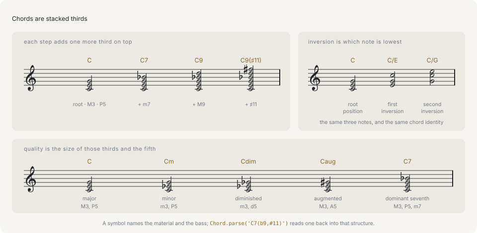

# Chords

A chord is several notes sounding at once. Western tonal music builds them by stacking thirds: take a scale, pick a starting note, and take every second note above it. Three notes stacked that way make a **triad**; four make a **seventh chord**. Everything else on this page is a variation on that one stack.

A chord in this library is plain data — a root, a quality name, and the semitone offsets of the tones above the root:

```ts
import { Chord } from '@libraz/libcantus';

Chord.parse('C').data;
// { rootPc: 0, quality: 'maj', intervals: [0, 4, 7], rootSpelling: { letter: 0, alter: 0 } }
```

`rootPc` is the root as a pitch class (0 = C, 1 = C-sharp/D-flat, …, 11 = B), `quality` names the kind of stack, and `intervals` are semitones measured up from the root. `rootSpelling` keeps the letter the root is written with, which is what separates a D-flat chord from a C-sharp chord in notation. Pitch classes and spelling are covered in [Pitch and intervals](pitch-and-intervals.md).



Each stack is the same operation applied one more time: a third on a third gives a triad, one more gives a seventh chord, and the thirds past the octave are the extensions. The bottom note of the *stack* is the root, which is a separate question from the bottom note actually sounding.

## Quality follows from the sizes of the thirds

A third is four semitones (major) or three (minor). Which one goes on the bottom and which on top is the whole of a triad's quality, and the fifth that closes the stack follows from that choice:

```ts
import { makeChord } from '@libraz/libcantus';

makeChord(0, 'maj').intervals; // [0, 4, 7]
makeChord(0, 'min').intervals; // [0, 3, 7]
makeChord(0, 'dim').intervals; // [0, 3, 6]
makeChord(0, 'aug').intervals; // [0, 4, 8]
```

Major is a major third under a minor third, minor is the reverse, and both close a perfect fifth at 7 semitones. Two minor thirds close a diminished fifth (6), two major thirds an augmented fifth (8). The quality name is a label for that arrangement.

## Seventh chords

Add one more third and the chord is named for the interval from its root to its new top note:

```ts
import { Chord } from '@libraz/libcantus';

Chord.parse('Cmaj7').pitchClasses(); // [0, 4, 7, 11]
Chord.parse('C7').pitchClasses(); // [0, 4, 7, 10]
Chord.parse('Cm7').pitchClasses(); // [0, 3, 7, 10]
Chord.parse('Cm7b5').pitchClasses(); // [0, 3, 6, 10]
Chord.parse('Cdim7').pitchClasses(); // [0, 3, 6, 9]
```

A major seventh is 11 semitones and a minor seventh 10, so `maj7` and `7` differ by one note. `ChordQuality` is a closed union of 43 names covering the triads, the sevenths, sixths, suspensions, and the common added-note chords; `chordQualities()` returns the list.

## Extensions and alterations

Keep stacking and the thirds run past the octave: the ninth, the eleventh, the thirteenth. Those are **extensions**, and `intervals` keeps them where they belong rather than folding them under the octave, so the shape of the stack survives a round trip:

```ts
import { Chord } from '@libraz/libcantus';

Chord.parse('C9').data.intervals; // [0, 4, 7, 10, 14]
Chord.parse('C13').data.intervals; // [0, 4, 7, 10, 14, 21]
Chord.parse('C9').pitchClasses(); // [0, 2, 4, 7, 10]
```

`pitchClasses()` is the same chord reduced to the twelve, which is what a detector or a piano-roll highlight wants; `intervals` is what a voicing wants.

An **alteration** raises or lowers one tone of the stack by a semitone without changing what the chord is:

```ts
import { Chord } from '@libraz/libcantus';

const altered = Chord.parse('C7(b9,#11)');

altered.data.intervals; // [0, 4, 7, 10, 13, 18]
altered.spec.alterations; // [{ degree: 9, alter: -1 }, { degree: 11, alter: 1 }]
altered.symbol(); // 'C7(b9,#11)'
```

`intervals` gives the sounding result; `spec` gives the structural reading — a base quality plus sevenths, alterations, additions, omissions, and a bass. The chord model is not a fixed list of names, so a symbol no quality covers still parses, sounds, and formats back.

## Inversion lives in `bassPc`

Playing the same three notes with a different one at the bottom gives an **inversion**. Root position has the root lowest, first inversion the third, second inversion the fifth.

```ts
import { Chord } from '@libraz/libcantus';

const first = Chord.of('C', 'maj').invert(1);

first.data.intervals; // [0, 4, 7]
first.data.bassPc; // 4
first.symbol(); // 'C/E'
Chord.of('C', 'maj').invert(2).symbol(); // 'C/G'
```

One rule governs the data model: **`intervals` always counts from the root, whatever is in the bass, and inversion is carried in `bassPc` alone.** A first-inversion C major chord is not `[0, 3, 8]` measured up from E; it is `[0, 4, 7]` from C with `bassPc` naming E. Rotating the interval list would throw the root away, and the root is what Roman numerals, harmonic function, and transposition are all computed from.

## Slash chords

`bassPc` is not required to be a chord tone. A slash chord puts an arbitrary note underneath a stack, and the notation is the same:

```ts
import { Chord } from '@libraz/libcantus';

Chord.parse('D/C').data.intervals; // [0, 4, 7]
Chord.parse('D/C').data.bassPc; // 0
Chord.parse('D/C').pitchClasses(); // [0, 2, 6, 9]
```

C is not in a D major triad, so `D/C` is not an inversion of anything — it is a D triad over a foreign bass. `pitchClasses()` includes the bass either way, because that is what sounds; `intervals` describes the stack alone.

## Chord symbols

A chord symbol is a text form of the structure above, and parsing and formatting are inverses of each other. Anywhere the API takes a `ChordLike`, the string works in place of the parsed value:

```ts
import { formatChordSymbol, parseChordSymbol, transposeChordSymbol } from '@libraz/libcantus';

parseChordSymbol('Am7');
// { rootPc: 9, quality: 'min7', intervals: [0, 3, 7, 10], rootSpelling: { letter: 5, alter: 0 } }
formatChordSymbol(parseChordSymbol('Am7')); // 'Am7'
transposeChordSymbol('C/E', 2); // 'D/F#'
```

Transposition moves the root, the bass, and the spelling together, so `C/E` up a whole tone is `D/F#` and not `D/Gb`.

## Figured bass

Figured bass is the older notation for the same idea: instead of naming the root, it writes the bass note and puts numbers under it for the intervals to be built above it.

```ts
import { Chord } from '@libraz/libcantus';

Chord.parse('C').figuredBass('C major'); // ''
Chord.parse('C/E').figuredBass('C major'); // '6'
Chord.parse('C/G').figuredBass('C major'); // '64'
Chord.parse('G7/B').figuredBass('C major'); // '65'
Chord.fromFiguredBass('E', '6', 'C major').symbol(); // 'C/E'
```

The figures count scale steps above the bass in the key, so they carry no root and no quality: `6` over E in C major is a C chord only because C major is what supplies the notes. Root position writes nothing at all, which is why the first line returns an empty string. The key is a required argument for that reason.

## Detection runs the same model backwards

Given a set of pitches rather than a name, `detectChord` ranks the chords that could account for them:

```ts
import { Chord, detectChordBest } from '@libraz/libcantus';

detectChordBest([60, 64, 67]); // { rootPc: 0, quality: 'maj', intervals: [0, 4, 7] }
Chord.detectBest([60, 64, 67, 71])?.symbol(); // 'Cmaj7'
Chord.detectBest([64, 67, 72])?.symbol(); // 'C/E'
Chord.detect([60, 64, 67]).length; // 6
```

Every candidate carries what it had to add (`extraPcs`) and what it had to assume was missing (`missingPcs`), so a caller can set its own threshold instead of trusting the top match. An input whose values all fall in 0..11 is read as unordered pitch classes and has no bass to report; MIDI numbers, as above, give the inversion too.

## Next

- [Harmony](../harmony.md) — the same chords read against a key, as Roman numerals and functions.
- [Voicing](../voicing.md) — turning a chord into actual pitches for actual voices.
- [Scales and keys](scales-and-keys.md) — where diatonic chords come from.
