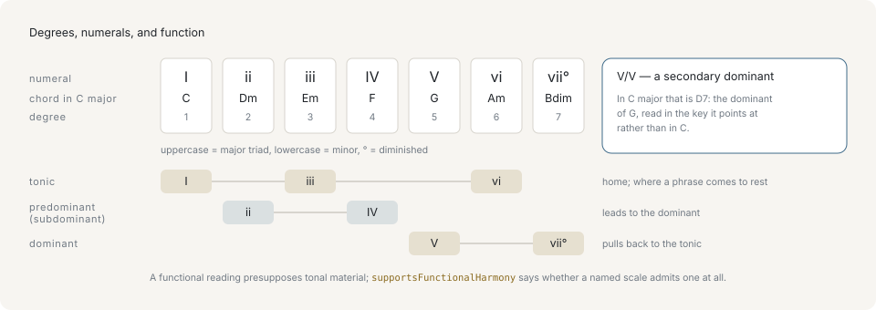
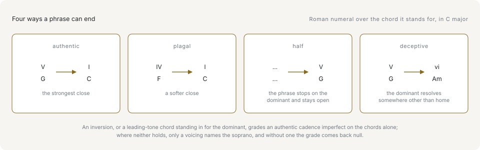

# Harmony

[Chords](chords.md) covered what a chord is on its own. Harmony is what a chord is *in a key*: `G7` is one thing in C major and another in G major, and almost every question worth asking about a progression is really a question about that relationship.

## A Roman numeral names a chord by its degree

Letter names travel with the chord. Roman numerals travel with the key: the numeral says which scale degree the chord is built on, so the same progression written in numerals holds in every key.

```ts
import { chordToRoman } from '@libraz/libcantus';

chordToRoman('G7', 'C major'); // 'V7'
chordToRoman('G7', 'G major'); // 'I7'
```

The chord did not change. The key did, and the numeral is a reading of one against the other.



Reading across a key gives every degree a numeral, and grouping those numerals gives the three functions the next section covers. A numeral is a position; a function is a job. The two are related but not the same, which is why chords on different degrees can share a function.

## Case carries the quality

The case of the numeral says what kind of triad stands on the degree, and a suffix marks the diminished one:

```ts
import { chordToRoman, diatonicTriad, majorKey } from '@libraz/libcantus';

const key = majorKey(0);

[1, 2, 3, 4, 5, 6, 7].map((degree) => chordToRoman(diatonicTriad(degree, key), key));
// ['I', 'ii', 'iii', 'IV', 'V', 'vi', 'viio']
```

Uppercase is a major triad, lowercase a minor one, and a trailing `o` a diminished one. The library writes `viio`; `vii°` and `viidim` both parse back to the same chord, so a host is free to render whichever it prefers. Arabic figures after the numeral carry sevenths and inversion exactly as figured bass does — `V7`, `V65`, `I6`.

## A numeral without a key is not a chord

`romanToChord` and `Chord.roman()` both take a key, and the class API refuses to invent one. `Chord.parse('G7').roman()` throws `InvalidInputError: chord has no key context; pass a Key or attach one with withKey()`. Attach the key and the same chord answers:

```ts
import { Chord, romanToChord } from '@libraz/libcantus';

Chord.parse('G7').withKey('C major').roman(); // 'V7'
Chord.parse('G7').withKey('G major').roman(); // 'I7'
romanToChord('V7', 'C major'); // { rootPc: 7, quality: 'dom7', intervals: [0, 4, 7, 10] }
```

Guessing a key from a single chord would be a detection step, and one chord is rarely enough evidence for one. Detecting a key from actual material is a separate call — `detectKey` and `keyTimelineFromNotes`, covered in [Analysis](../analysis.md).

## Function is what a chord does

Numerals name seven different chords, but they do not behave as seven different things. **Harmonic function** groups them by the role they play in a phrase:

- **Tonic** — the chord the phrase is at rest on, and the chords that stand in for it.
- **Subdominant** — the chords that move away from rest and set up the dominant. Textbooks that reserve "subdominant" for degree 4 alone call this function *predominant*; the API uses the one name for both.
- **Dominant** — the chords that pull back to the tonic, carrying the leading tone (degree 7, a semitone below the tonic) that does the pulling.

```ts
import { functionOf, Key } from '@libraz/libcantus';

functionOf('C', 'C major'); // 'tonic'
functionOf('Em', 'C major'); // 'tonic'
functionOf('Dm', 'C major'); // 'subdominant'
functionOf('F', 'C major'); // 'subdominant'
functionOf('G7', 'C major'); // 'dominant'

Key.major('C').progression('I', 'V', 'vi', 'IV').functions();
// ['tonic', 'dominant', 'tonic', 'subdominant']
```

`Em` and `C` share a function while sitting on different degrees. The grouping lets a progression be described by where it is going rather than by which chord it uses to get there. `analyzeChord` returns the function alongside the numeral and a `rationale` string naming the rule that settled it.

## Secondary dominants

Any chord in a key can be preceded by the dominant *of that chord*, borrowing the pull of a cadence for a degree that is not the tonic. That borrowed chord is a **secondary dominant**, and an **applied numeral** writes it as a numeral over its target:

```ts
import { chordToRoman, formatChordSymbol, majorKey, secondaryDominant } from '@libraz/libcantus';

const key = majorKey(0);

formatChordSymbol(secondaryDominant(5, key)); // 'D7'
chordToRoman('D7', 'C major'); // 'II7'
chordToRoman('D7', 'C major', { applied: true }); // 'V7/V'
chordToRoman('E7', 'C major', { applied: true }); // 'V7/vi'
```

**Applied numerals are off by default.** `II7` names the chord's root against the home key and is always a correct spelling; `V7/V` asserts that the chord is aimed at the fifth degree, which is a reading of the music rather than a fact about the chord. Ask for it when the surrounding progression supports it.

## Borrowed chords

A key has a **parallel minor** — the minor key on the same tonic, with a different set of notes. Chords taken from it and used in the major key are **borrowed**, and `analyzeChord` reports both that fact and where they came from:

```ts
import { analyzeChord } from '@libraz/libcantus';

const result = analyzeChord('Ab', 'C major');

result.roman; // 'bVI'
result.borrowed; // true
result.source; // 'parallelMinor'
result.function; // 'subdominant'
```

A borrowed chord keeps a function. `bVI` and `iv` both do subdominant work in C major, which is why they can be dropped into a major progression without breaking it. Substitution as a deliberate technique is in [Reharmonization](../reharmonization.md).

## Cadences

A **cadence** is how a phrase closes, read off the last two chords. Four are standard:

```ts
import { detectCadence } from '@libraz/libcantus';

detectCadence('G7', 'C', 'C major').type; // 'authentic'
detectCadence('F', 'C', 'C major').type; // 'plagal'
detectCadence('C', 'G', 'C major').type; // 'half'
detectCadence('G7', 'Am', 'C major').type; // 'deceptive'
```



Authentic closes dominant to tonic and is the strongest close available. Plagal closes subdominant to tonic. A half cadence stops *on* the dominant instead of resolving it, leaving the phrase open. A deceptive cadence sets up the authentic close and lands on the submediant (degree 6) instead. `detectCadence` also reports `phrygian` and `modal` closes, and returns `type: null` when the pair closes nothing.

## Grading a cadence needs a voicing

An authentic cadence is **perfect** when both chords stand on their roots and the soprano — the top voice — lands on the tonic, and **imperfect** otherwise. Two of those three conditions are answered by the chords. The third is answered only by knowing which note is on top, and chords do not carry that:

```ts
import { detectCadence } from '@libraz/libcantus';

detectCadence('G7', 'C', 'C major').strength; // null

const graded = detectCadence('G7', 'C', 'C major', {
  voicing: [
    [55, 62, 71],
    [48, 64, 72],
  ],
});

graded.strength; // 'perfect'
graded.soprano; // 'root'
```

`strength` is `null` rather than a guess whenever no voicing is supplied. The first result is not an imperfect cadence; it is a cadence that has not been graded. `rationale` says so in words.

## Modulation, key regions, and pivot chords

A piece that changes key **modulates**. The smooth way to do it is through a **pivot chord**: one that is diatonic in both keys, so it can be heard as belonging to the old key on arrival and to the new one on departure.

```ts
import { formatChordSymbol, pivotChords } from '@libraz/libcantus';

pivotChords('C major', 'G major').map((pivot) => [
  formatChordSymbol(pivot.chord),
  pivot.romanFrom,
  pivot.romanTo,
]);
// [['C', 'I', 'IV'], ['Em', 'iii', 'vi'], ['G', 'V', 'I'], ['Am', 'vi', 'ii']]
```

C major and G major share four triads, and each is a different hinge: `V - I` turns the old dominant into the new tonic, `I - IV` leaves through the old tonic. Over real material the unit of analysis is a **key region** — `keyTimelineFromNotes` returns `KeyRegion[]`, each with a beat span, a key, a confidence, and the pivot it turned on, so a key change is a boundary between regions rather than a flag on a chord. [Key relations and modulation](../key-relations-and-modulation.md) covers the relations and the timeline.

## Where a functional reading stops applying

Everything above assumes tonal material: a key with a tonic, a leading tone, and a dominant that pulls to it. That assumption is not universal, and the library says which scales it holds for rather than answering anyway:

```ts
import { Key, scaleSystemOf, supportsFunctionalHarmony } from '@libraz/libcantus';

Key.major('C').system(); // 'common-practice'
scaleSystemOf('dorian'); // 'modal'
scaleSystemOf('hijaz'); // 'non-functional'
supportsFunctionalHarmony('dorian'); // true
supportsFunctionalHarmony('hijaz'); // false
```

Modal material gets numerals and functions with the dominant's pull relaxed, since a mode holds together by something other than a leading tone. A `non-functional` scale gets neither, and asking for a Roman-numeral analysis of it produces a label with nothing behind it. Check `supportsFunctionalHarmony` before building a UI on numerals for arbitrary input.

## Next

- [Analysis](../analysis.md) — finding chords, keys, and cadences in note events rather than being handed them.
- [Key relations and modulation](../key-relations-and-modulation.md) — the circle of fifths, related keys, and key timelines.
- [Reharmonization](../reharmonization.md) — substituting chords on purpose.
- [Voices](voices.md) — what a voicing is, and why the cadence grader wanted one.
