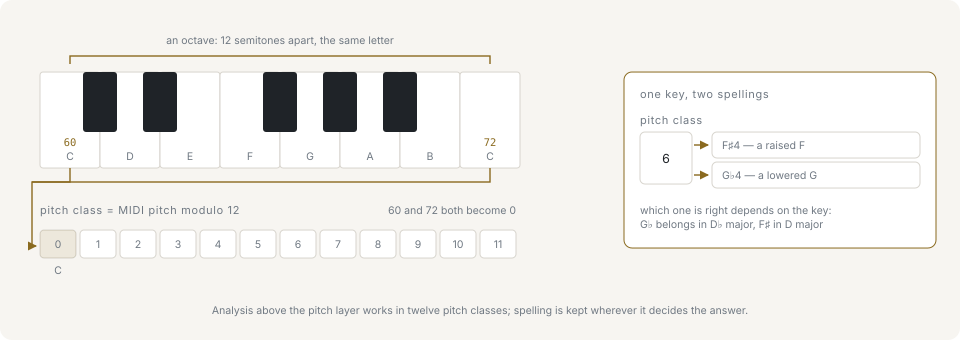
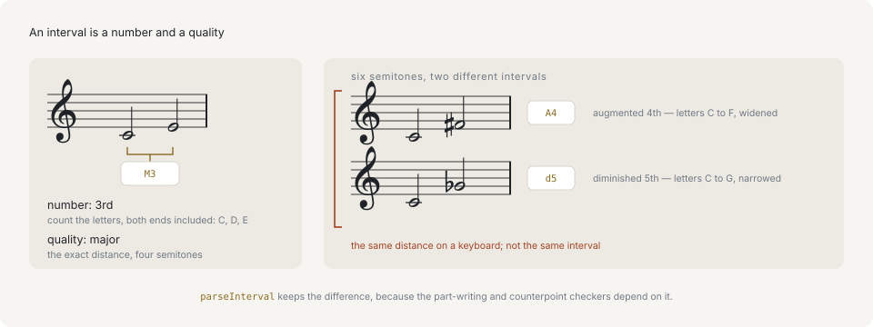

# Pitch and intervals

## Pitch, pitch class, and octave



A pitch is one sounding note, identified by a MIDI number: middle C is 60, and every step of 1 is a semitone, the smallest distance in twelve-tone tuning. A **pitch class** is that number modulo 12, so it names the note without saying which octave it is in — every C is pitch class 0. The **octave** is the rest of the number, the part pitch class throws away. Twelve semitones is one octave, and two pitches an octave apart sound like the same note at a different height.

```ts
import { Note } from '@libraz/libcantus';

const c4 = Note.parse('C4');

c4.midi; // 60
c4.pitchClass; // 0
c4.octave; // 4
Note.parse('C5').midi; // 72
Note.parse('C5').pitchClass; // 0
```

Which of the three a function takes is the first thing to check. Chord and key detection work in pitch classes, because a chord is the same chord whichever octave its notes land in. Voicing and voice leading work in MIDI numbers, because the distance between two voices is exactly what they are deciding.

## A spelled note is a letter, an alteration, and an octave

`Note` — and the plain `{ letter, alter, octave? }` data behind it — is not a MIDI number. `letter` is 0..6 for the seven letter names C D E F G A B, `alter` is a signed count of semitones (1 for a sharp, -1 for a flat, 2 for a double sharp), and `octave` is optional.

```ts
import { parseNote } from '@libraz/libcantus';

parseNote('C#4'); // { letter: 0, alter: 1, octave: 4 }
parseNote('Db4'); // { letter: 1, alter: -1, octave: 4 }
```

`letter` is 0..6 rather than a pitch class because the letter is what a musician actually reads, and what interval arithmetic counts. C# and Db are the same key on a keyboard, but C to F# spans four letters and C to Gb spans five, so the two names produce two different intervals. A pitch class cannot record that difference; a letter can. The library calls the letter-plus-alteration pair a note's **spelling**.

## Enharmonic spellings

Two spellings that sound the same pitch are **enharmonic**. Converting a spelled note to MIDI is lossless in one direction and not in the other:

```ts
import { formatNote, midiToNote, Note, noteToMidi, parseNote } from '@libraz/libcantus';

noteToMidi(parseNote('C#4')); // 61
noteToMidi(parseNote('Db4')); // 61
formatNote(midiToNote(61)); // 'C#4'
formatNote(midiToNote(61, 'flat')); // 'Db4'

Note.parse('C#4').enharmonic().map((note) => note.name); // ['Db4', 'B##3']
```

`midiToNote` has no context, so it applies a fixed default. Which spelling is *right* is decided by the key: pitch class 1 is C# in D major, where the scale already contains C#, and Db in B-flat major, where it does not. `spellPitch` takes the key and answers accordingly:

```ts
import { formatNote, majorKey, parseNote, spellPitch } from '@libraz/libcantus';

formatNote(spellPitch(61, parseNote('D'), majorKey(2))); // 'C#4'
formatNote(spellPitch(61, parseNote('Bb'), majorKey(10))); // 'Db4'
```

This is why so many functions in the library ask for a key they do not otherwise need. Anything that produces a name rather than a number has to be told which key it is naming it in.

## A note without an octave

The octave is optional, and leaving it out is a meaningful state rather than a missing field. Such a note has a pitch class and a spelling but no MIDI number:

```ts
import { noteToPitchClass, parseNote } from '@libraz/libcantus';

parseNote('Bb'); // { letter: 6, alter: -1 }
noteToPitchClass(parseNote('Bb')); // 10
```

Reading `.midi` on one throws `InvalidInputError` instead of guessing an octave. Key tonics, chord roots, and scale members are all stored this way, because none of them is in any particular octave.

## Intervals



An **interval** is the distance between two pitches, and it takes two values to state, not one. The **number** counts letter names inclusively — C up to E is a third, because C, D, E is three letters. The **quality** says how the interval is filled in: `M` major, `m` minor, `P` perfect, `A` augmented, `d` diminished. Seconds, thirds, sixths and sevenths come in major and minor; unisons, fourths, fifths and octaves come in perfect. A quality one semitone wider than major or perfect is augmented, one narrower than minor or perfect is diminished.

```ts
import { Interval, Note, parseInterval } from '@libraz/libcantus';

parseInterval('M3'); // { number: 3, quality: 'M', semitones: 4, descending: false }
Interval.between(Note.parse('C4'), Note.parse('E4')).name; // 'M3'
Interval.parse('M3').invert().name; // 'm6'
```

The semitone count is carried alongside, not instead. Everywhere an interval is accepted, the string form works: `'P5'`, `'-M3'` for a descending major third.

## An augmented fourth is not a diminished fifth

Both span six semitones. They are different intervals because they span a different number of letters, and they behave differently: an augmented fourth wants to expand outward, a diminished fifth to contract inward. Keeping the number separate from the semitone count is what lets the library tell them apart, and it decides the spelling of whatever comes out of a transposition.

```ts
import { Interval, Note, parseInterval } from '@libraz/libcantus';

parseInterval('A4').semitones; // 6
parseInterval('d5').semitones; // 6

Interval.between(Note.parse('C4'), Note.parse('F#4')).name; // 'A4'
Interval.between(Note.parse('C4'), Note.parse('Gb4')).name; // 'd5'

Note.parse('C4').transposeBy('A4').name; // 'F#4'
Note.parse('C4').transposeBy('d5').name; // 'Gb4'
```

## Consonance

Intervals sort into three classes by how stable they sound together: perfect consonance (unison, fifth, octave), imperfect consonance (thirds and sixths), and dissonance (seconds, sevenths, the tritone). The classification is a convention of common-practice counterpoint rather than an acoustic measurement, and every counterpoint and part-writing rule in the library is built on it.

```ts
import { classifyInterval, ConsonanceClass, Interval } from '@libraz/libcantus';

Interval.parse('P5').isConsonant(); // true
Interval.parse('M3').isConsonant(); // true
Interval.parse('P4').isConsonant(); // false
Interval.parse('P4').isConsonant(false); // true

classifyInterval(7) === ConsonanceClass.PerfectConsonance; // true
```

The perfect fourth is the one interval whose answer depends on the texture, which is why the call takes a second argument. Between two voices alone it counts as a dissonance and needs resolving; supported from below in a fuller texture it does not. The default is the two-voice reading, because that is what species counterpoint assumes.

## Transposition

Transposing by a number of semitones and transposing by an interval are different operations on a spelled note. Semitones move the pitch and leave the spelling to a default; an interval moves the letter too, so the result is spelled the way the interval names it.

```ts
import { Note, parseNote, transposeNote } from '@libraz/libcantus';

Note.parse('C4').transpose(7).name; // 'G4'
Note.parse('C4').transposeBy('P5').name; // 'G4'
transposeNote(parseNote('C4'), 6); // { letter: 3, alter: 1, octave: 4 }
```

Use the interval form whenever the output is going to be read as notation. Use the semitone form for pitch arithmetic that ends in a MIDI number.

## Where to go next

[Pitch and notation](../pitch-and-notation.md) covers the full spelling API — `spellLine` over a whole voice, chord- and key-aware spelling, the parse-result variants, and note names in German, Japanese, Italian, and fixed-do. [Tuning and frequency](../tuning-and-frequency.md) covers the step from a pitch to an actual frequency in hertz, which nothing on this page involves.
