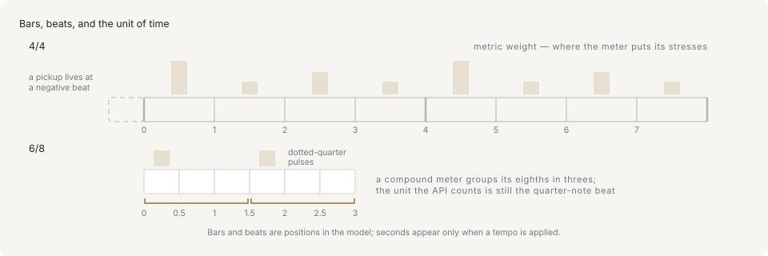

# Rhythm and meter

## The beat is always a quarter note

Every time value in this library is measured in **quarter-note beats**. A `NoteEvent` places itself with `startBeat` and lasts `durationBeat`, and both are quarter notes, in every time signature, with no exceptions.

```ts
import type { NoteEvent } from '@libraz/libcantus';

const notes: NoteEvent[] = [
  { pitch: 60, startBeat: 0, durationBeat: 1 },
  { pitch: 64, startBeat: 1, durationBeat: 0.5 },
];

notes[1]?.startBeat; // 1
notes[1]?.durationBeat; // 0.5
```

Three things the beat is not. It is not the *felt* beat — the pulse a listener taps along to — which in 6/8 is a dotted quarter and so covers 1.5 of these beats. It is not seconds; nothing about a beat says how long it takes until a tempo is supplied. And it is not ticks; a PPQ grid is a separate representation that `beatsToTicks` converts to. A quarter-note beat is a fixed unit chosen so that one number means the same thing everywhere, and reading it as any of the other three is where time bugs come from.

```ts
import { durationToBeats } from '@libraz/libcantus';

durationToBeats('quarter'); // 1
durationToBeats('eighth'); // 0.5
durationToBeats('whole'); // 4
```

## Bars and time signatures



A **bar** is a fixed-length group of beats, repeating from the start of the piece. Its length comes from the **time signature**, written as two numbers: the lower one names the note value that counts as one unit, the upper one says how many of those fit in a bar. In 4/4 the bar is four quarter notes; in 3/4, three; in 6/8, six eighth notes, which is three quarter-note beats.

A **bar position** splits an absolute beat into which bar it falls in and how far into that bar it is — the offset is again in quarter-note beats, not in the signature's own units.

```ts
import { beatsPerBar, beatToBarPosition, formatBarPosition } from '@libraz/libcantus';

beatsPerBar('4/4'); // 4
beatToBarPosition(4, '4/4'); // { bar: 1, beat: 0 }
beatToBarPosition(5, '4/4'); // { bar: 1, beat: 1 }
formatBarPosition(5, '4/4'); // '2.2'
```

A piece that changes signature partway is described by a `MeterMap`, an array of `{ startBeat, ts }` changes; passing one signature is shorthand for a map with a single entry.

## Simple and compound meter

In **simple** meter the felt beat divides in two. In **compound** meter it divides in three, and the signature says so by writing the division rather than the pulse: 6/8 is not six beats but two pulses of three eighths each. That is the one place where the count in the signature and the count a listener feels come apart, and it is the case worth working through.

```ts
import { beatsPerBar, isCompound, pulseBeats, pulsesPerBar } from '@libraz/libcantus';

isCompound('3/4'); // false
isCompound('6/8'); // true

beatsPerBar('6/8'); // 3
pulsesPerBar('6/8'); // 2
pulseBeats('6/8'); // 1.5
```

Read those three answers together. A 6/8 bar is six eighth notes, which is `beatsPerBar` 3 quarter-note beats of library time. It is felt as `pulsesPerBar` 2 pulses, each `pulseBeats` 1.5 beats long — a dotted quarter. Placing a note on "beat 2" of a 6/8 bar means beat 1.5, not beat 1. `beatsPerBar` is what bar arithmetic uses; `pulseBeats` is what a metronome would click.

## Metric weight

Positions within a bar are not equal. The downbeat carries the most weight, the other pulses less, subdivisions between them least. `metricWeight` grades a beat from 3 down to 0.

```ts
import { metricWeight } from '@libraz/libcantus';

metricWeight(0, '4/4'); // 3
metricWeight(1, '4/4'); // 1
metricWeight(2, '4/4'); // 2
metricWeight(0.5, '4/4'); // 0

metricWeight(0, '6/8'); // 3
metricWeight(1.5, '6/8'); // 2
metricWeight(1, '6/8'); // 0
```

Beat 2 of a 4/4 bar outranks beats 1 and 3 because the half-bar is the next strongest point after the downbeat. In 6/8 the second pulse at 1.5 is the strong one and beat 1 is off-pulse entirely, which is the same fact as the compound division seen from the accent side.

Metric weight is what several analyses are built on. Chord segmentation prefers to start a chord on a strong beat; a note on a weak beat is a better candidate for a passing tone than one on a downbeat; phrase and hypermeter detection look for repeating weight patterns; and generation uses it to place onsets and shape accents. An analysis run under the wrong signature comes out wrong in a way that still looks plausible, so supply the correct meter map wherever one is known.

## Bar numbers: 0-based in the data, 1-based when formatted

The numeric conversions call the first full bar 0. The formatters print that same bar as 1, the way a printed score numbers it.

```ts
import { beatToBarPosition, formatBarPosition } from '@libraz/libcantus';

beatToBarPosition(0, '4/4'); // { bar: 0, beat: 0 }
formatBarPosition(0, '4/4'); // '1.1'
```

Both origins are deliberate: 0-based numbering lets bar arithmetic run below the first bar, and 1-based display matches what a musician reads off a score. A UI that prints a `bar` field straight from `beatToBarPosition` reads one lower than the library's own output — add 1, or format the beat with `formatBarPosition` instead of numbering it.

## The pickup

A **pickup** (also called an anacrusis) is the run-in before the first downbeat: a piece that starts on the last beat of an incomplete bar. Beat 0 is the first downbeat, so a pickup lives at negative beats and in bar -1.

```ts
import { beatToBarPosition, formatBarPosition } from '@libraz/libcantus';

const pickup = [
  { pitch: 67, startBeat: -1, durationBeat: 1 },
  { pitch: 72, startBeat: 0, durationBeat: 2 },
];

pickup.map((note) => formatBarPosition(note.startBeat, '4/4')); // ['0.4', '1.1']
beatToBarPosition(-1, '4/4'); // { bar: -1, beat: 3 }
```

Negative beats are valid input throughout, which is what the 0-based bar origin is for. The formatter prints bar -1 as bar 0, again matching score practice.

## Tempo is the only thing that makes beats into seconds

Nothing above involves real time. A tempo — beats per minute — is what converts, and it is the only thing that does.

```ts
import { beatsToSeconds, beatsToTicks, Tempo } from '@libraz/libcantus';

beatsToSeconds(4, [{ startBeat: 0, bpm: 120 }]); // 2
Tempo.of(120).secondsAt(8); // 4
Tempo.of(120).ticksAt(2, 480); // 960
beatsToTicks(1.5, 480); // 720
```

One marking holds until the next, so a piece that changes tempo is described by a `TempoMap` — an array of `{ startBeat, bpm }` events, integrated piecewise across the changes. Ticks are the other conversion out of beats, onto a PPQ grid, and they need no tempo at all: a tick is a subdivision of a beat, not of a second.

## Note values and dots

A written note value is a second spelling of the same durations. A dot after a note adds half its length again, and a second dot adds half of that.

```ts
import { beatsToDuration, durationToBeats } from '@libraz/libcantus';

durationToBeats({ base: 'half', dots: 1 }); // 3
durationToBeats({ base: 'quarter', dots: 1 }); // 1.5
beatsToDuration(1.5); // { base: 'quarter', dots: 1 }
beatsToDuration(2); // { base: 'half', dots: 0 }
```

Work in beats and convert at the edges. `durationToBeats` is for reading notation in, `beatsToDuration` for writing it back out, and `beatsToTiedDurations` for a length that no single written value covers.

## Where to go next

[Time and arrangement](../time-and-arrangement.md) covers meter maps and meter changes, additive and tuplet meters, the `Meter`, `Tempo` and `Duration` classes, and arrangement-level analysis over tracks. [Rhythm and groove](../rhythm-and-groove.md) covers rhythm generation, groove templates, and humanization.
