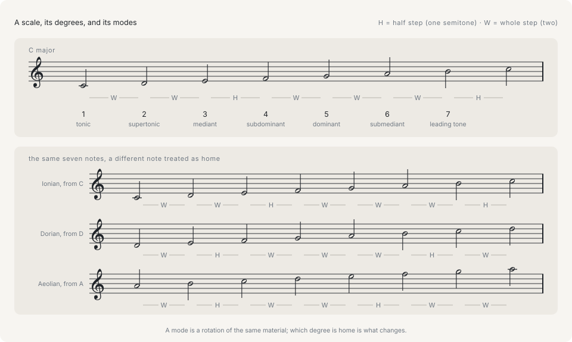

# Scales and keys

## A scale is the pitch material

A **scale** is the set of pitches a passage draws on, listed once in ascending order from a starting note called the **root**. It is not an ordering the music has to follow; it is the supply. Most Western music uses seven-note scales, and the major scale is the reference case.

```ts
import { diatonicPitchClasses } from '@libraz/libcantus';

const major = diatonicPitchClasses('C major');

major; // [0, 2, 4, 5, 7, 9, 11]

const steps = [...major, 12].slice(1).map((pc, i) => pc - (major[i] ?? 0));
steps; // [2, 2, 1, 2, 2, 2, 1]
```

Those steps are the definition. A **whole step** is two semitones, a **half step** is one, and the major scale is the pattern whole-whole-half-whole-whole-whole-half. Start that pattern on any of the twelve pitch classes and the result is a major scale; the pattern is the scale, and the root only says where it starts. The library stores exactly that: a `KeyScale` is a root pitch class plus a twelve-bit mask marking which semitones above the root belong to the scale.

## Degrees



A **degree** is a position in the scale, counted from 1 at the root. Degrees are how harmony is described independently of key — "the fifth degree" means G in C major and D in G major, and a rule stated about degree 5 holds in both. Each degree has a traditional name:

| Degree | Name | Note in C major |
|---|---|---|
| 1 | tonic | C |
| 2 | supertonic | D |
| 3 | mediant | E |
| 4 | subdominant | F |
| 5 | dominant | G |
| 6 | submediant | A |
| 7 | leading tone | B |

The tonic is the note the music treats as home. The dominant is the degree that pulls hardest back to it, and the leading tone sits a half step below the tonic and pulls up into it — that half step is why the seventh degree carries the tension it does.

```ts
import { Key } from '@libraz/libcantus';

const c = Key.major('C');

c.degree(1).name; // 'C'
c.degree(5).name; // 'G'
c.degree(7).name; // 'B'
c.degreeOf(67); // 5
c.degreeOf(61); // null
```

Degrees are 1-based throughout the library, in both directions. `Key.degreeOf` answers `null` for a pitch outside the scale, so an off-scale note can never be mistaken for the tonic.

## Modes

A **mode** is the same pitch material read as though a different degree were home. D dorian holds the same seven pitch classes as C major; what differs is which of them is the tonic, and therefore where the half steps fall relative to it.

```ts
import { diatonicPitchClasses, Key } from '@libraz/libcantus';

Key.major('C').noteNames(); // ['C', 'D', 'E', 'F', 'G', 'A', 'B']
Key.named('dorian', 'D').noteNames(); // ['D', 'E', 'F', 'G', 'A', 'B', 'C']

diatonicPitchClasses('C major'); // [0, 2, 4, 5, 7, 9, 11]
diatonicPitchClasses(Key.named('dorian', 'D')); // [0, 2, 4, 5, 7, 9, 11]
```

The seven rotations of the major scale are the church modes: ionian (the major scale itself), dorian, phrygian, lydian, mixolydian, aeolian (the natural minor scale), and locrian. `Key.named` and `scaleByName` build any of them on any root.

## The three minor scales

Minor is three related scales rather than one. The natural minor is the sixth rotation of the major scale and has no leading tone: its seventh degree is a whole step below the tonic. Raising that seventh degree gives the harmonic minor, which restores the leading tone at the cost of a step of three semitones between degrees 6 and 7. Raising the sixth degree as well gives the melodic minor, which removes that gap.

```ts
import { Key } from '@libraz/libcantus';

Key.minor('A').noteNames(); // ['A', 'B', 'C', 'D', 'E', 'F', 'G']
Key.named('harmonicMinor', 'A').noteNames(); // ['A', 'B', 'C', 'D', 'E', 'F', 'G#']
Key.named('melodicMinor', 'A').noteNames(); // ['A', 'B', 'C', 'D', 'E', 'F#', 'G#']

Key.minor('A').variant; // 'natural'
```

A piece in a minor key draws on all three, choosing per phrase: the harmonic form under a dominant chord, the melodic form in a rising line, the natural form elsewhere. `Key.minor` gives the natural form, and `variant` records which one a key is holding, so analysis can report that a G# in A minor is the raised seventh rather than a foreign note.

## A key is a tonic, a scale, and a spelling

A **key** is a scale with one of its degrees designated as home, written a particular way. The third part matters as much as the first two. F-sharp major and G-flat major contain the same twelve-tone pitches and are the same `KeyScale`; they are different keys because they are written differently, and a piece is written in one or the other.

```ts
import { Key } from '@libraz/libcantus';

Key.major('F#').noteNames(); // ['F#', 'G#', 'A#', 'B', 'C#', 'D#', 'E#']
Key.major('Gb').noteNames(); // ['Gb', 'Ab', 'Bb', 'Cb', 'Db', 'Eb', 'F']

Key.major('F#').scale.rootPc === Key.major('Gb').scale.rootPc; // true
Key.major('F#').scale.modeMask12 === Key.major('Gb').scale.modeMask12; // true
```

## The key signature and the count of fifths

A **key signature** is the set of sharps or flats printed once at the start of a staff instead of in front of every note. The library stores it as a signed count of fifths: positive counts sharps, negative counts flats, zero is the natural signature shared by C major and A minor.

```ts
import { Key } from '@libraz/libcantus';

Key.major('C').fifths; // 0
Key.major('D').fifths; // 2
Key.parse('Eb major').fifths; // -3
Key.major('F#').fifths; // 6
Key.major('Gb').fifths; // -6
Key.minor('A').fifths; // 0
```

One number holds the whole signature because the sharps and flats are always added in a fixed order, so the count determines the set. It is also the coordinate the circle of fifths runs on, which is what makes key distance a subtraction — see [Key relations and modulation](../key-relations-and-modulation.md).

## Three ways a key arrives, and only two carry a spelling

This is the distinction to keep straight when reading signatures. `KeyScale` is a root pitch class and a mask, and carries **no spelling** — it cannot tell F-sharp major from G-flat major, so nothing built from it alone can produce note names. `ResolvedKey` adds a spelled tonic and a minor variant. The `Key` class wraps a `ResolvedKey` and is the form that answers questions about names.

```ts
import { majorKey, resolveKey } from '@libraz/libcantus';

majorKey(6); // { rootPc: 6, modeMask12: 2741 }
resolveKey('C major');
// { scale: { rootPc: 0, modeMask12: 2741 }, tonic: { letter: 0, alter: 0 }, variant: 'major' }
```

`2741` is the mask for the major pattern, `0b101010110101`. Every entry point that takes a key accepts all three forms plus a string such as `'C major'`, and calls `resolveKey` on it. When a bare `KeyScale` goes in, a tonic spelling is chosen for it — the one with the fewest accidentals — so passing `majorKey(6)` yields G-flat major rather than F-sharp major. Pass a spelled key when the piece is written the other way.

## Not every scale supports a Roman-numeral reading

Roman numerals, harmonic function, and cadences are conventions of common-practice tonality. They rely on the scale having a leading tone and stacking into thirds. Applied to a whole-tone scale or a pentatonic, they produce labels with nothing behind them, so the library sorts every named scale into one of three systems and says which ones the analysis applies to.

```ts
import { Key, scaleSystemOf, supportsFunctionalHarmony } from '@libraz/libcantus';

scaleSystemOf('major'); // 'common-practice'
scaleSystemOf('dorian'); // 'modal'
scaleSystemOf('wholeTone'); // 'non-functional'

supportsFunctionalHarmony('major'); // true
supportsFunctionalHarmony('miyakoBushi'); // false

Key.named('dorian', 'D').system(); // 'modal'
```

Check `supportsFunctionalHarmony` before offering a Roman-numeral reading in a UI. For a whole-tone passage the correct answer is that the analysis does not apply, not a numeral picked by approximation.

## WORLD_SCALES records pitch material, not a system

`NAMED_SCALES` holds the Western vocabulary. `WORLD_SCALES` holds scales named in other traditions, and an entry there is a set of pitch classes and nothing else.

```ts
import { Key, scaleByName, scaleTonesInDegreeOrder } from '@libraz/libcantus';

Key.named('miyakoBushi', 'E').noteNames(); // ['E', 'F', 'A', 'B', 'C']
scaleTonesInDegreeOrder(scaleByName('miyakoBushi', 0)); // [0, 1, 5, 7, 8]
```

The traditions these names come from carry far more than a pitch set — a rāga has an ascending and descending path and characteristic phrases, a maqām exchanges its constituent tetrachords as a line moves, and Japanese scales are described by the nuclear tones framing each tetrachord. None of that is in a twelve-bit mask. Reach for these entries when a pitch set is what is wanted, and do not read the name as a model of the system it comes from.

## Where to go next

[Scales and modes](../scales-and-modes.md) covers the mask representation in full, the built-in vocabularies and their aliases, chord–scale relationships with available tensions and avoid notes, and how a scale is spelled. [Key relations and modulation](../key-relations-and-modulation.md) covers the circle of fifths, related keys, pivot chords, and how a key change is detected in a piece.
