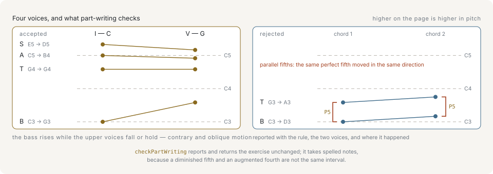

# Voices

A chord says which notes, not where. `C major` is C, E and G, and that leaves open which octave each one takes, how many players double which note, and what the bottom note is. A **voicing** is that decision: one concrete pitch per voice.

```ts
import { Voicing } from '@libraz/libcantus';

Voicing.satb('C').pitches; // [48, 60, 64, 67]
Voicing.forChord('C').pitches; // [60, 64, 67]
Voicing.forChord('C', { style: 'drop2' }).pitches; // [52, 60, 67]
```

The three calls voice the same chord three ways. Pitches come back as MIDI numbers in ascending order: `Voicing.satb` searches for an arrangement that fits per-voice ranges, and `Voicing.forChord` stacks the chord tones in a named style.

## Four voices, four ranges

The default convention here is **SATB** — soprano, alto, tenor, bass — the four-part choral texture that classical part-writing rules were written for. Four voices means four ranges, and the search keeps each voice inside its own:

```ts
import { SATB_RANGES } from '@libraz/libcantus';

SATB_RANGES;
// [{ min: 40, max: 60 }, { min: 48, max: 67 }, { min: 55, max: 74 }, { min: 60, max: 79 }]
```

Bass E2–C4, tenor C3–G4, alto G3–D5, soprano C4–G5. The ranges are conventional rather than physical: real singers exceed them, and the exercise tradition does not. Any other voice count gets evenly spaced ranges over roughly the same compass, because there is no conventional four-part answer to "voice this for five".

## Voice index 0 is the lowest voice

This holds everywhere in the API — in a voicing's pitch array, in `SATB_RANGES`, and in the `voices` field of a part-writing violation:

```ts
import { voiceChord } from '@libraz/libcantus';

const satb = voiceChord('C');

satb; // [48, 60, 64, 67]
satb[0]; // 48
satb[3]; // 67
```

Index 0 is the bass and the last index is the soprano. Score order on a page runs the other way, top staff first, so a renderer reverses; nothing inside the library does.

## Voice leading is the motion between two voicings

Given two chords, the interesting part is not either voicing but what each voice had to do to get from one to the other. That movement is **voice leading**, and the convention is to move each voice as little as possible.

```ts
import { voiceLeadingCost, voiceProgression } from '@libraz/libcantus';

voiceProgression(['C', 'G', 'Am', 'F']);
// [[48, 60, 64, 67], [43, 59, 62, 67], [45, 57, 60, 64], [41, 57, 60, 65]]
voiceLeadingCost([60, 64, 67], [59, 62, 67]); // 3
voiceLeadingCost([60, 64, 67], [48, 52, 55]); // 36
```

`voiceLeadingCost` is the total semitone movement across all voices and nothing more. It measures distance, not correctness: a low cost says the voices stayed put, not that the motion is clean. `voiceProgression` chooses each voicing for how well it continues the previous one, so voicing a progression is not the same as voicing each chord alone.



Two voices moving between two chords do one of four things, and part-writing convention is built on telling them apart. `voiceIndependence` counts them:

```ts
import { parseNote, voiceIndependence } from '@libraz/libcantus';

const upper = ['C5', 'D5', 'D5', 'F5', 'G5'].map((name) => parseNote(name));
const lower = ['E4', 'C4', 'E4', 'F4', 'G4'].map((name) => parseNote(name));

voiceIndependence(upper, lower).motion;
// { contrary: 0.25, oblique: 0.25, similar: 0.25, parallel: 0.25 }
```

The four moves in that pair, in order: **contrary** (the voices go opposite ways), **oblique** (one holds while the other moves), **similar** (both go the same way by different amounts), **parallel** (both go the same way by the same interval). Contrary motion is the preferred one, because it keeps the two lines audibly separate; parallel motion is what makes two voices fuse into one thickened line, which is why the rules below single out parallel perfect intervals in particular.

## The part-writing checker

`checkPartWriting` grades a sequence of voicings against the chords they realize. It reports; it does not rewrite:

```ts
import { checkPartWriting, majorKey, makeChord, spellVoicing } from '@libraz/libcantus';

const key = majorKey(0);
const chords = [makeChord(0, 'maj'), makeChord(2, 'maj')];
const voicings = [
  [48, 55, 64, 72],
  [50, 57, 66, 74],
].map((pitches, index) => spellVoicing(pitches, chords[index] ?? chords[0], key));

const violations = checkPartWriting(voicings, chords, key);

violations.map((violation) => violation.kind); // ['parallelFifth', 'parallelOctave']
violations[0]?.voices; // [0, 1]
violations[0]?.fromIndex; // 0
violations[0]?.toIndex; // 1
violations[0]?.rationale; // 'The two voices move into consecutive perfect fifths'
```

Every voice moved up a whole tone together, which slides the bass–tenor fifth and the bass–soprano octave along intact. A violation names the rule (`kind`), the voices involved by index (`voices`), the chord it starts and ends on (`fromIndex`, `toIndex`), and a one-sentence `rationale`. Eighteen kinds are checked, covering what happens inside one chord (`voiceCrossing`, `spacing`, `range`), what happens between two (`parallelFifth`, `parallelOctave`, `hiddenPerfect`, `overlap`, `crossRelation`, `unresolvedLeadingTone`, `unresolvedSeventh`), and the extra rules a species exercise adds.

The checker never touches the input. A student's answer is the thing being graded, and silently repairing it destroys the information the exercise exists to produce. An empty result means no rule was broken — not that the passage is good, and not that no rule could be judged, since bad options raise an error instead of quietly switching a rule off.

## Why the checker needs spelled notes

A MIDI number is a key on a keyboard. It cannot tell an augmented second from a minor third, or an augmented fourth from a diminished fifth, and it cannot see a cross relation at all — those distinctions live in the written letters:

```ts
import { isForbiddenMelodicLeap, parseNote } from '@libraz/libcantus';

isForbiddenMelodicLeap(parseNote('Ab4'), parseNote('B4')); // true
isForbiddenMelodicLeap(68, 71); // false
```

Both lines are the same two sounds. Spelled A-flat to B is an augmented second and forbidden; as 68 to 71 it is a minor third and permitted. Feeding MIDI numbers to the checkers would not produce wrong answers so much as quietly skip the rules that need letters, so they take spelled notes and `spellVoicing` is the step that produces them. Spelling is covered in [Pitch and intervals](pitch-and-intervals.md).

## Species counterpoint

Species counterpoint is a graded exercise: two lines, a fixed **cantus firmus** (the given line) and a written counterpoint against it, with the rhythm getting more elaborate at each step. `checkSpecies` grades species one through five.

```ts
import { checkSpecies, majorKey, parseNote } from '@libraz/libcantus';

const cantus = ['C4', 'D4', 'E4', 'D4', 'C4'].map((name) => parseNote(name));
const counterpoint = ['C5', 'A4', 'G4', 'B4', 'C5'].map((name) => parseNote(name));

checkSpecies(cantus, counterpoint, 1, majorKey(0)); // []
```

The five species:

1. **Note against note.** One counterpoint note per cantus note, every interval a consonance.
2. **Two against one.** Two counterpoint notes per cantus note; the weak half may be a dissonance passed through by step.
3. **Four against one.** Four notes per cantus note, which is the same rule with room for neighbour tones and the standing figures that quit a dissonance by leap.
4. **Syncopated.** The counterpoint is tied across the beat, so a note prepared as a consonance becomes a dissonance on the downbeat and resolves down by step — the suspension.
5. **Florid.** Mixed note values drawing on all four, which is why it is the one species that needs `opts.durations` to say where its notes fall.

Violations come back in the exercise's own time order, so the first one reported is the first one heard.

## Voice independence is a measurement, not a verdict

`voiceIndependence` answers how far two written lines behave as separate voices rather than as one line doubled. It returns numbers and stops there:

```ts
import { parseNote, voiceIndependence } from '@libraz/libcantus';

const lead = ['C5', 'D5', 'E5'].map((name) => parseNote(name));
const harmony = ['E4', 'F4', 'G4'].map((name) => parseNote(name));

const report = voiceIndependence(lead, harmony);

report.motion; // { contrary: 0, oblique: 0, similar: 0, parallel: 1 }
report.separation.min; // 8
report.crossings; // 0
report.longestPerfectRun; // 0
report.sounding; // 3
```

That harmony line runs a sixth below the lead throughout and comes out entirely parallel. Nothing there is a violation — a parallel sixth is not a parallel fifth, and doubling a melody in sixths is a normal thing to write. The report describes what was written and leaves the judgement to the caller. `rhythmicComplementarity` and `separation` fill out the same picture: together they are what distinguishes a second voice from a thickened first one.

## Next

- [Voicing](../voicing.md) — the search options, the named styles, and spelling a voicing for notation.
- [Counterpoint and part-writing](../counterpoint-and-part-writing.md) — every rule the checkers apply, and the individual predicates behind them.
- [Harmony](harmony.md) — the chords the voices are realizing.
