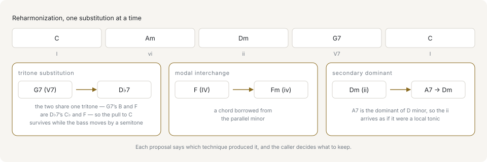

# Reharmonization

Reharmonization replaces the chords under a melody or a progression while keeping something fixed — the melody, the harmonic function, or just the length. The library offers the substitutions as proposals with their reasons attached, so a host can present them and let a user choose.

Chords, Roman numerals and harmonic function are the vocabulary this page works in. [The harmony primer](primer/harmony.md) teaches them and names the API for each.

## Substitutions for one chord



Each technique replaces a single chord and leaves the rest of the progression where it was, and each one carries the reason it was proposed: the tritone substitute keeps the guide tones of the dominant it stands in for, modal interchange takes a chord from the parallel mode, and a secondary dominant approaches the next chord as though that chord were a tonic of its own.

`substituteChord` returns every substitution it can justify for a chord in a key, each with its relationship, numeral, and harmonic function:

```ts
import { formatChordSymbol, majorKey, makeChord, substituteChord } from '@libraz/libcantus';

const subs = substituteChord(makeChord(7, 'dom7'), majorKey(0));

subs.map((sub) => sub.type).includes('tritone'); // true
formatChordSymbol(subs.find((sub) => sub.type === 'tritone')?.chord ?? makeChord(0, 'maj'));
// 'Db7'

// D7 resolves to G, so its substitute is spelled a semitone above G, not above C.
const applied = substituteChord(makeChord(2, 'dom7'), majorKey(0));
formatChordSymbol(applied.find((sub) => sub.type === 'tritone')?.chord ?? makeChord(0, 'maj'));
// 'Ab7'
```

The tritone substitute of G7 in C major is spelled Db7, not C#7. A tritone substitute is the bII7 of the chord its dominant resolves to, so it is written a semitone above that chord's root rather than above the key's tonic, and the spelling says so; where the key already spells that pitch class as a degree of its own, that letter is kept instead.

`Chord.substitutions` is the same query from the class API, and `Progression.substitute` puts one of them in place:

```ts
import { Chord, Key, Progression } from '@libraz/libcantus';

const subs = Chord.parse('G7').withKey(Key.major('C')).substitutions();
subs.find((sub) => sub.type === 'tritone')?.chord.rootPc; // 1

const progression = new Progression([Chord.parse('G7'), Chord.parse('C')], Key.major('C'));
progression.substitute(0, 'tritone').toString(); // 'Db7 C'
```

The four relationships:

| Type | Applies to | What it does |
| --- | --- | --- |
| `tritone` | Dominant-type chords | Replaces the dominant with the one a tritone away; the guide tones are shared. |
| `relative` | Triads and sevenths | Swaps in a chord sharing two triad tones. |
| `borrowed` | Any chord | Takes a triad from the parallel mode carrying the same harmonic function. |
| `chromaticMediant` | Any chord | A third away, with one common tone and a chromatic shift. |

An applied dominant is not one of them. Which dominant applies is decided by the chord that follows, and `substituteChord` is asked about one chord in a key. Where the target is known, `secondaryDominantOf` — or `Chord.secondaryDominant` — builds the applied dominant of a named chord; where the whole progression is being chosen, `harmonizeMelody` opens its vocabulary with `reharmonize: 'secondaryDominant'`.

### Keeping the melody consonant

A substitution that clashes with the note above it is not a substitution. Pass the melody's pitch classes and only chords containing all of them are kept:

```ts
import { majorKey, makeChord, substituteChord } from '@libraz/libcantus';

const all = substituteChord(makeChord(0, 'maj'), majorKey(0));
const overE = substituteChord(makeChord(0, 'maj'), majorKey(0), { melodyPcs: [4] });

overE.length <= all.length; // true
overE.every((sub) => sub.chord.intervals.length > 0); // true
```

Without it the result is the full set of theoretically available substitutions; with it, only the ones that fit the melody already written.

## The modal-interchange palette

Rather than asking chord by chord, take the chords available from the parallel mode as a set:

```ts
import { Chord, formatChordSymbol, Key, majorKey, modalInterchangePalette } from '@libraz/libcantus';

modalInterchangePalette(majorKey(0)).map((borrowed) => formatChordSymbol(borrowed.chord));
// ['Cm', 'Ddim', 'Eb', 'Fm', 'Gm', 'Ab', 'Bb', 'Db']

Chord.parse('C').withKey(Key.major('C')).modalInterchange().length; // 8
```

Each entry carries its numeral and its `source`, so a UI can group them by where they were borrowed from. The spellings stay on the flat side, as borrowed chords in a major key are written. The palette holds the parallel mode's triads the key does not already have, plus the Neapolitan; in a major key that is all seven of them, but a minor key gets five. The major dominant and the diminished triad on the raised seventh — `E` and `G#dim` in A minor, the two a caller is most likely to look for — are missing by design, because raising the seventh degree is an alteration inside the key rather than a chord taken from the parallel mode. A picker that wants to offer them has to add them as alterations. The palette belongs to the key rather than to any one chord, so `Chord.modalInterchange` returns the same list — it is reachable from a chord because that is where a caller looking for somewhere else to go already is.

## Augmented sixths

The three augmented sixths — Italian, French, German — are the other chromatic approach to the dominant, and they sit outside the substitution vocabulary because a spelled interval names them rather than a relationship to the chord they replace. All three stand on the lowered submediant (♭6, eight semitones above the tonic) and carry an augmented sixth above that bass, and it is that interval, resolving outward onto the dominant, that the family is named for:

```ts
import { augmentedSixthChord, chordToRoman, Key, majorKey, noteNames, romanToChord, spellAugmentedSixth } from '@libraz/libcantus';

Key.major('C').augmentedSixth('german').symbol(); // 'Ab7'
noteNames(spellAugmentedSixth('german', 'C')); // ['Ab', 'C', 'Eb', 'F#']

augmentedSixthChord('french', majorKey(0)).bassPc; // 8

chordToRoman(romanToChord('Ger6', 'C major'), 'C major'); // 'Ger6'
chordToRoman(romanToChord('Ger6/V', 'C major'), 'C major', { applied: true }); // 'Ger6/V'
```

The German sixth of C major sounds the pitch classes of an Ab7, and the letters are the whole difference: its top note is F#, which resolves up to G, where a bVI7 would write Gb. `augmentedSixthKind` reads a chord that already carries its spelling; `augmentedSixthFromPitchClasses` makes the same reading for a caller holding a MIDI track, where no accidental survives. A chord timeline read from notes reports one as a segment chord where it resolves onto the dominant.

## Negative harmony

`negativeHarmonyMirror` reflects a chord across the axis of its key:

```ts
import { Chord, Key, majorKey, makeChord, negativeHarmonyMirror } from '@libraz/libcantus';

const mirrored = negativeHarmonyMirror(makeChord(7, 'maj'), majorKey(0));

mirrored.rootPc; // 5
mirrored.quality; // 'min'

Chord.parse('G').negativeHarmony(Key.major('C')).symbol(); // 'Fm'
```

G major reflected across C's axis becomes F minor. It is a transformation rather than a proposal: there is exactly one result, and whether that result suits the piece is a compositional decision.

## Reharmonizing a whole progression

`generateProgression` reharmonizes through its context: `ctx.complexity.harmonic` sets how much of the progression is replaced by the secondary dominant of what follows, which says *how much* rather than *whether*:

```ts
import { generateProgression, majorKey } from '@libraz/libcantus';

const key = majorKey(0);
const plain = generateProgression({ key, style: 'idol', bars: 8, ctx: { seed: 5 } });
const rich = generateProgression({
  key,
  style: 'idol',
  bars: 8,
  ctx: { seed: 5, complexity: { harmonic: 1 } },
});

plain.length; // 8
rich.length; // 8
```

At `harmonic: 0` — the default — the preset is left alone; 0.5 takes about half of the chords the rules allow a dominant to be built on, and 1 takes every one of them. A chord is passed over when what follows is the tonic, when it is the last statement of the tonic left, when it already is the dominant of what follows or the chord one resolves into, or when what follows cannot be tonicized at all — nothing tonicizes a diminished triad. The length does not change, because reharmonization substitutes rather than inserts. `seed` fixes which chords are replaced, so the same seed always yields the same progression.

`presetId` picks a specific built-in progression; `preset` supplies caller-provided degrees, with `BORROWED_DEGREES` naming the non-diatonic ones:

```ts
import { BORROWED_DEGREES, generateProgression, majorKey } from '@libraz/libcantus';

BORROWED_DEGREES.bVII; // 10

const chords = generateProgression({
  key: majorKey(0),
  style: 'rock',
  bars: 4,
  preset: { degrees: [1, BORROWED_DEGREES.bVII, 4, 1] },
});

chords.map((span) => span.rootPc); // [0, 10, 5, 0]
```

## Harmonizing a melody from scratch

`harmonizeMelody` is the other direction: given a melody, choose chords under it. It classifies each melody note first, so a passing tone does not drag the harmony with it:

```ts
import { harmonizeMelody } from '@libraz/libcantus';

const result = harmonizeMelody({
  melody: [
    { pitch: 60, startBeat: 0, durationBeat: 1 },
    { pitch: 62, startBeat: 1, durationBeat: 1 },
    { pitch: 64, startBeat: 2, durationBeat: 1 },
    { pitch: 65, startBeat: 3, durationBeat: 1 },
    { pitch: 67, startBeat: 4, durationBeat: 4 },
  ],
});

result.chords.length >= 1; // true
result.melodyRoles.length; // 5
result.transposeSemitones; // 0
```

`result.chords` holds one `ChordSpan` per chord change on the harmonic-rhythm grid, and `result.melodyRoles` gives each melody note's role in the chord that ended up under it. `result.key` is the key the chords are written in, as a `ResolvedKey` — the scale together with the tonic it is spelled from, which under `key: 'infer'` is the only account of the key there is — and `transposeSemitones` is how far the melody was moved to get there. It is 0 unless `placement` asked for a search.

`key` defaults to `'infer'`, which estimates the key from the melody's pitch-class weighting, since a caller holding only a melody has nothing else to name one with; a key name harmonizes in that key instead. `ts` is the signature the melody is barred in. It weights the metric accents the chords are chosen against and it sets the chord grid, whose slot length is half a bar where the half falls on a felt beat and the whole bar where it does not, so a waltz changes chord on its downbeats rather than across them. `harmonicRhythm` names that slot length in beats directly:

```ts
import { harmonizeMelody } from '@libraz/libcantus';

const line = [
  { pitch: 60, startBeat: 0, durationBeat: 2 },
  { pitch: 62, startBeat: 2, durationBeat: 2 },
  { pitch: 64, startBeat: 4, durationBeat: 2 },
  { pitch: 65, startBeat: 6, durationBeat: 2 },
  { pitch: 67, startBeat: 8, durationBeat: 4 },
];

harmonizeMelody({ melody: line }).chords.length; // 5
harmonizeMelody({ melody: line, harmonicRhythm: 4 }).chords.length; // 1
harmonizeMelody({ melody: line, ts: '3/4' }).chords.map((chord) => chord.startBeat); // [0, 3, 9]
```

`placement` asks for the two searches, both off by default. `transposeSearch` moves the melody into the key it is harmonized in, and `octaveSearch` moves it into a comfortable register without changing a pitch class, so neither the key nor the chords move with it. Both report what they chose in `transposeSemitones`:

```ts
import { harmonizeMelody } from '@libraz/libcantus';

const tune = [
  { pitch: 60, startBeat: 0, durationBeat: 1 },
  { pitch: 62, startBeat: 1, durationBeat: 1 },
  { pitch: 64, startBeat: 2, durationBeat: 1 },
  { pitch: 65, startBeat: 3, durationBeat: 1 },
  { pitch: 67, startBeat: 4, durationBeat: 4 },
];

harmonizeMelody({ melody: tune, key: 'E major' }).transposeSemitones; // 0
harmonizeMelody({
  melody: tune,
  key: 'E major',
  placement: { transposeSearch: true, octaveSearch: false },
}).transposeSemitones; // -3
```

`budget` bounds the work one call may do. The search is one pass per placement over every pair of candidate chords in every slot, so a long line harmonized with `transposeSearch` on is what needs it raised; past it the call raises a `BudgetExceededError` rather than blocking the thread.

`Composer.harmonize` takes those last two steps for the caller: it applies the offset to the melody and places the chords on a timeline, so what comes back is a melody and a harmony that already agree.

```ts
import { Composer, Score } from '@libraz/libcantus';

const composer = Composer.of({ key: 'C major' });
const melody = Score.of([
  { pitch: 60, startBeat: 0, durationBeat: 1 },
  { pitch: 62, startBeat: 1, durationBeat: 1 },
  { pitch: 64, startBeat: 2, durationBeat: 1 },
  { pitch: 65, startBeat: 3, durationBeat: 1 },
  { pitch: 67, startBeat: 4, durationBeat: 4 },
]);

const harmonized = composer.harmonize(melody);

harmonized.chords.at(0)?.symbol(); // 'C'
harmonized.chords.totalBeats; // 8
harmonized.melody.notes.length; // 5
harmonized.transposeSemitones; // 0
```

A melody is cadenced where it ends, which is what a caller who hands over one phrase at a time wants. A line longer than one phrase closes at each phrase end as well, and the harmonizer cannot see those closes for itself: `phraseEnds` names them, and `phrasesFromTimeline` finds them for a line that already carries chords. A named beat divides the chord grid, the harmony moves into the slot that closes there, and the note the phrase comes to rest on is read as a structural tone rather than as an ornament of the next phrase's first note — so one call harmonizes the whole line, instead of harmonizing each phrase and joining the results.

```ts
import { harmonizeMelody } from '@libraz/libcantus';

// Two four-bar phrases in C, each coming to rest on the tonic.
const period = [60, 62, 64, 65, 67, 65, 64, 60, 64, 65, 67, 69, 71, 67, 62, 60].map(
  (pitch, index) => ({ pitch, startBeat: index, durationBeat: 1 }),
);

const whole = harmonizeMelody({ melody: period, phraseEnds: [8] });
const runOn = harmonizeMelody({ melody: period });

// The chord under the first phrase's close, on the last slot before beat 8.
whole.chords.some((chord) => chord.startBeat === 6); // true
// Without the boundary the close is swallowed by the chord already sounding.
runOn.chords.some((chord) => chord.startBeat === 6); // false
```

`classifyMelodyTones` runs the non-chord-tone classification on its own, for a UI that shades passing and neighbor tones without committing to a harmonization.

## Presenting a reharmonization

The substitution functions return proposals with their reasons attached. Present the reason alongside the chord: `type` and `roman` name the relationship, which the chord symbol alone does not. The modal-interchange palette carries `roman` and `source` in place of `type`, and `negativeHarmonyMirror` is a transformation with no reason to carry.

Keep the original chords. Reharmonization is a proposal about existing music, so the user has to be able to compare, reject, and revert. The same applies to generated parts; see [Generation](generation.md).
