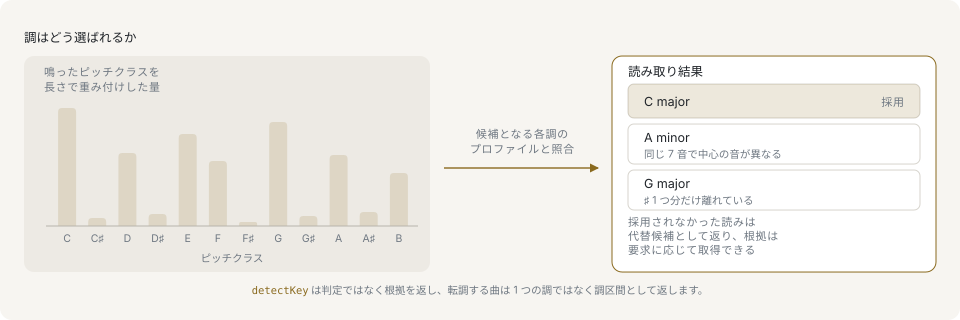
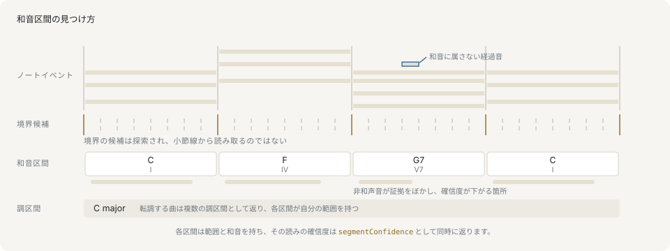

# 解析

解析は構造化された結果を返します。答えに加えて、その選択に使った根拠と、対応する API では退けた候補も保持します。

クラス API は、値そのものに問いを投げます。ピッチから認識した `Chord`、自身の終止を知っている `Timeline`、フレーズを言い当てられる `Score` といった具合です。関数 API は同じプレーンなデータを受け取り、同じ結果を返します。解析の経路はクラス API だけで完結し、このページのすべての読みは `Chord`、`Timeline`、`Score`、`Arrangement` のいずれかから辿れるので、解析のコードはどちらの書き方でも構いません。ライブラリ全体がそうだというわけではありません。`barPositionToBeat`、`barPositionToPulse`、`chordFromSpec`、`secondaryDominant`、`shiftByScaleDegrees` はクラス側の顔を持たない関数です。

このページの結果はいずれも、根拠に支えられた読みであって、音符から復元された事実ではありません。結果を提示する UI は、根拠となる数値をあわせて表示し、上書きできるようにしてください。

レポートが使う音楽の語彙——和音、機能、終止形——は[和声の入門](primer/harmony.md)で扱っています。

## コードの認識

`Chord.detectBest` は MIDI ピッチからコードを認識し、`Chord.detectMatches` は根拠をあわせて返します。

```ts
import { Chord } from '@libraz/libcantus';

Chord.detectBest([60, 63, 67, 70])?.symbol(); // 'Cm7'

const [best] = Chord.detectMatches([60, 64, 67]);

best?.chord.symbol(); // 'C'
best?.match.quality; // 'maj'
best?.match.exact; // true
best?.match.inversion; // 0

Chord.detectMatches([64, 67, 72])[0]?.match.inversion; // 1
```

関数側の入り口は、クラス値をかぶせずに同じ順位づけをプレーンなデータで返します。

```ts
import { detectChord, detectChordBest } from '@libraz/libcantus';

detectChordBest([60, 64, 67])?.rootPc; // 0

const match = detectChord([60, 64, 67])[0];
match?.quality; // 'maj'
match?.exact; // true
match?.inversion; // 0

detectChord([64, 67, 72])[0]?.inversion; // 1
```

`detectChordBest` と `Chord.detectBest` はそのまま使えるコードを返します。`detectChord` は順位づけされた `ChordMatch` を返し、`Chord.detectMatches` はそれぞれに対応するコードを組にして返します。答えと同じくらい根拠が重要な場面で使うのは後者の2つです。`ChordMatch` は、入力に含まれないコード構成音を `missingPcs`、コードに属さない入力ピッチを `extraPcs` として報告し、両者の集合が一致する場合に `exact` が真になります。`inversion` は転回形を特定できない場合に null になります。ベースのない順序なしピッチクラス集合の場合や、ベースがコード構成音でない場合で、後者では `bassPc` に値が入ります。

`input` は数値の読み方を決めます。`midi` は数値上もっとも低いピッチをベースとして扱い、`pitchClass` は順序なしとして扱います。既定の `auto` は、すべての値が 0..11 にある場合にのみピッチクラスとして解釈します。

## 調の認識



調は、どこかに書かれた調号ではなく、各ピッチクラスが音楽のどれだけを占めているかから読まれます。その分布を候補となる調ごとのプロファイルと相関させ、順位全体を返すので、呼び出し側は勝敗の差と次点の候補まで見られます。

`Key.detectBest` と `Key.detectMatches` は、鳴っているピッチまたはピッチクラスの並びから調を順位づけます。`weights` で指定しないかぎり、出現1回がそのまま重み1つ分になります。

```ts
import { Key } from '@libraz/libcantus';

const sounding = [2, 2, 2, 2, 5, 5, 9, 9, 11, 11, 7, 4, 0, 2];

Key.detectMatches(sounding, { modes: true })[0]?.scaleName; // 'dorian'
Key.detectBest(sounding)?.toString(); // 'D melodic minor'
```

その背後にある関数が `detectKey` と `detectKeyBest` で、`Key` ではなくプレーンな key/scale を返します。

```ts
import { detectKey, detectKeyBest } from '@libraz/libcantus';

const sounding = [2, 2, 2, 2, 5, 5, 9, 9, 11, 11, 7, 4, 0, 2];

detectKey(sounding, { modes: true })[0]?.scaleName; // 'dorian'
detectKeyBest(sounding)?.mode; // 'minor'
```

`KeyMatch` は、もっとも高く評価されたスケール、それにもっとも近い長調または短調、使っているスケール形（`variant`）、`NAMED_SCALES` 上の正確な名前、そのスケールが入力のどれだけを覆うかの割合（`fit`）、そして順位づけの基準である `score` を持ちます。`score` は、入力の重み付きピッチクラス分布と、候補のキープロファイルをその主音に回転させたものとのピアソン相関で、範囲は [-1, 1] です。`fit` は所属数を数え、`score` は重みが度数のどこに落ちているかを測ります。平行調どうしを分けるのは後者なので、順位を決めるのは `score` だけです。`Key.detectMatches` はそのすべてを、調自体は `Key` として返します。検出された `Key` は一致したスケール形をそのまま保つので、上の例は単なる minor ではなく melodic minor と名乗ります。`modes: true` は教会旋法を候補に加えます。指定しない場合の候補は12の長調と12の短調で、短調のスケール形は競争に参加しません。短調の候補は短調のプロファイルで1度だけ採点され、そのあとで自然・和声・旋律の各マスクのうち入力の重みをもっとも多く覆うものを報告します。

`explain: true` を渡すと、すべての候補に `rationale` が付き、首位の候補にだけ、退けた候補を理由とともに並べた `alternatives` が付きます。既定では無効です。順位づけは旋法を数える前でも24候補あり、そのすべてに説明文を組み立てる費用は検出そのものを上回るためです。

```ts
import { detectKey } from '@libraz/libcantus';

const sounding = [2, 2, 2, 2, 5, 5, 9, 9, 11, 11, 7, 4, 0, 2];

const [top] = detectKey(sounding, { explain: true });

typeof top?.rationale; // 'string'
top?.alternatives?.[0]?.label; // 'D major'
```

`profile` は、観測された分布を何と相関させるかを選びます。既定は `krumhansl`、コーパスの比率を使う場合は `temperley`、重みなしの比較には `flat` を指定します。`weights` は各ピッチの重みです。`detectKeyFromNotes` は長さ × ベロシティを重みとして渡します。入力がヒストグラムではなくノートイベントの場合はこちらが適切な入り口です。音の数え方はコード推定が自身のヒストグラムに使うものと同じで、ベロシティを持たない音は既定値を仮定せず重み1として数えます。ただし1点だけ意図的に共有していないものがあります。コード推定が加える拍節アクセントです。`detectKeyFromNotes` にはアクセントの基準となる拍子が渡らないためです。`Score.detectKeys()` は同じ順位付けをクラス側から行うもので、スコア全体を1つの調として読んだ候補を返すため、どの調がどれだけの差で勝ったのかを見られます。

```ts
import { Score } from '@libraz/libcantus';

const score = Score.of([{ pitch: 60, startBeat: 0, durationBeat: 4 }]);

score.detectKeys()[0]?.key.rootPc; // 0
```

曲全体でもっとも長く保たれた1つの調が欲しい場合は `Score.key()` が答えます。

## タイムラインと終止



区間の境界は小節線から読み取るのではなく探索されるので、1小節に2つのコードが入っていれば2つの区間として返ります。各区間はその範囲とコードを持ち、読みの確信度はタイムラインと並んで `segmentConfidence` に入ります。

`Timeline` は、時間上の位置を保った和声です。ルートと発音位置がすでに分かっているコードは `Timeline.fromChords` が並べ、`Score.timeline()` や `Timeline.fromNotes` はノートイベントからコード区間とその時点で効いている調を探します。

```ts
import { Chord, Key, Timeline } from '@libraz/libcantus';

const timeline = Timeline.fromChords(
  [Chord.parse('C').span(0), Chord.parse('F').span(4), Chord.parse('G7').span(8)],
  12,
  Key.major('C'),
);

timeline.length; // 3
timeline.at(9)?.symbol(); // 'G7'
timeline.roman().map((entry) => entry.roman);
// ['I', 'IV', 'V7']
```

その下で動く関数が `chordTimelineFromChords` で、区間をプレーンなデータとして受け取ります。

```ts
import { chordTimelineFromChords, chordToRoman, majorKey } from '@libraz/libcantus';

const timeline = chordTimelineFromChords(
  [
    { rootPc: 0, quality: 'maj', startBeat: 0 },
    { rootPc: 5, quality: 'maj', startBeat: 4 },
    { rootPc: 7, quality: 'dom7', startBeat: 8 },
  ],
  12,
);

timeline.segments.length; // 3
timeline.segments.map((segment) => chordToRoman(segment.chord, majorKey(0)));
// ['I', 'IV', 'V7']
```

`chordTimelineFromNotes` はタイムライン以外も返します。`keys` は解析が対象とした調区間、`prevailingKey` はもっとも長く保たれた調、`segmentConfidence` は区間順に1つずつの信頼度です。`Timeline` は3つとも持ちます。`timeline.keys`、`timeline.key`、`timeline.segmentConfidence` です。`key` を渡さないことで、転調する曲をその時点で実際に効いている調に対して解析できます。渡した場合は区間が1つになります。呼び出し側がすでに答えを出しているためです。

確信度は、選ばれたコードがその窓のどれだけを説明できたかの割合です。そのコードの構成音が担う重みを、窓で鳴っている重みの合計で割った値で、一致が厳密でない場合は割り引かれます。そのコードしか鳴っていない窓は1になり、非和声音が同時に鳴っていると値が下がります。

境界がどこに落ちうるかを決めるのは `segmentation` です。既定の `'dynamic'` は音符が示唆する変化を探索し、`harmonicRhythm` はその探索に対する事前分布として働きます。コードが長く続くと見込むほど、変化を1つ置くのに必要な根拠が増えます。`'grid'` は代わりに `harmonicRhythm` 拍ごとに区間を切ります。和声リズムが固定だと分かっている場合にだけ適切です。

増六の和音——3度を積み重ねた形ではなく、バスと上声部1つのあいだの音程から名前が付く和音——は別に判定されます。3度堆積の一致がこれを担えないためです。下げられた下中音の上にある同じ構成音が外へ開いて属和音へ解決する場合、つまり V や V7 へ直接進む場合と、属音のバスに立つ終止四六を経て進む場合には、増六の和音が区間のコードとして報告されます。それ以外へ進む場合は ♭VI7 としての3度堆積の読みが採られます。

`timeline.cadences()` は範囲全体の到達点——終止形はフレーズを閉じる2つの和音の組です——にラベルを付け、それぞれが到達する拍もあわせて返します。

```ts
import { Chord, Key, Timeline } from '@libraz/libcantus';

const timeline = Timeline.fromChords(
  [Chord.parse('C').span(0), Chord.parse('G').span(4), Chord.parse('C').span(8)],
  12,
  Key.major('C'),
);

const hits = timeline.cadences();

hits.map((hit) => hit.cadence.type); // ['half', 'authentic']
hits[1]?.atBeat; // 8
```

2つのコードにラベルを付けるのが `detectCadence` で、タイムラインが自身の区間に対して走らせているのが `detectCadences` です。

```ts
import { Chord, Key, detectCadence } from '@libraz/libcantus';

const key = Key.major('C').scale;
const g = Chord.of('G', 'maj').data;
const c = Chord.of('C', 'maj').data;

detectCadence(g, c, key).type; // 'authentic'
detectCadence(g, c, key).strength; // null
```

`strength` が null になるのは、ボイシングだけが欠けている場合に限られます。属和音そのものが鳴り、両方の和音が根音の上に立ち、ソプラノが分からないという状況です。属和音の代わりに導音上の和音が立つ場合や、どちらかの和音が自身の根音から外れている場合は、ボイシングの有無にかかわらず `imperfect` と判定されます。ボイシングを渡すと、基本形の V–I はソプラノ——最上声部です——が主音に着地するかどうかで完全・不完全に分類されます。根音進行のない V の反復は終止として報告されません。時間軸を持たない対応物が `Progression.cadences` で、隣り合う組ごとに1つの終止を読みます。

終止は固定の半音距離ではなく、その調が実際に持つ度数に対して判定されます。旋法は自身の下中音へ偽終止します。変格終止が下行してくる下属和音も、その調自身の第4度の上に立つ和音です。リディアンでは第4度が主音の三全音上にあり、5半音上の和音はそもそも調に含まれません。属和音が導音を持たない旋法（ドリアンやミクソリディアンの `v`）では、その属和音への到達も半終止になります。この最後の緩和は旋法だけのものです。長調は導音を持つため、借用した短調の `v` は半終止になりません。短調も音階には書かれない上げられた第7音で終止するため、その `v` は半終止になりません。

調の度数ではなく借用和音を指す種類が2つあり、こちらは意味どおりの固定オフセットで判定されます。`modal` はその調が第7度に何を書いていても主音の全音下の ♭VII に立つ長三和音で、`phrygian` は短調において、第1転回形の下属和音のバスが下げられた下中音から半音下行して属音へ到達する形です。

`cadence.type` が取る値は `authentic`、`plagal`、`half`、`deceptive`、`phrygian`、`modal` の6つ、または終止を成さない場合の null です。絞り込みで黙って落ちやすいのは後ろの2つです。`phrygian` は特定の半終止で、`half` の代わりに報告されるので、半終止を数えるコードは `phrygian` もあわせて数える必要があります。`modal` は古典的な分類のどれにも当てはまらない ♭VII–I の到達で、ポップスや旋法的な曲が重みを置く箇所です。`authentic` だけを探すコードはこれを一切見られません。網羅的なリファレンスは `CadenceResult.type` の TSDoc です。

終止四六の和音は主和音の転回ではなく属和音そのものです。バスはすでに属音に到達しており、その上の音は属和音自身の構成音へ下行して解決します。属和音の前の和音を `approach` として渡すと、終止は1つの事象として報告されます。種類と拍は属和音の解決のまま変わらず、`rationale` が「終止は四六から始まった」と述べます。`IV–I64–IV` のようにバスが離れる四六は通常の主和音の転回として読まれます。

## 縮約と形式

`timeline.reduce()` は各コードを `structural`、`passing`、`neighbor` に分類し、理由と、そのコードが鳴る拍の範囲を付けます。装飾の2つの図形は `analyzeVoice` が音符に付けるラベルと同じ綴りなので、1つの凡例で両方の層を扱えます。

```ts
import { Chord, Key, Timeline } from '@libraz/libcantus';

const timeline = Timeline.fromChords(
  [Chord.parse('Cmaj7').span(0), Chord.parse('C#dim7').span(4), Chord.parse('Dm7').span(8)],
  12,
  Key.major('C'),
);

timeline.reduce().map((entry) => entry.level);
// ['structural', 'passing', 'structural']
```

この読みには調が必要なので、調を持たないタイムライン（第3引数を省いた `Timeline.fromChords`）は推測せずに拒否します。骨格として何を残すかは `basis` が決めます。既定の `'function'` は主和音・属和音・終止するコードを残し、`'duration'` は周囲より長く鳴るコードを残します。後者は、そのコードの長さを他のコードの長さの中央値と厳密に比較するので、和声リズムが均等な場合は誰も突出せず、2つの装飾の図形が判断します。どちらの基準でも、進行が始まるコードと終わるコードが格下げされることはありません。どの読みが効いていても、この2つが進行の枠になるためです。関数版が `reduceProgression` で、調を独立した引数として受け取ります。

```ts
import { chordTimelineFromChords, majorKey, reduceProgression } from '@libraz/libcantus';

const timeline = chordTimelineFromChords(
  [
    { rootPc: 0, quality: 'maj7', startBeat: 0 },
    { rootPc: 1, quality: 'dim7', startBeat: 4 },
    { rootPc: 2, quality: 'min7', startBeat: 8 },
  ],
  12,
);

reduceProgression(timeline, majorKey(0)).map((entry) => entry.level);
// ['structural', 'passing', 'structural']
```

形式に関する問いには、`Score` が自身の持つ音符から答えます。`phrases()` は終止、休符、長く保たれた音、反復、ハイパーメーター上の位置、そして曲の終わりからフレーズ境界を提案し、各フレーズはどの信号が寄与したかを記録します。`hypermeter()` は小節より上の拍節構造を求め、`sections()` は繰り返される単位を A、B などのラベルとして識別します。A が Verse だという主張はしません。背後にある関数は `phrasesFromTimeline`、`hypermeter`、`sectionsFromNotes` で、音符とコードタイムラインを別々に受け取ります。

フレーズは、別々の問いに答える2つの数値を返します。`confidence` は境界そのものを評価するもので、その根拠の強さと、曲中の他のフレーズと比べた長さの妥当性を見ます。`structuralWeight` はフレーズを閉じる終止を評価するもので、範囲は [0, 1]、終止のないフレーズでは0です。終止の種類がどれだけ決定的かをまず見て、次にそのフレーズの位置を見ます。曲を締めくくる終止や、ハイパーメーターの境界に着地する終止は、ハイパー小節の途中にあるものより強く閉じます。`structuralCadences` はこの値でフレーズ終止を順位づけます。

## 転調

`Score.keys()`、`keyTimelineFromNotes`、`detectModulations` は曲を調区間に分割します。各区間は信頼度を持ち、コードが支持する場合はピボットも持ちます。[調関係と転調](key-relations-and-modulation.md)を参照してください。

同じ調区間へコードから辿るのが `timeline.modulations()` です。タイムラインは構築時に渡された調——並べられたコードの場合、呼び出し側が述べた調か、何もないか——を保持しますが、コード自体を調の示唆として探索するのはこのメソッドです。コードは、その3〜4個のピッチクラスよりもはるかに強く調を主張します。

```ts
import { Chord, Key, Timeline } from '@libraz/libcantus';

const timeline = Timeline.fromChords(
  [Chord.parse('C').span(0), Chord.parse('G7').span(4), Chord.parse('C').span(8)],
  12,
  Key.major('C'),
);

const regions = timeline.modulations();

regions.length; // 1
regions[0]?.startBeat; // 0
regions[0]?.endBeat; // 12
```

## 旋律の解析

繰り返しや変形を伴う旋律素材は `Score.motifs()` と `Score.contour()` が扱い、`Motif` は `relateTo` と `similarityTo` で別のモチーフと自身を比較します。関数としては `melodicContour`、`extractMotifs`、`relateMotifs`、`melodicSimilarity` です。[旋律とモチーフ](melody-and-motifs.md)を参照してください。

## アレンジのレポート

複数のトラックをまとめて読むのが `Arrangement` です。コードタイムライン、調区間、理論ラベル、音符と現在の和声の衝突をまとめ、返せるクラスがある場合はクラスで返します。`timeline()` は `Timeline` を、`track(name)` は `Score` を返します。

```ts
import { Arrangement } from '@libraz/libcantus';

const arrangement = Arrangement.of([
  {
    role: 'harmony',
    notes: [
      { pitch: 60, startBeat: 0, durationBeat: 4 },
      { pitch: 64, startBeat: 0, durationBeat: 4 },
      { pitch: 67, startBeat: 0, durationBeat: 4 },
    ],
  },
]);

arrangement.timeline().at(0)?.symbol(); // 'C'
Array.isArray(arrangement.conflicts); // true
```

同じ読みを1回の呼び出しにまとめたものが `analyzeArrangement` です。レポートが持つのは `keys` と `prevailingKey`、`timeline`、そしてその上ではなく隣に並ぶ `segmentConfidence`——素の `ChordTimeline` が持つのは `at` と `segments` だけです——さらに `cadences`、トラックごとの注釈である `tracks`、そして `conflicts` です。テンションはこれとは別の読みで、`tensionCurve` から得ます。

```ts
import { analyzeArrangement } from '@libraz/libcantus';

const report = analyzeArrangement([
  {
    role: 'harmony',
    notes: [
      { pitch: 60, startBeat: 0, durationBeat: 4 },
      { pitch: 64, startBeat: 0, durationBeat: 4 },
      { pitch: 67, startBeat: 0, durationBeat: 4 },
    ],
  },
]);

report.timeline.segments.length >= 1; // true
Array.isArray(report.conflicts); // true
```

アレンジ全体の結果が不要な場合は、`tensionCurve` と `analyzeVoice` がその一部を返します。`toVoiceNotes` は単一トラックを声部レベルの解析向けに整えます。クラス側では、前者にあたるのが `Arrangement.tension` です。後者にあたる `Score.voices` は曲全体を読みます。スコアは多声なので、音符を声部に分け、各音をその声部の中で、同時に鳴っている他のすべてに対して分類します。掛留を報告するにはこれが要ります（不協和は何かに対して不協和だからです）。ある声部の音が別の声部の経過音として聞かれることも防げます。同じ声部レベルの読みを、1つのパッセージをフラットな配列として受け取って行うのが `analyzePolyphony` です。音符を声部に分け、各音をその下で同時に鳴っている他のすべてに対して分類し、渡された順に1音1件の注釈を返します。各注釈は、その配列上の位置を `noteId` として持ちます。長さのない音は鳴らないため所属する声部を持ちませんが、注釈自体は残り、コードに対してだけ読まれます。編集をまたいで解析を保持する `createArrangementSession`（`Arrangement.update` が使っているのもこれです）については[パフォーマンス](performance.md)を参照してください。

`analyzeVoice` が名指す装飾音の図形——経過音・刺繍音・掛留・倚音・先取音・逸音——は、同じ音に対して `classifyMelodyTones` が使う語と同一です。1つの旋律を解析から読んでもハーモナイザから読んでも、返る語彙は1つに揃います。ただし `analyzeVoice` は拍節を受け取らず旋律形だけを見るため、もう一方より図形を名指す箇所が少なくなります。名前が食い違うのではなく、名前が付く範囲が狭いということです。
