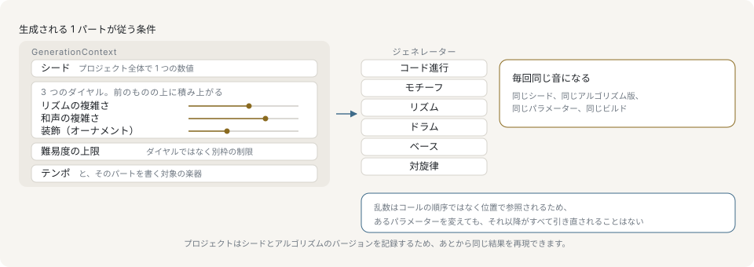

# 決定性とシード

保存されたプロジェクトの実体は、シードとパラメータです。ライブラリがそれを同じ音符に戻せる場合にのみ、同じ曲として開き直せます。生成まわりは3つの保証の上に組み立てられています。同じシードは同じ乱数列を返すこと、1回の抽選が呼び出し順ではなく位置に紐づくこと、そして契約自体がバージョン番号を持つことです。

以下のダイヤルは音楽の考え方から名前を取っており、このページは小節と拍で数えます。音楽の予備知識がない読者向けには、そのどちらも[入門](primer/index.md)で扱っています。

## 曲全体でシードはひとつ



1つのコンテキストが、すべてのジェネレータを賄います。シードは曲全体でただ1つの数値です。complexity の3つのダイヤルは互いに積み上がり、難易度の上限はその中の4つ目ではなく、隣に立つ別種の制限です。テンポと、そのパートを書く対象の楽器も同じオブジェクトに載ります。このページに書かれていることは、すべてこの単一の入口から導かれます。

プロジェクトのシードは `GenerationContext` が保持し、各パートはそこから自分の乱数を導きます。数値をそのまま渡すと `{ seed }` の略記になります。

```ts
import { generateDrums, resolveContext } from '@libraz/libcantus';

resolveContext(7).seed; // 7
resolveContext({ seed: 7, bpm: 96 }).bpm; // 96

const a = generateDrums({ bars: 2, style: 'standard', section: 'verse', ctx: 7 });
const b = generateDrums({ bars: 2, style: 'standard', section: 'verse', ctx: 7 });
JSON.stringify(a) === JSON.stringify(b); // true
```

同じシードから導かれたパート同士は衝突しません。各ジェネレータがシードの下で自分の名前空間を使うためです。シード7のベースラインとドラムパターンは独立しており、どちらか一方を同じシードで生成し直せばそのまま再現されます。

シードは省略可能で、省略時は0です。テンポだけを指定したコンテキストもそれ自体で完結した要求であり、コンテキストを一切渡さずに呼び出したジェネレータも決定的です。シード0から引くためです。

`deriveSeed` はコンテキストが土台にしている導出そのもので、独自の素材を生成するホストがプロジェクトのシードに相乗りする場合に使います。コンテキストは呼び出し側のパスの前に自前のセグメントを2つ加えます。`'v'` と、解決後のアルゴリズムバージョンです。同じ固定のしかたを自分の素材にも求めるホストは、この2つも併せて渡します。

```ts
import { ALGORITHM_VERSION, deriveSeed, resolveContext } from '@libraz/libcantus';

resolveContext().seed; // 0

deriveSeed(42, 'drums') === deriveSeed(42, 'drums'); // true
deriveSeed(42, 'drums') === deriveSeed(42, 'bass'); // false
deriveSeed(42, 'drums') === deriveSeed(42, 'drums', 'v', ALGORITHM_VERSION); // false
```

## 位置で引く乱数

呼び出し順に引くと、すべての値が「それまでに何回引いたか」に依存します。曲の途中のパラメータを1つ変えただけで、それ以降がすべて引き直しになります。`PositionalRng` はこの結合を断ちます。抽選はシードとパスだけから決まる純粋な関数であり、4小節目2.5拍の値は3小節目に何が起きたかに影響されません。

```ts
import { createPositionalRng, includeAt } from '@libraz/libcantus';

const rng = createPositionalRng(7);

rng.at('ghost', 4, 2.5) === rng.at('ghost', 4, 2.5); // true
includeAt(rng, 0, 'ghost', 4, 2.5); // false
includeAt(rng, 1, 'ghost', 4, 2.5); // true
```

`includeAt` は `at(...path) < complexity` を判定します。これが複雑さのスライダーに期待どおりの挙動を与えます。抽選値が位置で固定されているため、選ばれるイベントの集合は単調に増加します。`c1 < c2` のとき、`c1` で含まれていたものは `c2` でも必ず含まれます。つまみを上げると音が増えるだけで、すでに鳴っている音は移動しません。

この乱数源はコンテキストへ直接渡せます。`GenerationContext.rng` はシードからの導出を補うのではなく置き換えるもので、乱数源を渡した場合 `seed` は読まれません。渡した乱数源の下でも各パートは自分の名前空間を使うため、1つの曲のパート同士は互いに独立したままです。

```ts
import { createPositionalRng, resolveContext } from '@libraz/libcantus';

const supplied = resolveContext({ seed: 999, rng: createPositionalRng(7) });
const derived = resolveContext({ seed: 999 });

supplied.part('drums').at('ghost', 1, 2) === derived.part('drums').at('ghost', 1, 2); // false
```

連続した乱数列が必要な場合は `createRng` を使います。

```ts
import { createRng } from '@libraz/libcantus';

const rng = createRng(42);
const first = rng.next();

createRng(42).next() === first; // true
createRng(43).next() === first; // false
```

`prob`、`range`、`float` は抽選を消費する前に引数を検証します。拒否された呼び出しは乱数列を進めないため、エラーを catch した側と、その呼び出しを行わなかった側とで以降の列が一致します。

## complexity と difficulty は別種のつまみ

`Complexity` には4つのフィールドがありますが、同種のものは3つだけです。

| フィールド | 範囲 | 意味 |
| --- | --- | --- |
| `rhythmic` | 0..1 | 細分化とシンコペーション。 |
| `harmonic` | 0..1 | テンション、代理和音、経過和音。 |
| `ornament` | 0..1 | ゴーストノート、フラム、装飾。 |
| `difficulty` | 1..5 | 演奏の難しさの上限。 |

前の3つは量を増やす要求で、1つ動かしても既存の内容は乱れません。`difficulty` は強さではなく、候補を削るだけの上限です。「凝っているが易しい」も「素朴だが難しい」も実在する要求であるため、上限は他の3つが出した案を拡大縮小せず、そこから絞り込みます。

```ts
import { generateDrums, MAX_DIFFICULTY, MIN_DIFFICULTY } from '@libraz/libcantus';

MIN_DIFFICULTY; // 1
MAX_DIFFICULTY; // 5

const sparse = generateDrums({
  bars: 2,
  style: 'funk',
  section: 'chorus',
  ctx: { seed: 3, bpm: 100, complexity: { rhythmic: 0.2, ornament: 0.1 } },
});
const busy = generateDrums({
  bars: 2,
  style: 'funk',
  section: 'chorus',
  ctx: { seed: 3, bpm: 100, complexity: { rhythmic: 0.9, ornament: 0.8 } },
});

sparse.length <= busy.length; // true
```

上限が作用するのはタイミングの層だけです。その音が楽器に存在するか、その形を保持できるかは `GenerationContext.instruments` から決まり、上限の値にかかわらず適用されます。[楽器と演奏可能性](instruments-and-playability.md)を参照してください。

上限を使う場合は `bpm`、すなわち4分音符を1拍としたテンポを渡します。テンポがなければ「その時間内に到達できるか」を測る基準がありません。

## アルゴリズムバージョンの固定

パッケージのバージョンは、そのテイクがパラメータのどの読みで作られたかを示せません。ジェネレータ内部のバグ修正はパッチリリースですが、それでもすべての音符が動きます。それを示すのが `ALGORITHM_VERSION` という別の番号です。

```ts
import { ALGORITHM_VERSION, MIN_ALGORITHM_VERSION, resolveAlgorithmVersion } from '@libraz/libcantus';

resolveAlgorithmVersion(undefined) === ALGORITHM_VERSION; // true
resolveAlgorithmVersion(MIN_ALGORITHM_VERSION); // 1
```

アルゴリズムバージョンを固定すれば、同じシードと同じ公開パラメータから、同じビルドで同じ出力が得られます。この番号が示すのは、そのプロジェクトがパラメータのどの読みに対して書かれたか、です。

この番号が行わないのは、その読みを訂正から凍結することです。ジェネレータはバージョンごとの実装ではなく1つの実装を持つため、古い番号を固定しても、現在の実装で別の抽選を引くだけで、その番号が以前に出していた結果は戻りません。音楽的に誤っていた出力の修正は、すでに使われているバージョンの音符を動かします。修正はパッチとして出し、変更履歴に記載します。定数を上げるのは訂正ではなく方針の変更を示すときであり、曲を厳密に再現するには、シードとアルゴリズムバージョンに加えてパッケージのバージョンも記録します。

バージョンは、ジェネレータが引くすべての導出に加わるため、2つのバージョンが同じ抽選値を共有することはありません。`deriveSeed` で独自の素材を導出するホストはその外側にいるので、解決後の `algorithmVersion` をパスのセグメントとして渡すことで同じように固定します。このビルドが生成しないバージョンは、別のバージョンとして描画されるのではなく拒否されます。新しいビルドが保存したプロジェクトを、古いビルドは再現できないためです。

```ts
import { isLibcantusError, resolveContext } from '@libraz/libcantus';

let code = 'ok';
try {
  resolveContext({ seed: 1, algorithmVersion: 999 });
} catch (error) {
  if (isLibcantusError(error)) code = error.code;
}
code; // 'INVALID_INPUT'
```

## プロジェクトファイルに保存する項目

生成したパートを同じ内容で開き直すには、次を記録します。

- シード
- 解決後の `algorithmVersion`
- そのテイクを作ったパッケージのバージョン
- ジェネレータに渡した全オプション（`complexity` と `bpm` を含む）
- 呼び出し側が渡した vocabulary

生成されたノートイベント自体の保存は必須ではありませんが、保存しておくほうが安全です。このビルドが生成しなくなったバージョンでも内容が残り、ユーザーが手で編集した結果も保持されます。

このうち最初の2項目は composer が自分でまとめます。`composer.data` は、それを組み立てたときの設定に、呼び出し側がどちらも指定しなかった場合でもシードと `algorithmVersion` を解決して書き込んだものです。開き直したビルドの既定値ではなく、パートが実際に引いた値がそこにあります。`Composer.fromData` はそれをそのまま受け取ります。

```ts
import { ALGORITHM_VERSION, Composer } from '@libraz/libcantus';

const composer = Composer.of({ key: 'C major', bpm: 96 });

composer.data.seed; // 0
composer.data.algorithmVersion === ALGORITHM_VERSION; // true
Composer.fromData(composer.data).data.seed; // 0
```

`data` が唯一含めない設定が、`rng` として渡した乱数源です。値ではなく乱数列そのものへのハンドルであり、プロジェクトファイルには書き出せません。保存したデータから組み立て直した composer は、シードから引きます。

context 自体は保存対象ではありません。`resolveContext` が返すのはライブオブジェクトで、`instrument` と `part` は関数です。そのまま直列化するとジェネレータが呼び出す部分がまさに失われます。渡した値のほうを保存し、読み込み時に context を作り直してください。

```ts
import { resolveContext } from '@libraz/libcantus';

const saved = { seed: 7, algorithmVersion: 1, complexity: { rhythmic: 0.4 } };
const context = resolveContext(saved);
context.seed; // 7
resolveContext(saved).seed === context.seed; // true
```

## 保証の範囲外

この保証が覆うのはジェネレータの返り値だけです。解析結果、エラーメッセージ、別のアルゴリズムバージョンで得た出力はその範囲外になります。解析は実際には決定的で、同じ音符には同じ読みを返しますが、バージョン管理はされていません。調検出の改善によってリリース間でラベルが変わることがあります。
