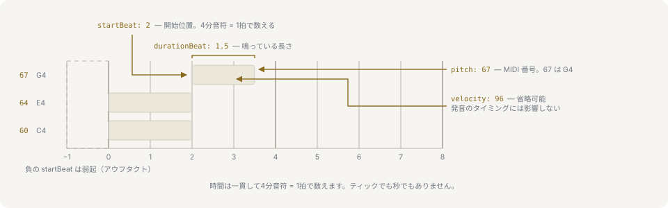

# はじめかた

## 動作環境とインストール

Node.js 22 以降を使用します。

```sh
yarn add @libraz/libcantus
```

パッケージに実行時依存はありません。手軽に使うならルートから、インポート境界を絞りたい場合はレイヤーのサブパスからインポートします。

## コードを組み立てて調べる

クラス API は、値を組み立ててそれについて問い合わせるための簡潔な手段です。

```ts
import { Chord, Key } from '@libraz/libcantus';

const key = Key.major('C');
const dominant = key.chord(5, 'dom7');

dominant.symbol(); // 'G7'
dominant.pitchClasses(); // [2, 5, 7, 11]
dominant.analyze(key).roman; // 'V7'
Chord.parse('C7(b9,#11)').pitchClasses(); // [0, 1, 4, 6, 7, 10]
```

model レイヤーのクラスはすべて不変です。単体の `Note` はもちろん、曲全体を持つ `Score` や `Composer` も同じです。変形するメソッドは新しい値を返すため、元の調やコードはそのまま残ります。

同じ値はプレーンデータとしても存在し、関数 API はそちらを受け取ります。

```ts
import { Chord, chordToRoman, majorKey } from '@libraz/libcantus';

const g7 = Chord.of('G', 'dom7');

g7.data.rootPc; // 7
chordToRoman(g7.data, majorKey(0)); // 'V7'
```

## ノートイベント

時間上の位置を持つものはすべて `NoteEvent` です。`Score` が保持するのも、解析が読むのも、ジェネレータが返すのもこの形です。



`pitch` は MIDI 番号で、60 が中央の C です。`pitch` と `velocity` はいずれも 0 から 127 の整数です。`startBeat` と `durationBeat` は曲頭からの4分音符を単位とする拍を数えます。秒でも小節でもありません。小節は、その拍に拍子を当てはめたときにはじめて現れます。

```ts
import { beatToBarPosition, type NoteEvent } from '@libraz/libcantus';

const note: NoteEvent = {
  pitch: 60,
  startBeat: 4,
  durationBeat: 1,
  velocity: 96,
};

beatToBarPosition(note.startBeat, '4/4'); // { bar: 1, beat: 0 }
```

小節番号は0始まりなので、4/4 で `startBeat` が 4 の音は2小節目の先頭の拍にあたります。`startBeat` が負の値なら弱起（アウフタクト）で、最初の強拍より前に鳴る音を表します。

## 短いタイムラインを解析する

`Score` はノートイベントと、それを読むための文脈をひとまとめにした値です。曲に対して尋ねたいことは、そのメソッドとして並んでいます。次の例は4小節のブロックコードを渡し、その和声を読み、各区間にラベルを付けます。

```ts
import { Score } from '@libraz/libcantus';

const notes = [[48, 60, 64, 67], [41, 60, 65, 69], [43, 59, 62, 65], [48, 60, 64, 67]].flatMap(
  (pitches, bar) => pitches.map((pitch) => ({ pitch, startBeat: bar * 4, durationBeat: 4 })),
);

Score.of(notes)
  .timeline()
  .roman()
  .map((entry) => entry.roman);
// ['I', 'IV', 'V7', 'I']
```

クラスはいずれも関数コアの薄い外皮なので、同じ読み取りを関数ひとつずつでも書けます。どちらのスタイルを選ぶかは好みの問題で、できることは変わりません。

```ts
import { chordTimelineFromNotes, chordToRoman } from '@libraz/libcantus';

const notes = [[48, 60, 64, 67], [41, 60, 65, 69], [43, 59, 62, 65], [48, 60, 64, 67]].flatMap(
  (pitches, bar) => pitches.map((pitch) => ({ pitch, startBeat: bar * 4, durationBeat: 4 })),
);

const { timeline, prevailingKey } = chordTimelineFromNotes(notes);
timeline.segments.map((segment) => chordToRoman(segment.chord, prevailingKey));
// ['I', 'IV', 'V7', 'I']
```

コードの境界はイベントから推定されます。曲が転調する場合、結果は複数の調区間を含むことがあります。呼び出し側が冒頭の調をあらかじめ決める必要はありません。

区間は範囲とコードを持ちます。各読みの信頼度は `segmentConfidence` として並んで返り、区間の順に1つずつ対応します。

```ts
import { chordTimelineFromNotes } from '@libraz/libcantus';

const notes = [[48, 60, 64, 67], [43, 59, 62, 65]].flatMap((pitches, bar) =>
  pitches.map((pitch) => ({ pitch, startBeat: bar * 4, durationBeat: 4 })),
);

const { timeline, segmentConfidence, keys } = chordTimelineFromNotes(notes);

timeline.segments[0]?.startBeat; // 0
timeline.segments[0]?.endBeat; // 4
segmentConfidence.length === timeline.segments.length; // true
keys.length >= 1; // true
```

`keys` は解析が対象とした調区間を保持し、`prevailingKey` はもっとも長く保たれた調です。調号に表示する調や、単一の調を受け取るジェネレータに渡す調はこちらになります。

## それに対して何かを生成する

`Composer` は1曲を書くときの設定、つまり調・テンポ・シードを保持し、各パートはそれを受け継ぎます。パートごとに同じ設定を書き直す必要はありません。プログレッションは `Timeline` として返るので、解析の節で読んだ値とそのまま同じものです。

```ts
import { Composer } from '@libraz/libcantus';

const composer = Composer.of({ key: 'C major', bpm: 120, seed: 9 });
const plan = composer.progression({ style: 'idol', bars: 4 });

plan.totalBeats; // 16
plan.roman().map((entry) => entry.roman); // ['vi', 'ii', 'V', 'I']
```

その下にあるジェネレータは、同じデータとシードを受け取ります。同じシードからは常に同じ音が得られます。

```ts
import { generateProgression, majorKey } from '@libraz/libcantus';

const key = majorKey(0);
const a = generateProgression({ key, style: 'idol', bars: 4, ctx: { seed: 9 } });
const b = generateProgression({ key, style: 'idol', bars: 4, ctx: { seed: 9 } });

a.length; // 4
JSON.stringify(a) === JSON.stringify(b); // true
```

## インポート境界を選ぶ

```ts
import { parseNote, parseTimeSignature } from '@libraz/libcantus/core';
import { majorKey, makeChord } from '@libraz/libcantus/theory';
import { detectKey } from '@libraz/libcantus/analyze';
import { generateMotif } from '@libraz/libcantus/generate';
import { Note, Key } from '@libraz/libcantus/model';
```

ルートの入り口はこれらのシンボルを再エクスポートするため、サブパスは別の API ではなくパッケージングの選択です。

## 次のステップ

- [入門](primer/index.md)は、API の名前のもとになっている音楽の考え方を、音楽の知識がない読者向けに扱います: [音高と音程](primer/pitch-and-intervals.md)、[音階と調](primer/scales-and-keys.md)、[和音](primer/chords.md)、[和声](primer/harmony.md)、[声部](primer/voices.md)、[リズムと拍子](primer/rhythm-and-meter.md)。
- [ユースケース](use-cases/index.md)には、DAW アシスタント、和声課題チェッカー、楽曲解析、生成アレンジの一連の流れがあります。
- [はじめに](introduction.md)ではデータモデルとエンジンの前提を説明します。
- 生成された TypeDoc リファレンスが全シンボルを網羅します。[API リファレンス](api-reference.md)を参照してください。
