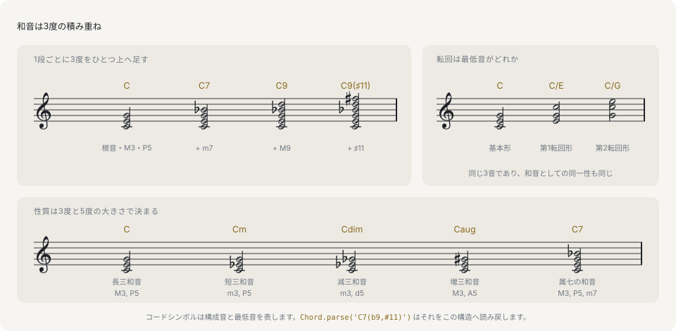

# 和音（コード）

和音は複数の音が同時に鳴っているものです。西洋の調性音楽では、これを3度の積み重ねで組み立てます。音階から始まりの音を1つ選び、そこから1つ飛ばしに音を取っていく形です。この積み方で3音になったものが**三和音**、4音になったものが**七の和音**です。このページの残りは、すべてこの1つの積み方の変形にあたります。

このライブラリでの和音はプレーンなデータです。根音、音質を表す名前、そして根音から上に測った半音数の並びを持ちます。

```ts
import { Chord } from '@libraz/libcantus';

Chord.parse('C').data;
// { rootPc: 0, quality: 'maj', intervals: [0, 4, 7], rootSpelling: { letter: 0, alter: 0 } }
```

`rootPc` は根音をピッチクラスで表したもの（0 が C、1 が C#/Db、…、11 が B）、`quality` は積み方の種類の名前、`intervals` は根音から上に測った半音数です。`rootSpelling` は根音を書き表す文字を保持します。記譜のうえで Db の和音と C# の和音を分けているのがこの情報です。ピッチクラスと綴りについては[ピッチと音程](pitch-and-intervals.md)を参照してください。



どの段も、同じ操作をもう一度適用したものです。3度の上にもう1つ3度を積めば三和音、さらに積めば七の和音になり、オクターブを越えた3度がテンションにあたります。**積み**の最低音が根音であり、実際に鳴っている最低音が何かはそれとは別の問題です。

## 3度の大きさが和音の種類を決めます

3度は4半音（長3度）か3半音（短3度）のどちらかです。どちらを下に置きどちらを上に置くかが三和音の種類のすべてであり、積みを閉じる5度もその選択から決まります。

```ts
import { makeChord } from '@libraz/libcantus';

makeChord(0, 'maj').intervals; // [0, 4, 7]
makeChord(0, 'min').intervals; // [0, 3, 7]
makeChord(0, 'dim').intervals; // [0, 3, 6]
makeChord(0, 'aug').intervals; // [0, 4, 8]
```

長三和音は長3度の上に短3度、短三和音はその逆で、どちらも7半音の完全5度で閉じます。短3度を2つ積めば減5度（6半音）、長3度を2つ積めば増5度（8半音）で閉じます。`quality` の名前はこの配置に付いたラベルです。

## 七の和音

3度をもう1つ積むと、根音から新しい最高音までの音程を名前に持つ和音になります。

```ts
import { Chord } from '@libraz/libcantus';

Chord.parse('Cmaj7').pitchClasses(); // [0, 4, 7, 11]
Chord.parse('C7').pitchClasses(); // [0, 4, 7, 10]
Chord.parse('Cm7').pitchClasses(); // [0, 3, 7, 10]
Chord.parse('Cm7b5').pitchClasses(); // [0, 3, 6, 10]
Chord.parse('Cdim7').pitchClasses(); // [0, 3, 6, 9]
```

長7度は11半音、短7度は10半音なので、`maj7` と `7` の違いは1音だけです。`ChordQuality` は43個の名前からなる閉じた union で、三和音・七の和音・6thコード・サスペンデッド・よく使う付加音の和音を覆います。一覧は `chordQualities()` が返します。

## テンションと変化音

さらに積み続けると、3度はオクターブを越えて9度・11度・13度へ進みます。これが**テンション**です。`intervals` はこれらをオクターブ内に畳まずそのままの位置に保つので、積みの形が往復しても失われません。

```ts
import { Chord } from '@libraz/libcantus';

Chord.parse('C9').data.intervals; // [0, 4, 7, 10, 14]
Chord.parse('C13').data.intervals; // [0, 4, 7, 10, 14, 21]
Chord.parse('C9').pitchClasses(); // [0, 2, 4, 7, 10]
```

`pitchClasses()` は同じ和音を12音に還元した形で、検出やピアノロールの色づけが必要とするのはこちらです。`intervals` はボイシングが必要とする形です。

変化音は、和音の正体を変えないまま積みの1音を半音上げ下げしたものです。

```ts
import { Chord } from '@libraz/libcantus';

const altered = Chord.parse('C7(b9,#11)');

altered.data.intervals; // [0, 4, 7, 10, 13, 18]
altered.spec.alterations; // [{ degree: 9, alter: -1 }, { degree: 11, alter: 1 }]
altered.symbol(); // 'C7(b9,#11)'
```

`intervals` は鳴る結果を、`spec` は構造としての読みを与えます。`spec` は基本の音質に、7th・変化音・付加音・省略音・ベース音を加えた形です。和音のモデルは固定された名前の一覧ではないため、どの `quality` にも当てはまらないシンボルでも、解析され、鳴り、元の表記に戻ります。

## 転回は `bassPc` が持ちます

同じ3音を、別の音を最低音にして鳴らしたものが**転回形**です。根音が最低音なら基本形、3度が最低音なら第1転回形、5度が最低音なら第2転回形になります。

```ts
import { Chord } from '@libraz/libcantus';

const first = Chord.of('C', 'maj').invert(1);

first.data.intervals; // [0, 4, 7]
first.data.bassPc; // 4
first.symbol(); // 'C/E'
Chord.of('C', 'maj').invert(2).symbol(); // 'C/G'
```

このデータモデルを支配する規則は1つです。**`intervals` は最低音が何であっても常に根音から数え、転回は `bassPc` だけが持ちます**。ハ長調の主和音の第1転回形は、E から上に測った `[0, 3, 8]` ではありません。C から測った `[0, 4, 7]` に、E を指す `bassPc` が付いた形です。`intervals` を回転させると根音が失われますが、ローマ数字も和音の機能も移高も、すべて根音から計算されます。

## スラッシュコード（オンコード）

`bassPc` は和音の構成音である必要はありません。スラッシュコードは任意の音を積みの下に置くもので、表記のしかたは転回形と同じです。

```ts
import { Chord } from '@libraz/libcantus';

Chord.parse('D/C').data.intervals; // [0, 4, 7]
Chord.parse('D/C').data.bassPc; // 0
Chord.parse('D/C').pitchClasses(); // [0, 2, 6, 9]
```

C は D の長三和音に含まれないので、`D/C` は何かの転回形ではなく、外部のベース音の上に置かれた D の三和音です。`pitchClasses()` は実際に鳴るものを返すのでどちらの場合もベース音を含み、`intervals` は積みだけを表します。

## コードシンボル

コードシンボルは、上のデータ構造を文字列にした形です。解析と整形は互いの逆の操作にあたります。API が `ChordLike` を取る場所ではどこでも、解析済みの値の代わりに文字列を渡せます。

```ts
import { formatChordSymbol, parseChordSymbol, transposeChordSymbol } from '@libraz/libcantus';

parseChordSymbol('Am7');
// { rootPc: 9, quality: 'min7', intervals: [0, 3, 7, 10], rootSpelling: { letter: 5, alter: 0 } }
formatChordSymbol(parseChordSymbol('Am7')); // 'Am7'
transposeChordSymbol('C/E', 2); // 'D/F#'
```

移高は根音・ベース音・綴りをまとめて動かすので、`C/E` を全音上げた結果は `D/Gb` ではなく `D/F#` になります。

## 数字付き低音

数字付き低音は、同じ考え方をより古い記法で書いたものです。根音を名指す代わりに、低音の音符を書き、その下に積み上げる音程を数字で示します。

```ts
import { Chord } from '@libraz/libcantus';

Chord.parse('C').figuredBass('C major'); // ''
Chord.parse('C/E').figuredBass('C major'); // '6'
Chord.parse('C/G').figuredBass('C major'); // '64'
Chord.parse('G7/B').figuredBass('C major'); // '65'
Chord.fromFiguredBass('E', '6', 'C major').symbol(); // 'C/E'
```

数字は調の音階に沿って低音から上の度数を数えたものなので、根音も音質も持ちません。ハ長調で E の上の `6` が C の和音になるのは、ハ長調がその音を供給しているからです。基本形は何も書かないため、最初の行は空文字列を返します。調が必須の引数であるのはこのためです。

## 検出は同じモデルを逆向きに使います

名前ではなくピッチの集合が与えられた場合、`detectChord` はそれを説明できる和音を順位づけて返します。

```ts
import { Chord, detectChordBest } from '@libraz/libcantus';

detectChordBest([60, 64, 67]); // { rootPc: 0, quality: 'maj', intervals: [0, 4, 7] }
Chord.detectBest([60, 64, 67, 71])?.symbol(); // 'Cmaj7'
Chord.detectBest([64, 67, 72])?.symbol(); // 'C/E'
Chord.detect([60, 64, 67]).length; // 6
```

各候補は、余分に含まれていた音（`extraPcs`）と、欠けていると見なした音（`missingPcs`）を持ちます。最上位の候補を鵜呑みにせず、呼び出し側で独自のしきい値を決められます。値がすべて 0..11 に収まる入力は順序を持たないピッチクラスとして読まれるため、報告できるベース音がありません。上の例のような MIDI 番号なら転回形まで返ります。

## 次に読むページ

- [和声](../harmony.md) — 同じ和音を調に対して読み、ローマ数字と機能で表します。
- [ボイシング](../voicing.md) — 和音を実際の声部の実際のピッチに変換します。
- [音階と調](scales-and-keys.md) — ダイアトニックな和音がどこから来るのかを扱います。
