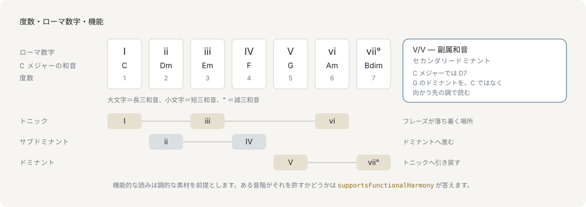
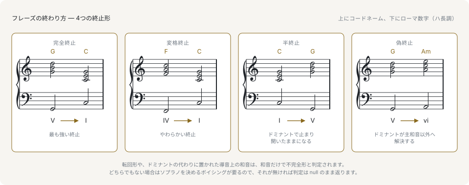

# 和声

[和音（コード）](chords.md)では、和音そのものが何かを扱いました。和声が扱うのは、和音が**調のなかで**何であるかです。`G7` はハ長調では1つのものであり、ト長調では別のものです。進行について問う価値のあることは、ほとんどがこの関係についての問いです。

## ローマ数字は和音を度数で名指します

音名は和音とともに移動します。ローマ数字は調とともに移動します。数字は和音がどの度数の上に建っているかを示すので、数字で書かれた進行はどの調でもそのまま成り立ちます。

```ts
import { chordToRoman } from '@libraz/libcantus';

chordToRoman('G7', 'C major'); // 'V7'
chordToRoman('G7', 'G major'); // 'I7'
```

和音は変わっていません。変わったのは調であり、ローマ数字は一方をもう一方に対して読んだ結果です。



調を端から読めばすべての度数にローマ数字が付き、その数字をまとめれば次の節で扱う3つの機能になります。ローマ数字は位置であり、機能は役割です。両者は関係していますが同じではありません。度数の異なる和音どうしが同じ機能を持てるのはそのためです。

## 大文字・小文字が音質を表します

ローマ数字の大文字・小文字は、その度数の上に建つ三和音の種類を表し、減三和音には接尾辞が付きます。

```ts
import { chordToRoman, diatonicTriad, majorKey } from '@libraz/libcantus';

const key = majorKey(0);

[1, 2, 3, 4, 5, 6, 7].map((degree) => chordToRoman(diatonicTriad(degree, key), key));
// ['I', 'ii', 'iii', 'IV', 'V', 'vi', 'viio']
```

大文字が長三和音、小文字が短三和音、末尾の `o` が減三和音です。ライブラリが出力するのは `viio` ですが、`vii°` と `viidim` も同じ和音として解析されるため、表示はホスト側の好みで選べます。ローマ数字のあとに続くアラビア数字は、数字付き低音とまったく同じ形で7thと転回を表します（`V7`、`V65`、`I6`）。

## 調のないローマ数字は和音になりません

`romanToChord` も `Chord.roman()` も調を取り、クラス API は調を勝手に作りません。`Chord.parse('G7').roman()` は `InvalidInputError: chord has no key context; pass a Key or attach one with withKey()` を投げます。調を与えれば同じ和音が答えます。

```ts
import { Chord, romanToChord } from '@libraz/libcantus';

Chord.parse('G7').withKey('C major').roman(); // 'V7'
Chord.parse('G7').withKey('G major').roman(); // 'I7'
romanToChord('V7', 'C major'); // { rootPc: 7, quality: 'dom7', intervals: [0, 4, 7, 10] }
```

和音1つから調を推測することは検出にあたりますが、和音1つでは根拠として足りません。実際の素材から調を検出するのは別の呼び出しです。`detectKey` と `keyTimelineFromNotes` がそれにあたり、[解析](../analysis.md)で扱います。

## 機能は和音の働きを表します

ローマ数字は7つの異なる和音を名指しますが、7つが7通りにふるまうわけではありません。**機能**は、フレーズのなかで果たす役割によって和音をまとめます。

- **トニック** — フレーズが落ち着く和音と、その代わりを務める和音。
- **サブドミナント** — 落ち着きから離れ、ドミナントを準備する和音。「サブドミナント」を第4度だけに限る教科書では、この機能を*プリドミナント*と呼びます。API は両方に同じ名前を使います。
- **ドミナント** — トニックへ引き戻す和音。引く力を担う導音（第7度、主音の半音下）を含みます。

```ts
import { functionOf, Key } from '@libraz/libcantus';

functionOf('C', 'C major'); // 'tonic'
functionOf('Em', 'C major'); // 'tonic'
functionOf('Dm', 'C major'); // 'subdominant'
functionOf('F', 'C major'); // 'subdominant'
functionOf('G7', 'C major'); // 'dominant'

Key.major('C').progression('I', 'V', 'vi', 'IV').functions();
// ['tonic', 'dominant', 'tonic', 'subdominant']
```

`Em` と `C` は異なる度数に建ちながら同じ機能を共有します。このまとめ方によって、進行を、どの和音を使ったかではなく、どこへ向かっているかで記述できます。`analyzeChord` はローマ数字と機能に加えて、判断の決め手になった規則を述べる `rationale` を返します。

## 副属和音

調のなかのどの和音も、**その和音にとってのドミナント**を前に置くことができます。主音以外の度数に、終止形の引く力を借りる形です。この借りてきた和音が**副属和音**で、対象の上にローマ数字を重ねて書いたものを applied numeral と呼びます。

```ts
import { chordToRoman, formatChordSymbol, majorKey, secondaryDominant } from '@libraz/libcantus';

const key = majorKey(0);

formatChordSymbol(secondaryDominant(5, key)); // 'D7'
chordToRoman('D7', 'C major'); // 'II7'
chordToRoman('D7', 'C major', { applied: true }); // 'V7/V'
chordToRoman('E7', 'C major', { applied: true }); // 'V7/vi'
```

**applied numeral は既定では無効です。** `II7` は和音の根音を元の調に対して名指したもので、つねに正しい表記です。`V7/V` はその和音が第5度を狙っていると主張するもので、和音についての事実というより音楽の読みにあたります。前後の進行がその読みを支えるときに指定してください。

## 借用和音

調には**同主調**、つまり同じ主音を持ち構成音の異なる短調があります。そこから取ってきて長調で使う和音が**借用和音**で、`analyzeChord` は借用であることと、どこから来たかの両方を報告します。

```ts
import { analyzeChord } from '@libraz/libcantus';

const result = analyzeChord('Ab', 'C major');

result.roman; // 'bVI'
result.borrowed; // true
result.source; // 'parallelMinor'
result.function; // 'subdominant'
```

借用和音も機能を保ちます。ハ長調で `bVI` と `iv` はどちらもサブドミナントの働きをするので、長調の進行に差し込んでも進行が壊れません。技法としての意図的な代理は[リハーモナイズ](../reharmonization.md)で扱います。

## 終止形

**終止形**はフレーズの閉じ方で、最後の2つの和音から読み取ります。標準的なものが4つあります。

```ts
import { detectCadence } from '@libraz/libcantus';

detectCadence('G7', 'C', 'C major').type; // 'authentic'
detectCadence('F', 'C', 'C major').type; // 'plagal'
detectCadence('C', 'G', 'C major').type; // 'half'
detectCadence('G7', 'Am', 'C major').type; // 'deceptive'
```



完全終止はドミナントからトニックへ閉じるもので、いちばん強い閉じ方です。変格終止はサブドミナントからトニックへ閉じます。半終止はドミナントを解決せずその**上で**止まり、フレーズを開いたまま残します。偽終止は完全終止を準備しておいて下中音（第6度）の和音に着地します。`detectCadence` は `phrygian` と `modal` の閉じ方も報告し、何も閉じていない組には `type: null` を返します。

## 完全か不完全かの判定にはボイシングが要ります

完全終止のうち、2つの和音がどちらも基本形で、かつソプラノ（最上声部）が主音に着地するものを**完全**、それ以外を**不完全**と呼びます。3つの条件のうち2つは和音だけで答えが出ます。残る1つは最上声部が何かを知らなければ答えられず、和音はその情報を持ちません。

```ts
import { detectCadence } from '@libraz/libcantus';

detectCadence('G7', 'C', 'C major').strength; // null

const graded = detectCadence('G7', 'C', 'C major', {
  voicing: [
    [55, 62, 71],
    [48, 64, 72],
  ],
});

graded.strength; // 'perfect'
graded.soprano; // 'root'
```

ボイシングが渡されないかぎり、`strength` は推測ではなく `null` になります。最初の結果は不完全終止ではなく、判定されていない終止です。`rationale` もそのとおりに述べます。

## 転調・調区間・軸和音

調が変わる曲は**転調**します。滑らかに転調する方法が**軸和音**（ピボットコード）を経由する形です。両方の調でダイアトニックな和音を選べば、入りは古い調のもの、出は新しい調のものとして聞けます。

```ts
import { formatChordSymbol, pivotChords } from '@libraz/libcantus';

pivotChords('C major', 'G major').map((pivot) => [
  formatChordSymbol(pivot.chord),
  pivot.romanFrom,
  pivot.romanTo,
]);
// [['C', 'I', 'IV'], ['Em', 'iii', 'vi'], ['G', 'V', 'I'], ['Am', 'vi', 'ii']]
```

ハ長調とト長調は4つの三和音を共有し、それぞれが別の蝶番になります。`V - I` は古い調の属和音を新しい調の主和音に変え、`I - IV` は古い調の主和音を通って出ていきます。実際の素材の上では、解析の単位は**調区間**です。`keyTimelineFromNotes` が返す `KeyRegion[]` は、拍の範囲・調・確信度・経由した軸和音を持つので、調の変化は和音に付いたフラグではなく区間の境界として表れます。調関係とタイムラインは[調関係と転調](../key-relations-and-modulation.md)で扱います。

## 機能的な読みが成り立たなくなる場所

ここまでの内容はすべて、調性のある素材を前提としています。主音があり、導音があり、そこへ引くドミナントがある、という前提です。この前提は普遍的ではなく、ライブラリはとにかく答えを返すのではなく、どの音階でその前提が成り立つかを示します。

```ts
import { Key, scaleSystemOf, supportsFunctionalHarmony } from '@libraz/libcantus';

Key.major('C').system(); // 'common-practice'
scaleSystemOf('dorian'); // 'modal'
scaleSystemOf('hijaz'); // 'non-functional'
supportsFunctionalHarmony('dorian'); // true
supportsFunctionalHarmony('hijaz'); // false
```

旋法（モード）の素材にはローマ数字と機能が付きますが、ドミナントの引く力は緩められます。旋法は導音以外のものでまとまっているためです。`non-functional` の音階にはどちらも付かず、そこにローマ数字による解析を求めても、中身のないラベルが返るだけです。任意の入力に対してローマ数字を前提とした UI を組む前に、`supportsFunctionalHarmony` を確認してください。

## 次に読むページ

- [解析](../analysis.md) — 和音・調・終止形を、与えられるのではなくノートイベントから見つけます。
- [調関係と転調](../key-relations-and-modulation.md) — 五度圏、関係調、調のタイムラインを扱います。
- [リハーモナイズ](../reharmonization.md) — 和音を意図的に差し替えます。
- [声部](voices.md) — ボイシングとは何か、そして終止形の判定がなぜそれを求めたのかを扱います。
