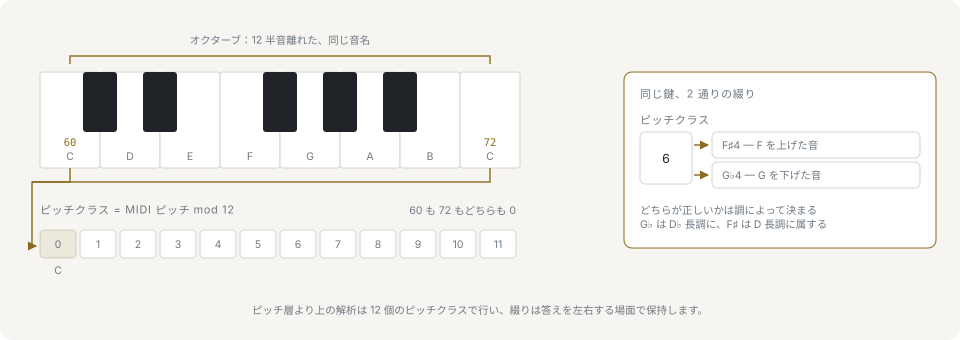
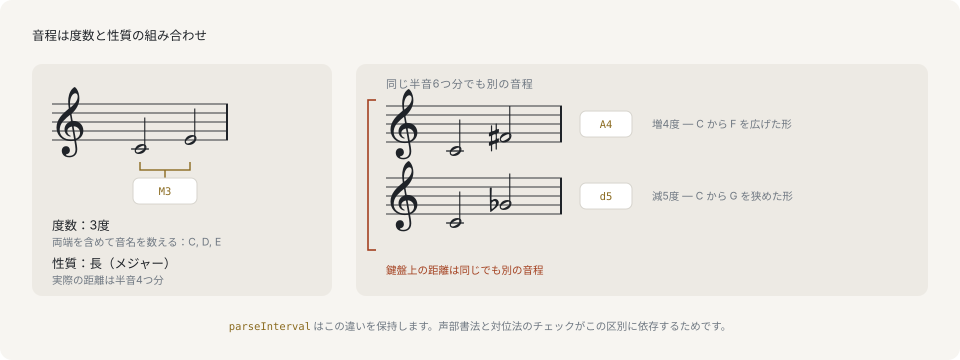

# ピッチと音程

## ピッチ・ピッチクラス・オクターブ



ピッチは鳴っている1つの音で、MIDI 番号で表します。中央のドは 60 で、1 の差が半音、つまり12平均律でいちばん小さい距離です。**ピッチクラス**はその番号を 12 で割った余りで、オクターブを問わずに音を指します。どのオクターブの C もピッチクラスは 0 です。**オクターブ**は番号の残りの部分、つまりピッチクラスが捨てた情報にあたります。12半音が1オクターブで、1オクターブ離れた2つのピッチは、高さの違う同じ音として聞こえます。

```ts
import { Note } from '@libraz/libcantus';

const c4 = Note.parse('C4');

c4.midi; // 60
c4.pitchClass; // 0
c4.octave; // 4
Note.parse('C5').midi; // 72
Note.parse('C5').pitchClass; // 0
```

関数がこの3つのどれを取るかは、最初に確認する点です。コード検出と調検出はピッチクラスで動きます。和音は構成音がどのオクターブに来ても同じ和音だからです。ボイシングと声部進行は MIDI 番号で動きます。2つの声部の距離そのものが判断の対象だからです。

## 綴られた音は文字・変化記号・オクターブの組

`Note` と、その背後にある `{ letter, alter, octave? }` というデータは、MIDI 番号ではありません。`letter` は7つの音名 C D E F G A B に対応する 0..6、`alter` は符号付きの半音数（シャープが 1、フラットが -1、ダブルシャープが 2）、`octave` は省略可能です。

```ts
import { parseNote } from '@libraz/libcantus';

parseNote('C#4'); // { letter: 0, alter: 1, octave: 4 }
parseNote('Db4'); // { letter: 1, alter: -1, octave: 4 }
```

`letter` がピッチクラスではなく 0..6 なのは、演奏者が実際に読むのが文字であり、音程の計算が数えるのも文字だからです。C# と Db は鍵盤上では同じ鍵ですが、C から F# は文字を4つ、C から Gb は5つまたぐので、2つの名前は別々の音程を生みます。ピッチクラスにはこの違いを記録できず、文字にはできます。この文字と変化記号の組を、ライブラリでは音の**綴り**と呼びます。

## 異名同音の綴り

同じピッチを鳴らす2つの綴りを異名同音といいます。綴られた音から MIDI への変換は片方向にだけ情報を失いません。

```ts
import { formatNote, midiToNote, Note, noteToMidi, parseNote } from '@libraz/libcantus';

noteToMidi(parseNote('C#4')); // 61
noteToMidi(parseNote('Db4')); // 61
formatNote(midiToNote(61)); // 'C#4'
formatNote(midiToNote(61, 'flat')); // 'Db4'

Note.parse('C#4').enharmonic().map((note) => note.name); // ['Db4', 'B##3']
```

`midiToNote` には文脈がないため、固定の既定値を当てます。どちらの綴りが正しいかを決めるのは調です。ピッチクラス 1 は、音階にすでに C# を含むニ長調では C#、含まない変ロ長調では Db になります。`spellPitch` は調を受け取ってそのとおりに答えます。

```ts
import { formatNote, majorKey, parseNote, spellPitch } from '@libraz/libcantus';

formatNote(spellPitch(61, parseNote('D'), majorKey(2))); // 'C#4'
formatNote(spellPitch(61, parseNote('Bb'), majorKey(10))); // 'Db4'
```

ライブラリの多くの関数が、それ以外には必要としない調を要求するのはこのためです。数値ではなく名前を出力するものは、どの調のもとで名付けるのかを教えてもらう必要があります。

## オクターブを持たない音

オクターブは省略できます。省略は欠損ではなく意味のある状態です。この形の音はピッチクラスと綴りを持ちますが、MIDI 番号は持ちません。

```ts
import { noteToPitchClass, parseNote } from '@libraz/libcantus';

parseNote('Bb'); // { letter: 6, alter: -1 }
noteToPitchClass(parseNote('Bb')); // 10
```

この音に `.midi` を読むと、オクターブを推測せずに `InvalidInputError` を投げます。調の主音、和音の根音、音階の構成音はいずれもこの形で保持されます。どれも特定のオクターブに属さないためです。

## 音程



音程は2つのピッチのあいだの距離で、表すには1つではなく2つの値が要ります。度数は音名の文字を両端込みで数えたもので、C から上の E は3度です。C, D, E で文字が3つだからです。質はその度数がどう埋められているかを表し、`M` が長、`m` が短、`P` が完全、`A` が増、`d` が減にあたります。2度・3度・6度・7度には長と短があり、1度・4度・5度・8度には完全があります。長または完全より半音広ければ増、短または完全より半音狭ければ減です。

```ts
import { Interval, Note, parseInterval } from '@libraz/libcantus';

parseInterval('M3'); // { number: 3, quality: 'M', semitones: 4, descending: false }
Interval.between(Note.parse('C4'), Note.parse('E4')).name; // 'M3'
Interval.parse('M3').invert().name; // 'm6'
```

半音数は度数と質の代わりではなく、並べて保持されます。音程を受け取るところではどこでも文字列の形が使えます。完全5度なら `'P5'`、下行する長3度なら `'-M3'` です。

## 増4度と減5度は同じではありません

どちらも6半音です。それでも別の音程なのは、またぐ文字の数が違い、ふるまいも違うからです。増4度は外側へ広がろうとし、減5度は内側へ縮もうとします。度数を半音数と分けて持つことが両者を区別可能にしており、移高の結果がどう綴られるかもこれで決まります。

```ts
import { Interval, Note, parseInterval } from '@libraz/libcantus';

parseInterval('A4').semitones; // 6
parseInterval('d5').semitones; // 6

Interval.between(Note.parse('C4'), Note.parse('F#4')).name; // 'A4'
Interval.between(Note.parse('C4'), Note.parse('Gb4')).name; // 'd5'

Note.parse('C4').transposeBy('A4').name; // 'F#4'
Note.parse('C4').transposeBy('d5').name; // 'Gb4'
```

## 協和

音程は、同時に鳴らしたときの安定度によって3つに分かれます。完全協和（1度・5度・8度）、不完全協和（3度と6度）、不協和（2度・7度・三全音）です。この分類は音響的な測定ではなく古典和声の約束事で、ライブラリの対位法規則と声部書法規則はすべてこの上に組み立てられています。

```ts
import { classifyInterval, ConsonanceClass, Interval } from '@libraz/libcantus';

Interval.parse('P5').isConsonant(); // true
Interval.parse('M3').isConsonant(); // true
Interval.parse('P4').isConsonant(); // false
Interval.parse('P4').isConsonant(false); // true

classifyInterval(7) === ConsonanceClass.PerfectConsonance; // true
```

完全4度だけは答えがテクスチャに依存します。呼び出しが第2引数を取るのはそのためです。2声のあいだでは不協和として扱われ解決を要しますが、より厚いテクスチャで下から支えられている場合はそうではありません。既定は2声の読みで、種目対位法が前提とするものと一致します。

## 移高

半音数による移高と音程による移高は、綴られた音に対しては別の操作です。半音数はピッチを動かし、綴りは既定に任せます。音程は文字も動かすので、結果はその音程が示すとおりに綴られます。

```ts
import { Note, parseNote, transposeNote } from '@libraz/libcantus';

Note.parse('C4').transpose(7).name; // 'G4'
Note.parse('C4').transposeBy('P5').name; // 'G4'
transposeNote(parseNote('C4'), 6); // { letter: 3, alter: 1, octave: 4 }
```

出力を楽譜として読ませるなら音程の形を使ってください。MIDI 番号で終わるピッチ計算には半音数の形を使います。

## 次に読むページ

[音高と記譜](../pitch-and-notation.md)は綴りの API 全体を扱います。声部全体に対する `spellLine`、和音と調を考慮した綴り、解析結果を返す `tryParse` 系、ドイツ語・日本語・イタリア語・固定ドの音名などです。[音律と周波数](../tuning-and-frequency.md)は、ピッチからヘルツ単位の実際の周波数へ進む段階を扱います。このページの内容にはいっさい関わりません。
