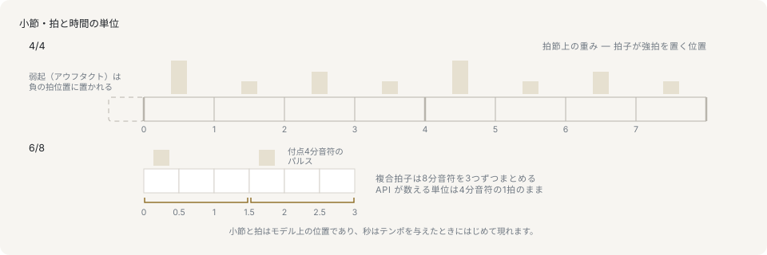

# リズムと拍子

## 拍は常に4分音符

このライブラリの時間の値はすべて**4分音符を1拍**として測ります。`NoteEvent` は `startBeat` で位置を、`durationBeat` で長さを表し、どちらも4分音符単位です。どの拍子でも例外なくそうです。

```ts
import type { NoteEvent } from '@libraz/libcantus';

const notes: NoteEvent[] = [
  { pitch: 60, startBeat: 0, durationBeat: 1 },
  { pitch: 64, startBeat: 1, durationBeat: 0.5 },
];

notes[1]?.startBeat; // 1
notes[1]?.durationBeat; // 0.5
```

この拍でないものが3つあります。1つ目は体感される拍、つまり聴き手が合わせて足を鳴らす脈です。6/8 拍子ではそれは付点4分音符で、ここでいう拍の 1.5 個分にあたります。2つ目は秒です。テンポが与えられるまで、拍からは所要時間は何も決まりません。3つ目はティックです。PPQ のグリッドは別の表現で、`beatsToTicks` が変換します。4分音符を1拍とするのは、1つの数がどこでも同じ意味になるように選ばれた固定の単位で、これを他の3つのどれかとして読むところから時間まわりのバグが生まれます。

```ts
import { durationToBeats } from '@libraz/libcantus';

durationToBeats('quarter'); // 1
durationToBeats('eighth'); // 0.5
durationToBeats('whole'); // 4
```

## 小節と拍子



小節は、曲の先頭から繰り返される固定長の拍のまとまりです。長さは拍子から決まります。拍子は2つの数で書き、下の数が1単位となる音価を、上の数がそれが小節にいくつ入るかを表します。4/4 では小節は4分音符4つ、3/4 では3つ、6/8 では8分音符6つ、つまり4分音符3拍分です。

小節内位置は、絶対拍を、どの小節に入るかと、その小節の先頭からどれだけ進んだ位置かに分けたものです。この進んだ量もやはり拍子固有の単位ではなく4分音符単位です。

```ts
import { beatsPerBar, beatToBarPosition, formatBarPosition } from '@libraz/libcantus';

beatsPerBar('4/4'); // 4
beatToBarPosition(4, '4/4'); // { bar: 1, beat: 0 }
beatToBarPosition(5, '4/4'); // { bar: 1, beat: 1 }
formatBarPosition(5, '4/4'); // '2.2'
```

途中で拍子が変わる曲は `MeterMap` で記述します。`{ startBeat, ts }` の変化点の配列で、拍子を1つ渡す形は要素が1つのマップの省略記法です。

## 単純拍子と複合拍子

単純拍子では体感される拍が2分割されます。複合拍子では3分割され、拍子記号は脈ではなく分割のほうを書きます。6/8 は6拍ではなく、8分音符3つずつの脈が2つです。拍子記号の数字と聴き手が感じる数が食い違う唯一の場面で、通して確認しておく価値があります。

```ts
import { beatsPerBar, isCompound, pulseBeats, pulsesPerBar } from '@libraz/libcantus';

isCompound('3/4'); // false
isCompound('6/8'); // true

beatsPerBar('6/8'); // 3
pulsesPerBar('6/8'); // 2
pulseBeats('6/8'); // 1.5
```

この3つの答えは合わせて読みます。6/8 の小節は8分音符6つで、ライブラリの時間では `beatsPerBar` の 3 拍です。体感されるのは `pulsesPerBar` の 2 つの脈で、各脈の長さは `pulseBeats` の 1.5 拍、つまり付点4分音符です。6/8 の小節で「2拍目」に音を置くとは、拍 1 ではなく拍 1.5 に置くことを意味します。小節の計算に使うのは `beatsPerBar`、メトロノームが刻むのは `pulseBeats` です。

## 拍節上の重み

小節内の位置は対等ではありません。1拍目がいちばん重く、他の脈はそれより軽く、脈と脈のあいだの分割はいちばん軽くなります。`metricWeight` は拍を 3 から 0 で格付けします。

```ts
import { metricWeight } from '@libraz/libcantus';

metricWeight(0, '4/4'); // 3
metricWeight(1, '4/4'); // 1
metricWeight(2, '4/4'); // 2
metricWeight(0.5, '4/4'); // 0

metricWeight(0, '6/8'); // 3
metricWeight(1.5, '6/8'); // 2
metricWeight(1, '6/8'); // 0
```

4/4 の拍 2 が拍 1 と拍 3 より上位なのは、小節の中間点が1拍目の次に強い位置だからです。6/8 では 1.5 にある第2の脈が強く、拍 1 は脈から外れます。複合拍子の分割をアクセントの側から見た、同じ事実です。

拍節上の重みは、いくつもの解析の土台になっています。和音区間の切り出しは強拍で和音を始めることを優先し、弱拍の音は1拍目の音より経過音の候補になりやすく、フレーズと大楽節の検出は重みの繰り返しパターンを探し、生成はこれを使って発音位置を決めアクセントを形づくります。誤った拍子で走らせた解析は、それらしく見える形で誤った結果になります。拍子のマップが分かっている場面では必ず正しいものを渡してください。

## 小節番号はデータでは 0 起点、整形時は 1 起点

数値を返す変換は最初の完全な小節を 0 と数えます。整形する関数は同じ小節を 1 と印字します。印刷された楽譜の番号の付け方に合わせたものです。

```ts
import { beatToBarPosition, formatBarPosition } from '@libraz/libcantus';

beatToBarPosition(0, '4/4'); // { bar: 0, beat: 0 }
formatBarPosition(0, '4/4'); // '1.1'
```

どちらの起点も意図されたものです。0 起点なら小節の計算が最初の小節より前まで走り、1 起点の表示は演奏者が楽譜から読み取る番号と一致します。`beatToBarPosition` の `bar` をそのまま表示する UI は、ライブラリ自身の出力より 1 小さい番号を出します。1 を足すか、自前で番号を付けずに `formatBarPosition` で整形してください。

## 弱起

弱起（アウフタクト）は最初の1拍目の前に置かれる助走で、曲が不完全な小節の後ろの拍から始まる形です。拍 0 が最初の1拍目なので、弱起は負の拍、小節 -1 に位置します。

```ts
import { beatToBarPosition, formatBarPosition } from '@libraz/libcantus';

const pickup = [
  { pitch: 67, startBeat: -1, durationBeat: 1 },
  { pitch: 72, startBeat: 0, durationBeat: 2 },
];

pickup.map((note) => formatBarPosition(note.startBeat, '4/4')); // ['0.4', '1.1']
beatToBarPosition(-1, '4/4'); // { bar: -1, beat: 3 }
```

負の拍は全体を通して正当な入力で、0 起点の小節番号はそのためにあります。整形時は小節 -1 が小節 0 と印字され、これも楽譜の慣習に合わせたものです。

## 拍を秒にするのはテンポだけ

ここまでの内容に実時間は関わりません。変換するのはテンポ、つまり1分あたりの拍数で、それ以外には何もありません。

```ts
import { beatsToSeconds, beatsToTicks, Tempo } from '@libraz/libcantus';

beatsToSeconds(4, [{ startBeat: 0, bpm: 120 }]); // 2
Tempo.of(120).secondsAt(8); // 4
Tempo.of(120).ticksAt(2, 480); // 960
beatsToTicks(1.5, 480); // 720
```

1つの指定は次の指定まで有効なので、テンポが変わる曲は `TempoMap` で記述します。`{ startBeat, bpm }` の配列で、変化点をまたいで区分ごとに積分されます。ティックは拍からのもう一方の変換で、PPQ のグリッドに載せるものです。テンポはいっさい必要としません。ティックは秒の細分ではなく拍の細分だからです。

## 音価と付点

書かれた音価は、同じ長さのもう1つの綴りです。音符に付く点は自身の長さの半分を加え、2つ目の点はさらにその半分を加えます。

```ts
import { beatsToDuration, durationToBeats } from '@libraz/libcantus';

durationToBeats({ base: 'half', dots: 1 }); // 3
durationToBeats({ base: 'quarter', dots: 1 }); // 1.5
beatsToDuration(1.5); // { base: 'quarter', dots: 1 }
beatsToDuration(2); // { base: 'half', dots: 0 }
```

処理は拍で行い、変換は境界で行ってください。`durationToBeats` は記譜を読み込む側、`beatsToDuration` は書き出す側、`beatsToTiedDurations` は単一の音価では表せない長さのためのものです。

## 次に読むページ

[時間と編曲](../time-and-arrangement.md)は拍子のマップと拍子変化、加法拍子と連符、`Meter`・`Tempo`・`Duration` クラス、トラック単位の編曲解析を扱います。[リズムとグルーヴ](../rhythm-and-groove.md)はリズム生成、グルーヴテンプレート、ヒューマナイズを扱います。
