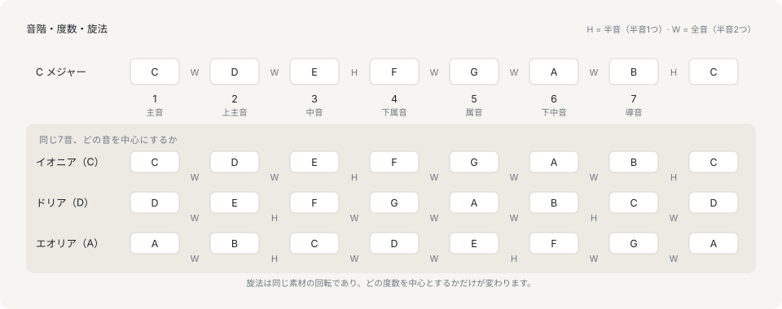

# 音階と調

## 音階は使う音の材料

音階（スケール）は、ある楽節が使う音の集合を、根音と呼ぶ開始音から上行順に一度だけ並べたものです。音楽がその順に進まなければならないという規則ではなく、材料の一覧です。西洋音楽の多くは7音の音階を使い、その基準になるのが長音階です。

```ts
import { diatonicPitchClasses } from '@libraz/libcantus';

const major = diatonicPitchClasses('C major');

major; // [0, 2, 4, 5, 7, 9, 11]

const steps = [...major, 12].slice(1).map((pc, i) => pc - (major[i] ?? 0));
steps; // [2, 2, 1, 2, 2, 2, 1]
```

この歩幅が音階の定義そのものです。全音は2半音、半音は1半音で、長音階は全全半全全全半という並びです。この並びを12のピッチクラスのどれから始めても長音階になります。音階とは並びのことで、根音はどこから始まるかを言うだけです。ライブラリはまさにそれを保持しています。`KeyScale` は根音のピッチクラスと、根音から何半音上が音階に属するかを示す12ビットのマスクの組です。

## 度数



度数は音階の中の位置で、根音を 1 として数えます。度数があることで、和声を調から独立して記述できます。「第5度」はハ長調では G、ト長調では D を指し、第5度について述べた規則は両方で成り立ちます。各度数には伝統的な名前があります。

| 度数 | 名前 | ハ長調での音 |
|---|---|---|
| 1 | 主音 | C |
| 2 | 上主音 | D |
| 3 | 中音 | E |
| 4 | 下属音 | F |
| 5 | 属音 | G |
| 6 | 下中音 | A |
| 7 | 導音 | B |

主音は音楽が帰着点として扱う音です。属音はそこへ最も強く引き戻す度数で、導音は主音の半音下にあって主音へ上行しようとします。第7度が持つ緊張はこの半音から来ています。

```ts
import { Key } from '@libraz/libcantus';

const c = Key.major('C');

c.degree(1).name; // 'C'
c.degree(5).name; // 'G'
c.degree(7).name; // 'B'
c.degreeOf(67); // 5
c.degreeOf(61); // null
```

度数はライブラリ全体で、入力も出力も 1 起点です。`Key.degreeOf` は音階外のピッチに対して `null` を返すので、音階外の音が主音と取り違えられることはありません。

## 旋法

旋法（モード）は、同じ音の材料を、別の度数を帰着点として読んだものです。ニ調のドリアはハ長調と同じ7つのピッチクラスを持ちます。違うのはそのどれが主音かであり、したがって主音から見て半音がどこに来るかです。

```ts
import { diatonicPitchClasses, Key } from '@libraz/libcantus';

Key.major('C').noteNames(); // ['C', 'D', 'E', 'F', 'G', 'A', 'B']
Key.named('dorian', 'D').noteNames(); // ['D', 'E', 'F', 'G', 'A', 'B', 'C']

diatonicPitchClasses('C major'); // [0, 2, 4, 5, 7, 9, 11]
diatonicPitchClasses(Key.named('dorian', 'D')); // [0, 2, 4, 5, 7, 9, 11]
```

長音階を7通りに回転させたものが教会旋法です。イオニア（長音階そのもの）、ドリア、フリギア、リディア、ミクソリディア、エオリア（自然短音階）、ロクリアの7つで、`Key.named` と `scaleByName` がどの根音の上にも組み立てます。

## 3つの短音階

短調は1つではなく、関連する3つの音階です。自然短音階は長音階の6番目の回転で、導音を持ちません。第7度が主音の全音下にあるためです。この第7度を上げると和声的短音階になり、導音が得られる代わりに第6度と第7度のあいだが3半音開きます。第6度も上げると旋律的短音階になり、その開きが消えます。

```ts
import { Key } from '@libraz/libcantus';

Key.minor('A').noteNames(); // ['A', 'B', 'C', 'D', 'E', 'F', 'G']
Key.named('harmonicMinor', 'A').noteNames(); // ['A', 'B', 'C', 'D', 'E', 'F', 'G#']
Key.named('melodicMinor', 'A').noteNames(); // ['A', 'B', 'C', 'D', 'E', 'F#', 'G#']

Key.minor('A').variant; // 'natural'
```

短調の曲は3つすべてを楽節ごとに使い分けます。属和音の下では和声的短音階、上行する旋律では旋律的短音階、それ以外では自然短音階という具合です。`Key.minor` は自然短音階を返し、`variant` はその調がどれを保持しているかを記録します。これにより、イ短調の G# を外来音ではなく上げられた第7度として報告できます。

## 調は主音と音階と綴りの組

調は、音階のうち1つの度数を帰着点に定め、特定の書き方で書いたものです。3つ目の要素も最初の2つと同じだけ重要です。嬰ヘ長調と変ト長調は12平均律で同じ音を含み、`KeyScale` としては同一です。それでも別の調なのは書き方が違うからで、曲はどちらか一方で書かれます。

```ts
import { Key } from '@libraz/libcantus';

Key.major('F#').noteNames(); // ['F#', 'G#', 'A#', 'B', 'C#', 'D#', 'E#']
Key.major('Gb').noteNames(); // ['Gb', 'Ab', 'Bb', 'Cb', 'Db', 'Eb', 'F']

Key.major('F#').scale.rootPc === Key.major('Gb').scale.rootPc; // true
Key.major('F#').scale.modeMask12 === Key.major('Gb').scale.modeMask12; // true
```

## 調号と5度の数

調号は、音符ごとではなく五線の先頭に一度だけ書かれるシャープまたはフラットの集合です。ライブラリはこれを符号付きの5度の数として保持します。正がシャープの数、負がフラットの数で、0 はハ長調とイ短調が共有する何もつかない調号です。

```ts
import { Key } from '@libraz/libcantus';

Key.major('C').fifths; // 0
Key.major('D').fifths; // 2
Key.parse('Eb major').fifths; // -3
Key.major('F#').fifths; // 6
Key.major('Gb').fifths; // -6
Key.minor('A').fifths; // 0
```

1つの数で調号全体が表せるのは、シャープとフラットが付く順序が決まっていて、数が集合を決めるからです。これは5度圏が走る座標でもあり、調の距離が引き算になる理由でもあります。[調関係と転調](../key-relations-and-modulation.md)を参照してください。

## 調の受け取り方は3通りで、綴りを持つのはどれか

調号を読むときに区別しておく点です。`KeyScale` は根音のピッチクラスとマスクだけで、綴りを**持ちません**。嬰ヘ長調と変ト長調を区別できないので、これだけから音名を出すことはできません。`ResolvedKey` は綴られた主音と短調の変種を加えます。`Key` クラスは `ResolvedKey` を包んだもので、名前についての問いに答えられる形です。

ビルダーはこの両方をまとめて返します。`majorKey` が返すのは `KeyScale` であり、ピッチクラスだけを必要とする読み手はそのまま受け取れますが、そのピッチクラスに対してライブラリが読み取る綴りが横に書き添えられています。ピッチクラスだけに戻すのは `toKeyScale` です。綴りを落とすことがコード上で見えるように、そう名付けられています。

```ts
import { majorKey, resolveKey, toKeyScale } from '@libraz/libcantus';

majorKey(6);
// { rootPc: 6, modeMask12: 2741, tonic: { letter: 4, alter: -1 }, variant: 'major' }
toKeyScale(majorKey(6)); // { rootPc: 6, modeMask12: 2741 }
resolveKey('C major');
// { scale: { rootPc: 0, modeMask12: 2741 }, tonic: { letter: 0, alter: 0 }, variant: 'major' }
```

`2741` は長音階の並びを表すマスク、`0b101010110101` です。ビルダーが書き添える綴りは臨時記号がいちばん少ない読みなので、`majorKey(6)` は嬰ヘ長調ではなく変ト長調になります。曲がもう一方で書かれている場合は、`'F# major'` のように綴られた調を渡してください。

入口がどの形を受け付けるかは、その答えが綴りに依存するかどうかで決まります。大半は依存しないので、どの形でも受け取ります。依存するもの——`figuredBassOf`、`romanToChord`、`spellVoicing`、`substituteChord` とその近傍——は綴りを持つ形だけを受け取ります。ピッチクラスに落とした調をそうした入口に渡すと、5度圏の反対側の綴りで答えが返るのではなく、コンパイルエラーになります。

## すべての音階でローマ数字が読めるわけではありません

ローマ数字・機能・終止形は古典和声の約束事です。音階に導音があり、3度堆積で和音が組めることを前提にしています。全音音階やペンタトニックに当てはめても、中身のないラベルが出るだけです。そのためライブラリは、名前のある音階すべてを3つの体系に分類し、この解析が適用できるものを示します。

```ts
import { Key, scaleSystemOf, supportsFunctionalHarmony } from '@libraz/libcantus';

scaleSystemOf('major'); // 'common-practice'
scaleSystemOf('dorian'); // 'modal'
scaleSystemOf('wholeTone'); // 'non-functional'

supportsFunctionalHarmony('major'); // true
supportsFunctionalHarmony('miyakoBushi'); // false

Key.named('dorian', 'D').system(); // 'modal'
```

UI でローマ数字の読みを提示する前に `supportsFunctionalHarmony` を確認してください。全音音階の楽節に対して正しい応答は、近似で選んだ数字ではなく、この解析は適用できないという答えです。

## WORLD_SCALES が記録するのは音の材料であって体系ではありません

`NAMED_SCALES` は西洋の語彙を保持します。`WORLD_SCALES` は他の伝統で名前を持つ音階を保持しますが、その項目はピッチクラスの集合であり、それ以上のものではありません。

```ts
import { Key, scaleByName, scaleTonesInDegreeOrder } from '@libraz/libcantus';

Key.named('miyakoBushi', 'E').noteNames(); // ['E', 'F', 'A', 'B', 'C']
scaleTonesInDegreeOrder(scaleByName('miyakoBushi', 0)); // [0, 1, 5, 7, 8]
```

これらの名前の由来である伝統は、音の集合よりはるかに多くのものを持ちます。ラーガには上行形と下行形と特徴的な句があり、マカームは旋律の進行につれて構成テトラコルドを入れ替え、日本の音階は各テトラコルドを枠づける核音によって記述されます。そのどれも12ビットのマスクには入っていません。音の集合が欲しいときにこれらの項目を使ってください。名前を、その由来である体系のモデルとして読まないでください。

## 次に読むページ

[スケールとモード](../scales-and-modes.md)はマスク表現の全体、組み込みの語彙と別名、利用可能テンションと回避音を含むコードスケールの関係、音階の綴り方を扱います。[調関係と転調](../key-relations-and-modulation.md)は5度圏、近親調、軸和音（ピボットコード）、曲の中で調の変化をどう検出するかを扱います。
