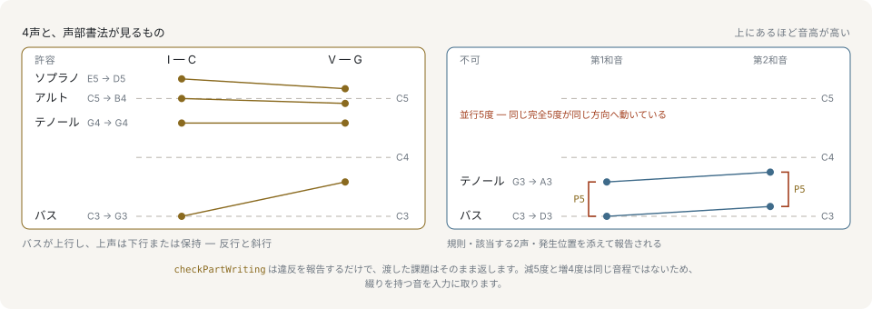

# 声部

和音が定めるのはどの音かであって、どこで鳴るかではありません。`C major` は C・E・G の3音ですが、それぞれがどのオクターブに来るのか、どの音を誰が重複させるのか、最低音は何かは決まらないままです。**ボイシング**はその決定であり、声部ごとに具体的なピッチを1つずつ与えます。

```ts
import { Voicing } from '@libraz/libcantus';

Voicing.satb('C').pitches; // [48, 60, 64, 67]
Voicing.forChord('C').pitches; // [60, 64, 67]
Voicing.forChord('C', { style: 'drop2' }).pitches; // [52, 60, 67]
```

3つの呼び出しは同じ和音を3通りにボイシングしています。ピッチは MIDI 番号を低い順に並べた形で返ります。`Voicing.satb` は声部ごとの音域に収まる配置を探索し、`Voicing.forChord` は指定したスタイルでコード構成音を積みます。

## 4つの声部、4つの音域

ここでの既定の約束事は **SATB**、つまりソプラノ・アルト・テノール・バスの四声体です。古典の声部書法の規則はこのテクスチャのために書かれました。4声ということは音域も4つあり、探索は各声部を自分の音域のなかに収めます。

```ts
import { SATB_RANGES } from '@libraz/libcantus';

SATB_RANGES;
// [{ min: 40, max: 60 }, { min: 48, max: 67 }, { min: 55, max: 74 }, { min: 60, max: 79 }]
```

バス E2–C4、テノール C3–G4、アルト G3–D5、ソプラノ C4–G5 です。この音域は生理的な限界ではなく慣習です。実際の歌手はこれを越えますし、課題の伝統は越えません。それ以外の声部数には、ほぼ同じ音域幅を等分した範囲が割り当たります。「5声で書く」に対する慣用的な四声体の答えが存在しないためです。

## 声部の添字 0 は最低声部です

これは API 全体で一貫しています。ボイシングのピッチ配列でも、`SATB_RANGES` でも、声部書法の違反が持つ `voices` でも同じです。

```ts
import { voiceChord } from '@libraz/libcantus';

const satb = voiceChord('C');

satb; // [48, 60, 64, 67]
satb[0]; // 48
satb[3]; // 67
```

添字 0 がバスで、最後の添字がソプラノです。楽譜の並びは逆で上の段から始まるので、描画側が反転させます。ライブラリの内部で反転する箇所はありません。

## 声部進行は2つのボイシングのあいだの動きです

2つの和音が与えられたとき、興味の対象はどちらのボイシングでもなく、一方から他方へ移るために各声部が何をしたかです。この動きが**声部進行**であり、各声部の移動をできるだけ小さく保つのが慣習です。

```ts
import { voiceLeadingCost, voiceProgression } from '@libraz/libcantus';

voiceProgression(['C', 'G', 'Am', 'F']);
// [[48, 60, 64, 67], [43, 59, 62, 67], [45, 57, 60, 64], [41, 57, 60, 65]]
voiceLeadingCost([60, 64, 67], [59, 62, 67]); // 3
voiceLeadingCost([60, 64, 67], [48, 52, 55]); // 36
```

`voiceLeadingCost` が返すのは全声部の総移動量（半音）だけです。測っているのは距離であって正しさではありません。値が小さいことは声部があまり動かなかったことを意味するのであって、進行が清潔であることを意味しません。`voiceProgression` は各ボイシングを、前のボイシングからの接続の良さで選びます。進行をボイシングすることは、和音を1つずつボイシングすることとは違います。



2つの和音のあいだで2つの声部が取る動きは4種類しかなく、声部書法の約束事はその区別の上に組み立てられています。`voiceIndependence` はこれを数えます。

```ts
import { parseNote, voiceIndependence } from '@libraz/libcantus';

const upper = ['C5', 'D5', 'D5', 'F5', 'G5'].map((name) => parseNote(name));
const lower = ['E4', 'C4', 'E4', 'F4', 'G4'].map((name) => parseNote(name));

voiceIndependence(upper, lower).motion;
// { contrary: 0.25, oblique: 0.25, similar: 0.25, parallel: 0.25 }
```

この組に含まれる4つの動きを順に挙げると、**反行**（2声が逆方向へ動く）、**斜行**（一方が保留し他方が動く）、**類似**（同じ方向へ異なる幅で動く）、**平行**（同じ方向へ同じ音程を保って動く）です。好まれるのは反行です。2つの線が聞き分けられる状態を保つからです。平行は2声が1本の太い線に融合する原因になります。下の規則が完全音程の平行をとりわけ問題にするのはそのためです。

## 声部書法チェッカー

`checkPartWriting` は、ボイシングの列を、それが実現している和音に対して採点します。報告するだけで、書き換えはしません。

```ts
import { checkPartWriting, majorKey, makeChord, spellVoicing } from '@libraz/libcantus';

const key = majorKey(0);
const chords = [makeChord(0, 'maj'), makeChord(2, 'maj')];
const voicings = [
  [48, 55, 64, 72],
  [50, 57, 66, 74],
].map((pitches, index) => spellVoicing(pitches, chords[index] ?? chords[0], key));

const violations = checkPartWriting(voicings, chords, key);

violations.map((violation) => violation.kind); // ['parallelFifth', 'parallelOctave']
violations[0]?.voices; // [0, 1]
violations[0]?.fromIndex; // 0
violations[0]?.toIndex; // 1
violations[0]?.rationale; // 'The two voices move into consecutive perfect fifths'
```

すべての声部がそろって全音上がったため、バスとテノールの5度、バスとソプラノの8度がそのままの形で滑っています。違反は、規則の名前（`kind`）、関わる声部の添字（`voices`）、動きの開始と終了にあたる和音（`fromIndex`、`toIndex`）、そして一文の `rationale` を持ちます。検査される規則は18種類あり、1つの和音の内部で起きること（`voiceCrossing`、`spacing`、`range`）、2つの和音のあいだで起きること（`parallelFifth`、`parallelOctave`、`hiddenPerfect`、`overlap`、`crossRelation`、`unresolvedLeadingTone`、`unresolvedSeventh`）、そして種目対位法が追加する規則を覆います。

チェッカーは入力に手を触れません。採点の対象は学習者の答案そのものであり、黙って修復すれば、課題が生み出すはずの情報が消えます。結果が空であることは、どの規則も破られなかったことを意味します。よい音楽であることも、判定できない規則があったことも意味しません。不正なオプションは規則を黙って無効にせずエラーになるからです。

## チェッカーが綴られた音を要求する理由

MIDI 番号は鍵盤上の鍵です。増2度と短3度、増4度と減5度を区別できず、対斜はそもそも見えません。これらの区別は書かれた文字のなかにあります。

```ts
import { isForbiddenMelodicLeap, parseNote } from '@libraz/libcantus';

isForbiddenMelodicLeap(parseNote('Ab4'), parseNote('B4')); // true
isForbiddenMelodicLeap(68, 71); // false
```

2行は同じ2つの響きです。Ab から B と綴れば増2度で禁じられ、68 から 71 なら短3度で許されます。MIDI 番号をチェッカーに渡すと、誤った答えが返るというより、文字を必要とする規則が黙って飛ばされます。そのためチェッカーは綴られた音を取り、`spellVoicing` がその形を作る手順にあたります。綴りについては[ピッチと音程](pitch-and-intervals.md)を参照してください。

## 種目対位法

種目対位法は段階のある課題です。2つの線、つまり与えられた線である**定旋律**と、それに対して書く対位声部からなり、段階が進むほどリズムが精緻になります。`checkSpecies` は第1種から第5種までを採点します。

```ts
import { checkSpecies, majorKey, parseNote } from '@libraz/libcantus';

const cantus = ['C4', 'D4', 'E4', 'D4', 'C4'].map((name) => parseNote(name));
const counterpoint = ['C5', 'A4', 'G4', 'B4', 'C5'].map((name) => parseNote(name));

checkSpecies(cantus, counterpoint, 1, majorKey(0)); // []
```

5つの種目は次のとおりです。

1. **音符対音符**。定旋律1音に対位声部1音を当て、すべての音程が協和になります。
2. **2対1**。定旋律1音に対位声部2音を当て、弱拍側は順次進行で通過する不協和にできます。
3. **4対1**。定旋律1音に対位声部4音を当てるもので、同じ規則に刺繍音と、跳躍で不協和を離れる定型の余地が加わります。
4. **シンコペーション**。対位声部が拍をまたいで結ばれるので、協和として準備された音が強拍で不協和になり、順次下行して解決します。これが掛留です。
5. **華麗**。音価を混ぜて前の4種を使い分けるもので、音の位置を示す `opts.durations` を必要とする唯一の種目です。

違反は課題自身の時間順で返るため、最初に報告されるものが最初に聞こえるものになります。

## 声部の独立性は判定ではなく測定です

`voiceIndependence` は、書かれた2つの線が、1本の線を重ねたものではなく別々の声部としてどれだけふるまっているかに答えます。返るのは数値であり、そこで止まります。

```ts
import { parseNote, voiceIndependence } from '@libraz/libcantus';

const lead = ['C5', 'D5', 'E5'].map((name) => parseNote(name));
const harmony = ['E4', 'F4', 'G4'].map((name) => parseNote(name));

const report = voiceIndependence(lead, harmony);

report.motion; // { contrary: 0, oblique: 0, similar: 0, parallel: 1 }
report.separation.min; // 8
report.crossings; // 0
report.longestPerfectRun; // 0
report.sounding; // 3
```

このハーモニー線は主旋律の6度下を最後まで並走するので、動きは完全に平行と出ます。ここに違反は1つもありません。平行6度は並行5度ではありませんし、旋律を6度で重ねるのは普通に書かれるものです。レポートは書かれた内容を記述するだけで、判断は呼び出し側に委ねます。`rhythmicComplementarity` と `separation` も同じ絵を埋める値です。あわせて見ると、第2の声部と、太くなっただけの第1声部とを分けるものが見えます。

## 次に読むページ

- [ボイシング](../voicing.md) — 探索のオプション、名前の付いたスタイル、記譜のためにボイシングを綴る手順を扱います。
- [対位法と和声課題](../counterpoint-and-part-writing.md) — チェッカーが適用する全規則と、その背後にある個別の述語を扱います。
- [和声](harmony.md) — 声部が実現している和音そのものを扱います。
