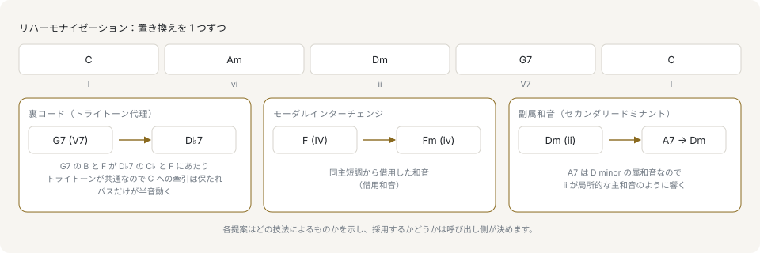

# リハーモナイズ

リハーモナイズは、何か1つを固定したまま — メロディ、和声機能、あるいは長さだけ — その下のコードを置き換える処理です。このライブラリは代理和音を理由付きの提案として返すため、ホストはそれを提示してユーザーに選ばせられます。

このページは和音（コード）、ローマ数字、機能（トニック・サブドミナント・ドミナント）を前提にしています。[和声の入門](primer/harmony.md)がそれらを解説し、対応する API を示します。

## 1つのコードに対する代理



どの手法も置き換えるのは1つのコードだけで、進行の残りはそのままです。そして、どれも提案された理由を持ちます。裏コードは置き換えた属和音のガイドトーンを保ち、モーダルインターチェンジは同主調からコードを借り、副属和音は次のコードをその場のトニックであるかのように準備します。

`substituteChord` は、ある調におけるそのコードの代理として根拠を示せるものをすべて返します。各項目は関係、ローマ数字、和声機能を持ちます。

```ts
import { formatChordSymbol, majorKey, makeChord, substituteChord } from '@libraz/libcantus';

const subs = substituteChord(makeChord(7, 'dom7'), majorKey(0));

subs.map((sub) => sub.type).includes('tritone'); // true
formatChordSymbol(subs.find((sub) => sub.type === 'tritone')?.chord ?? makeChord(0, 'maj'));
// 'Db7'

// D7 resolves to G, so its substitute is spelled a semitone above G, not above C.
const applied = substituteChord(makeChord(2, 'dom7'), majorKey(0));
formatChordSymbol(applied.find((sub) => sub.type === 'tritone')?.chord ?? makeChord(0, 'maj'));
// 'Ab7'
```

ハ長調における G7 の裏コードは C#7 ではなく Db7 と綴られます。裏コードは、その属和音が解決する先のコードから見た bII7 です。したがって調の主音の半音上ではなく、解決先のコードの根音の半音上に書かれ、綴りがそれを示しています。その調がすでにそのピッチクラスを自身の度数として綴っている場合は、そちらの文字が保たれます。

クラス API では `Chord.substitutions` が同じ問い合わせにあたり、`Progression.substitute` はそのうち1つを実際に差し替えます。

```ts
import { Chord, Key, Progression } from '@libraz/libcantus';

const subs = Chord.parse('G7').withKey(Key.major('C')).substitutions();
subs.find((sub) => sub.type === 'tritone')?.chord.rootPc; // 1

const progression = new Progression([Chord.parse('G7'), Chord.parse('C')], Key.major('C'));
progression.substitute(0, 'tritone').toString(); // 'Db7 C'
```

4つの関係は次のとおりです。

| 種類 | 対象 | 内容 |
| --- | --- | --- |
| `tritone` | 属和音型 | 三全音離れた属和音に置き換えます。ガイドトーンが共有されます。 |
| `relative` | 三和音・七の和音 | 三和音の構成音を2つ共有するコードに差し替えます。 |
| `borrowed` | 任意 | 同主調から、同じ和声機能を持つ三和音を借ります。 |
| `chromaticMediant` | 任意 | 3度離れ、共通音1つと半音変化を伴います。 |

副属和音はこの一覧に入りません。どの属和音が当たるかは後続の和音が決めるもので、`substituteChord` が受け取るのは1つの和音と調だけだからです。対象が分かっている場面では `secondaryDominantOf`（クラスでは `Chord.secondaryDominant`）が指定した和音に対する副属和音を作ります。進行全体を選び直す場面では、`harmonizeMelody` が `reharmonize: 'secondaryDominant'` で語彙を広げます。

### メロディとの整合を保つ

上に乗る音とぶつかる代理は代理になりません。メロディのピッチクラスを渡すと、それらをすべて含むコードだけが残ります。

```ts
import { majorKey, makeChord, substituteChord } from '@libraz/libcantus';

const all = substituteChord(makeChord(0, 'maj'), majorKey(0));
const overE = substituteChord(makeChord(0, 'maj'), majorKey(0), { melodyPcs: [4] });

overE.length <= all.length; // true
overE.every((sub) => sub.chord.intervals.length > 0); // true
```

指定しない場合は理論上利用できる代理の全体が返り、指定した場合はすでに書かれたメロディに適合するものだけが残ります。

## モーダルインターチェンジのパレット

コードごとに問い合わせる代わりに、同主調から借りられるコードを集合として取得できます。

```ts
import { Chord, formatChordSymbol, Key, majorKey, modalInterchangePalette } from '@libraz/libcantus';

modalInterchangePalette(majorKey(0)).map((borrowed) => formatChordSymbol(borrowed.chord));
// ['Cm', 'Ddim', 'Eb', 'Fm', 'Gm', 'Ab', 'Bb', 'Db']

Chord.parse('C').withKey(Key.major('C')).modalInterchange().length; // 8
```

各項目はローマ数字と `source` を持つため、UI は借用元ごとにまとめて表示できます。綴りはフラット側に寄ります。長調における借用和音はそのように書かれるためです。パレットが持つのは、同主調の三和音のうちその調が持たないものとナポリの和音です。長調では同主短調の7つの三和音がすべて入りますが、短調では5つになります。長三和音の属和音と、上げた第7度上の減三和音（イ短調の `E` と `G#dim`）は入りません。呼び出し側がもっとも探しそうな2つですが、第7度を上げるのは同主調から取った和音ではなく調の内側での変位であるため、意図的に外れています。これらを提示したい UI は、変位として自前で加えることになります。パレットは個々のコードではなく調に属するので、`Chord.modalInterchange` も同じ一覧を返します。コードから辿れるようにしてあるのは、次の行き先を探している呼び出し側がすでにコードのところにいるからです。

## 増六の和音

イタリア・フランス・ドイツの3種類の増六の和音は、ドミナントへ向かうもう1つの半音階的な接近です。置き換える相手との関係ではなく綴られた音程が名前を決めるため、代理の語彙からは外れています。3種類とも下中音を半音下げた音（♭6、主音の8半音上）を低音に置き、その上に増六度を持ちます。外側へ開いてドミナントへ解決するこの音程が、この一群の名前の由来です。

```ts
import { augmentedSixthChord, chordToRoman, Key, majorKey, noteNames, romanToChord, spellAugmentedSixth } from '@libraz/libcantus';

Key.major('C').augmentedSixth('german').symbol(); // 'Ab7'
noteNames(spellAugmentedSixth('german', 'C')); // ['Ab', 'C', 'Eb', 'F#']

augmentedSixthChord('french', majorKey(0)).bassPc; // 8

chordToRoman(romanToChord('Ger6', 'C major'), 'C major'); // 'Ger6'
chordToRoman(romanToChord('Ger6/V', 'C major'), 'C major', { applied: true }); // 'Ger6/V'
```

ハ長調のドイツの増六の和音は Ab7 と同じピッチクラスを鳴らし、違いは文字だけにあります。最上音は F# で、これは G へ上行して解決します。bVI7 であればここは Gb と書かれます。すでに綴りを持つコードを読むのが `augmentedSixthKind` で、臨時記号の残らない MIDI トラックを扱う呼び出し側のために同じ読みを行うのが `augmentedSixthFromPitchClasses` です。音符から読んだコードのタイムラインは、ドミナントへ解決する位置で増六の和音を区間のコードとして報告します。

## ネガティブハーモニー

`negativeHarmonyMirror` は、調の軸に対してコードを反転させます。

```ts
import { Chord, Key, majorKey, makeChord, negativeHarmonyMirror } from '@libraz/libcantus';

const mirrored = negativeHarmonyMirror(makeChord(7, 'maj'), majorKey(0));

mirrored.rootPc; // 5
mirrored.quality; // 'min'

Chord.parse('G').negativeHarmony(Key.major('C')).symbol(); // 'Fm'
```

C の軸で反転させた G メジャーは F マイナーになります。これは提案ではなく変換です。結果はちょうど1つで、それが曲に適するかどうかは作曲上の判断になります。

## 進行全体をリハーモナイズする

`generateProgression` のリハーモナイズはコンテキストで指定します。`ctx.complexity.harmonic` は進行のどれだけを後続和音の副属和音に置き換えるかを決めるもので、実行するかどうかではなくどの程度実行するかを指定できます。

```ts
import { generateProgression, majorKey } from '@libraz/libcantus';

const key = majorKey(0);
const plain = generateProgression({ key, style: 'idol', bars: 8, ctx: { seed: 5 } });
const rich = generateProgression({
  key,
  style: 'idol',
  bars: 8,
  ctx: { seed: 5, complexity: { harmonic: 1 } },
});

plain.length; // 8
rich.length; // 8
```

既定値の `harmonic: 0` ではプリセットがそのまま使われ、0.5 では規則が属和音を立てられるコードのおよそ半分、1 ではそのすべてが置き換わります。次が主和音であるとき、残る主和音の提示がそれ1つだけであるとき、すでに次のコードの属和音であるかまたは属和音の解決先であるとき、そして次のコードがそもそも一時的な主和音になれないとき — 減三和音を一時的な主和音にはできません — そのコードは対象から外れます。長さは変わりません。リハーモナイズは挿入ではなく置換であるためです。どのコードが置き換わるかは `seed` が固定するため、同じシードなら常に同じ進行になります。

`presetId` は組み込みの特定の進行を指定し、`preset` は呼び出し側の度数列を渡します。全音階外の度数には `BORROWED_DEGREES` の名前を使います。

```ts
import { BORROWED_DEGREES, generateProgression, majorKey } from '@libraz/libcantus';

BORROWED_DEGREES.bVII; // 10

const chords = generateProgression({
  key: majorKey(0),
  style: 'rock',
  bars: 4,
  preset: { degrees: [1, BORROWED_DEGREES.bVII, 4, 1] },
});

chords.map((span) => span.rootPc); // [0, 10, 5, 0]
```

## メロディから和音を付ける

`harmonizeMelody` は逆方向の処理で、メロディを与えるとその下のコードを選びます。まず各メロディ音を分類するため、経過音が和声を引きずることはありません。

```ts
import { harmonizeMelody } from '@libraz/libcantus';

const result = harmonizeMelody({
  melody: [
    { pitch: 60, startBeat: 0, durationBeat: 1 },
    { pitch: 62, startBeat: 1, durationBeat: 1 },
    { pitch: 64, startBeat: 2, durationBeat: 1 },
    { pitch: 65, startBeat: 3, durationBeat: 1 },
    { pitch: 67, startBeat: 4, durationBeat: 4 },
  ],
});

result.chords.length >= 1; // true
result.melodyRoles.length; // 5
result.transposeSemitones; // 0
```

`result.chords` は和声リズムの格子上でのコード変化ごとに1つの `ChordSpan` を持ち、`result.melodyRoles` は各メロディ音が最終的に下に来たコードの中で果たす役割を返します。`result.key` はコードが書かれている調で、型は `ResolvedKey` です。音階と、それを綴る主音を合わせて持つもので、`key: 'infer'` のもとではこれが調についての唯一の記録になります。`transposeSemitones` はそこへ到達するためにメロディを移動した量です。`placement` で探索を求めていなければ 0 になります。

`key` の既定値は `'infer'` で、メロディのピッチクラスの重み付けから調を推定します。メロディしか持たない呼び出し側には、調を名指しする材料が他にないためです。調名を渡せばその調で和声付けします。`ts` はメロディが書かれている拍子です。コードを選ぶ基準となる拍節上の重みを決め、コードの格子も決めます。格子のスロット長は、小節の半分が体感上の拍（felt beat）に乗るならその半分、乗らないなら小節1つ分です。そのためワルツは小節をまたがずに強拍でコードが変わります。`harmonicRhythm` はそのスロット長を拍数で直接指定します。

```ts
import { harmonizeMelody } from '@libraz/libcantus';

const line = [
  { pitch: 60, startBeat: 0, durationBeat: 2 },
  { pitch: 62, startBeat: 2, durationBeat: 2 },
  { pitch: 64, startBeat: 4, durationBeat: 2 },
  { pitch: 65, startBeat: 6, durationBeat: 2 },
  { pitch: 67, startBeat: 8, durationBeat: 4 },
];

harmonizeMelody({ melody: line }).chords.length; // 5
harmonizeMelody({ melody: line, harmonicRhythm: 4 }).chords.length; // 1
harmonizeMelody({ melody: line, ts: '3/4' }).chords.map((chord) => chord.startBeat); // [0, 3, 9]
```

`placement` は2つの探索を要求するもので、どちらも既定では無効です。`transposeSearch` はメロディを和声付けする調へ移し、`octaveSearch` は無理のない音域へ移します。後者はピッチクラスを変えないため、調もコードも動きません。どちらも選んだ結果を `transposeSemitones` で報告します。

```ts
import { harmonizeMelody } from '@libraz/libcantus';

const tune = [
  { pitch: 60, startBeat: 0, durationBeat: 1 },
  { pitch: 62, startBeat: 1, durationBeat: 1 },
  { pitch: 64, startBeat: 2, durationBeat: 1 },
  { pitch: 65, startBeat: 3, durationBeat: 1 },
  { pitch: 67, startBeat: 4, durationBeat: 4 },
];

harmonizeMelody({ melody: tune, key: 'E major' }).transposeSemitones; // 0
harmonizeMelody({
  melody: tune,
  key: 'E major',
  placement: { transposeSearch: true, octaveSearch: false },
}).transposeSemitones; // -3
```

`budget` は1回の呼び出しが行える計算量の上限です。探索は配置1つにつき、各スロットの候補コードの組をすべて1巡します。そのため `transposeSearch` を有効にした長い旋律がこの値を上げる必要のある場面です。上限を超えた場合はスレッドを塞ぐ代わりに `BudgetExceededError` を投げます。

`Composer.harmonize` はこの最後の2手順を呼び出し側に代わって行います。移動量をメロディに適用し、コードをタイムラインの上に配置するため、返ってくるのは互いに整合したメロディと和声です。

```ts
import { Composer, Score } from '@libraz/libcantus';

const composer = Composer.of({ key: 'C major' });
const melody = Score.of([
  { pitch: 60, startBeat: 0, durationBeat: 1 },
  { pitch: 62, startBeat: 1, durationBeat: 1 },
  { pitch: 64, startBeat: 2, durationBeat: 1 },
  { pitch: 65, startBeat: 3, durationBeat: 1 },
  { pitch: 67, startBeat: 4, durationBeat: 4 },
]);

const harmonized = composer.harmonize(melody);

harmonized.chords.at(0)?.symbol(); // 'C'
harmonized.chords.totalBeats; // 8
harmonized.melody.notes.length; // 5
harmonized.transposeSemitones; // 0
```

メロディは終わるところで終止します。1フレーズずつ渡す呼び出し側にとってはこれが望ましい挙動です。1つのフレーズより長い旋律は各フレーズの区切りでも終止しますが、ハーモナイザ自身にはその位置が分かりません。区切りを名指しするのが `phraseEnds` で、すでにコードが付いている旋律であれば `phrasesFromTimeline` がその位置を見つけます。名指しした拍はコードのグリッドを分割し、そこで閉じるスロットへ和声が動き、フレーズが落ち着く音は次のフレーズの頭に対する装飾音ではなく構造音として読まれます。したがって旋律全体を1回の呼び出しで和声付けでき、フレーズごとに和声付けして繋ぐ必要はありません。

```ts
import { harmonizeMelody } from '@libraz/libcantus';

// Two four-bar phrases in C, each coming to rest on the tonic.
const period = [60, 62, 64, 65, 67, 65, 64, 60, 64, 65, 67, 69, 71, 67, 62, 60].map(
  (pitch, index) => ({ pitch, startBeat: index, durationBeat: 1 }),
);

const whole = harmonizeMelody({ melody: period, phraseEnds: [8] });
const runOn = harmonizeMelody({ melody: period });

// The chord under the first phrase's close, on the last slot before beat 8.
whole.chords.some((chord) => chord.startBeat === 6); // true
// Without the boundary the close is swallowed by the chord already sounding.
runOn.chords.some((chord) => chord.startBeat === 6); // false
```

`classifyMelodyTones` は非和声音の分類だけを単体で実行します。ハーモナイズを確定させずに経過音や刺繍音を色分けする UI 向けです。

## リハーモナイズの提示

代理を返す関数は、いずれも理由付きの提案を返します。コードとあわせて理由も提示してください。`type` と `roman` が関係を示し、これはコード記号だけでは伝わりません。モーダルインターチェンジのパレットは `type` の代わりに `roman` と `source` を持ち、`negativeHarmonyMirror` は変換なので持ち回る理由がありません。

元のコードは保持してください。リハーモナイズは既存の音楽に対する提案であり、ユーザーが比較・却下・復元できる必要があります。生成パートにも同じことが当てはまります。[生成](generation.md)を参照してください。
